# NPClassworks UI 综合评审与优化方向

编写日期：2026-10-03。对象：学生端、教师端、班级大屏，以及设置、学校管理和 NPEP 配套界面。

**总体判断：NPClassworks 的业务分工和多数交互机制有实际依据；主要短板是功能增长后，页面没有形成清晰、统一的视觉与信息层级。大屏的专用交互已经比较成熟，学生手机端和教师手机端则需要调整内容顺序与页面结构。只改配色和圆角，不能解决全部问题。**

目前“有功能、能完成任务”的基础值得保留。更合适的方向是：**共享品牌、语义和组件规范，分别设计三端的信息密度、导航、阅读与操作方式。**

本文是一份设计分析和后续实施依据，本次没有修改产品 UI、业务逻辑、账号、数据库或线上服务。

## 目录

- [1. 范围、方法与证据](#scope)
- [2. 三端的设备与真实任务](#devices)
- [3. 当前 UI 如何组织](#structure)
- [4. 美观性问题的共同原因](#visual-problems)
- [5. 学生端：让作业先出现](#student)
- [6. 教师端：把发布和管理组织成任务](#teacher)
- [7. 班级大屏：同时照顾远看与近触](#screen)
- [8. 配套界面：设置、管理、工具与通知](#support)
- [9. 建议建立的视觉规范](#design-system)
- [10. 性能与设备差异](#performance)
- [11. 可访问性与易用性](#accessibility)
- [12. 问题清单与优先级](#priorities)
- [13. 分阶段优化计划](#plan)
- [14. 验收标准](#acceptance)
- [15. 源码与证据索引](#sources)

<a id="scope"></a>
## 1. 范围、方法与证据

### 1.1 源码基线

| 项目 | 本次依据 |
| --- | --- |
| 仓库 | `D:\CodeProjects\NPClassworks` |
| 分支 | `codex/npep-preauthorized-pairing-20261003` |
| HEAD | `cc9c1a14ebf986f4ace6828f1715f7d02d3f7310` |
| 开始审阅时的工作区 | 干净 |
| 产品声明 | `1.2.0 / Hitori` |
| 技术基础 | Vue 3、Vuetify 3、Pinia、Vite、PWA；中文界面 |
| 本次新增内容 | 本文、示例截图和评审证据；产品源码未改动 |

NPEduTools、NPClassworksKV 只作为理解设备状态与业务语义的背景；本次评审对象是 NPClassworks 网页。NPEssentials 不涉及本次 UI 评审。

### 1.2 证据分级

本文使用三个标签，避免把意见写成事实：

- **[实测]**：当前源码构建产物在隔离浏览器中的截图、DOM 尺寸或计算样式。
- **[源码]**：组件、样式、默认设置或构建配置直接体现的行为；没有对每个分支逐一操作。
- **[建议]**：基于任务与设计判断提出的方向，尚未实施，也不等于用户已接受的产品决定。

依据项目现有 `scripts/serve-e2e.js` 构建真实前端，使用 `tests/e2e/backend.js` 的内存 API 与少量场景夹具；服务仅在本机回环地址运行。数据全部为示例学校、教师、班级和六科作业，包含一项未确认、截止时间、选做、提交说明和需带物品。

完成 **7 种 CSS 视口、21 个页面／状态截图**。其中包含浅深主题、学生正文、教师整页、大屏录入、抄写模式、设置与管理页。字体读回确认 Windows 本次正文实际使用 Roboto 和 Microsoft YaHei。

测试浏览器是 Windows 上的无头 Chromium；手机场景使用触摸／移动视口模拟。它**不等同于 Android、iOS、教室触摸驱动或后排观看的真实验收**。日期固定用于复现版面，不用截图中的时间验证业务时序。截图关闭动画并等待布局稳定。

21 个捕获状态未出现未捕获的页面脚本异常。夹具没有覆盖所有管理和设备接口，不能据此宣称所有功能通过；本次也没有测出生产环境的 LCP、INP、长期 CPU 或内存稳定性。

### 1.3 实测布局摘要

下表位置均为滚动前、稳定布局下的 **CSS 像素**，不是物理屏幕像素。相同作业数据下，状态区长度、科目数量和配置变化仍会改变结果。

| 场景 | 视口 | 关键观测 |
| --- | --- | --- |
| 学生手机 | 390 × 844 | 第一张作业卡片顶端 `y=1414`；第一段正文 `y=1512`，16px |
| 较窄学生手机 | 360 × 800 | 第一张作业卡片 `y=1537`；第一段正文 `y=1669` |
| 学生电脑 | 1440 × 1000 | 第一张作业卡片 `y=800`；第一段正文 `y=898` |
| 教师电脑 | 1440 × 1000 | 发布与管理两栏从 `y=292` 开始；正文输入框 `y=952` |
| 教师手机 | 390 × 844 | 正文输入框 `y=1088`；发布管理区 `y=2596`；整页约 3859px |
| 班级大屏 | 1920 × 1080 | 作业区从 `y=355` 开始；正文 20.8px；三列 |
| 较低有效分辨率大屏 | 1366 × 768 | 作业区从约 `y=354` 开始；正文仍为 20.8px；两列 |
| 缩放后的较小有效视口 | 1280 × 720 | 作业区从 `y=368` 开始；正文仍为 20.8px；两列 |
| 4K、100% CSS 尺寸场景 | 3840 × 2160 | 正文仍为 20.8px；自动布局扩为五列 |

上述主页面稳定后均未发现整页横向溢出。这是现有响应式布局的一项优点，但“没有横向溢出”与“信息顺序适合手机”是不同标准。

原始依据：[布局与样式记录](../docs/ui-review-20261003/measurements.json)、[构建资源体积](../docs/ui-review-20261003/asset-sizes.json)。

<a id="devices"></a>
## 2. 三端的设备与真实任务

### 2.1 设备假设

目前未获得具体学校的设备清单与使用频率，暂按下表评审。它是工作假设，不代表用户设备已经逐台核实。

| 端 | 主要设备与环境假设 | 核心任务 | 优先照顾的体验 |
| --- | --- | --- | --- |
| 学生 | 手机为主，兼顾平板／电脑；碎片时间、单手、移动网络 | 看今天各科作业、明日提交与需带、核对更新、标记完成 | 首屏正文、少滚动、低流量、状态易辨、个人阅读 |
| 教师 | 办公电脑与手机兼用；手机常用于课间补发／更正 | 发布、复用、确认大屏录入、更正、核对班级和日期 | 输入效率、目标准确、快速切换任务、保留草稿 |
| 班级大屏 | Windows 一体机，1080p 或 4K，可能有缩放与旧硬件 | 全班远看、近距离触摸录入、考勤、通知、抄写 | 远距离可读、操作位置可达、稳定常显、弱机持续运行 |
| 学校管理 | 以电脑为主，手机用于临时查看与少量处理 | 组织、账号、设备、排程、考试与运行状态 | 范围明确、可扫描列表、危险操作分区、结果可追溯 |

必须分清**物理分辨率、CSS 视口、系统缩放、设备尺寸与观看距离**。4K 面板在 200% 缩放下可能呈现接近 1920px 的 CSS 宽度；不能简单用“4K”就推断应增加列数。

### 2.2 三端不宜共用同一种页面密度

| 设计问题 | 学生端 | 教师端 | 大屏端 |
| --- | --- | --- | --- |
| 首页最重要的信息 | 今天要做什么 | 现在要处理或发布什么 | 全班当前需要看到什么 |
| 常驻控件 | 少量日期、筛选、完成状态 | 任务导航、目标班级、主要操作 | 日期／班级、内容、固定触控入口 |
| 历史／详情 | 按需展开 | 容易检索与比较 | 近距离操作时展开 |
| 字号 | 舒适阅读为先 | 输入与列表扫描兼顾 | 观看距离优先，不能只按密度压小 |
| 留白 | 区分内容，控制前置信息高度 | 按任务分组，提高扫描效率 | 围绕正文与触控区分配 |
| 动效 | 短反馈，尊重减少动态效果设置 | 状态反馈，避免打断输入 | 默认克制，持续显示时避免无意义运动 |
| 离线 | 保留已加载内容并说明时效 | 保护输入与重试意图 | 强调最近同步时间、缓存与待上传状态 |

同一组件可以共享数据语义，但应提供对应端的展示变体。将桌面两栏堆成手机一栏，只完成了尺寸适配。

<a id="structure"></a>
## 3. 当前 UI 如何组织

`ClassworksHome.vue` 是主入口，按角色切换学生、教师和大屏。设置、学校管理、初始化有独立页面；许多工作流以弹窗、全屏对话框或附属卡片出现。

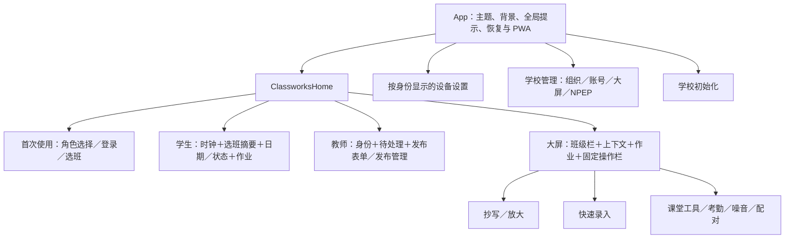

### 3.1 值得保留的设计

1. **角色与权限有实际边界。** 学生免登录看作业，教师负责发布和确认，大屏有独立绑定与临时退出逻辑。
2. **作业语义较完整。** 日期、截止、确认、更正、无作业与尚未录入、走班归属都有对应信息。
3. **大屏已有专用能力。** 触控栏、抄写、放大、自动列数、长内容处理、字体比例和节能选项，都比单纯放大网页更贴近教室。
4. **异常状态有表达。** 离线缓存、待上传、冲突、未知设备状态与历史回执没有一概伪装成成功。
5. **复杂功能有按需加载。** 教师编辑、历史、课堂工具、抄写、部分管理界面使用异步组件。
6. **布局有一定弹性。** 已有换行、移动断点、底部安全区、部分减少动态效果和键盘焦点处理。

### 3.2 当前结构的代价

功能入口不断增加后，很多信息通过“再加一张卡片／一排按钮／一段提示”进入主页面。单个组件通常容易理解，叠加后的页面却很难立即判断主次。

学生端最明显：时钟、班级摘要、八个入口、日期、六科状态、需带物品、筛选、分科标题，层层排在正文之前。教师端的问题则是把长表单、待处理和记录管理放进同一纵向流。

这些问题可以在保留业务模型和现有组件的前提下改善。

依据：S01、S02、S03、S04、S05。

<a id="visual-problems"></a>
## 4. 美观性问题的共同原因

### 4.1 品牌与主体界面尚未统一

**[源码＋实测]** 品牌已有暖橙色标识，主色为 `#D97732`，辅色为 `#A94E24 / #F2B56B`。但 Vuetify 只设置了默认深色模式，没有建立对应品牌主题；本次读回深色主色为 `#2196F3`、浅色为 `#1867C0`。

因此，品牌出现在首次进入、关于和安装图标中，工作页面却主要由默认蓝色主操作、绿色状态、橙色截止和默认灰底组成。颜色本身都能使用，但尚未形成一致的产品识别。

**[建议]** 沿用既有标识，建立完整浅／深主题配色对；为动作、状态、正文和边界分别定义颜色。不要把所有 `primary` 直接替换成亮橙后结束，白字与橙底也有对比度问题，见第 9、11 节。

### 4.2 很多模块拥有同等视觉重量

**[实测]** 时钟、班级说明、日期、状态、表单和工具大量使用圆角大底板。连续的“大圆角＋底色＋内边距”让每一块都像主内容。

问题不是“卡片不能用”，而是卡片没有表达稳定的层级：

- 页面分区可以用标题与间距，不一定再套一个底板。
- 真正独立的作业或任务适合卡片。
- 附属信息更适合安静的行、分隔线或展开区域。
- 重要异常可以提高对比，常态说明不必同样突出。

### 4.3 布局空白与信息密度不均匀

**[实测]** 学生端上方控制区占用很大高度，正文却在小卡片中与大量元信息挤在一起；教师长表单先显示多个选择和解释，主要输入很靠后；大屏顶部多个横条与短作业卡片的元信息占比偏高。

**[建议]** 先重新分配空间，再调小单个控件的 padding。单纯把整页压紧，会同时损伤阅读和触控。

### 4.4 标签、图标与说明重复争夺注意力

学生正文区域同时出现分科标题、卡内科目、班级、标题、确认状态、普通优先级、作者、发布时间、截止状态与完成按钮。信息大多有用途，但未必需要持续同等强调。

例如“普通”通常是默认状态，可不显示为彩色标签；班级固定时可弱化每张卡片上的重复班名；截止与正文更新则应保持清楚。

同样，说明框适合解释复杂或首次出现的规则。每次操作都重复展示完整技术说明，会让提醒逐渐成为背景噪声。

### 4.5 文字层级需要跨组件统一

**[源码＋实测]** 标题、正文、标签、说明分别混用 Vuetify 字体类、固定 px、rem、clamp 和大屏比例。大屏正文随比例变化，部分标题、元信息和状态仍保持较小字号。

本次 Windows 字体读回是 Roboto 与 Microsoft YaHei，未发现可据以认定“中文字体加载失败”的证据。需要优化的是明确中文字体回退、字重、行距和字号角色，而不是换一套装饰字体。

### 4.6 功能差异已经存在，视觉规则尚未完全分端

大屏做了较多专用处理，但学生与教师手机端仍保留较多桌面信息。共用样式中的旧网格、悬浮、发光和多套过渡规则也增加维护成本。

这些选择器不一定都作用于当前页面；不能把样式文件中出现过的动画都算成运行中的性能问题。应先检查实际命中，再整理规则。

依据：S01、S06、S07、S08、S09。

<a id="student"></a>
## 5. 学生端：让作业先出现

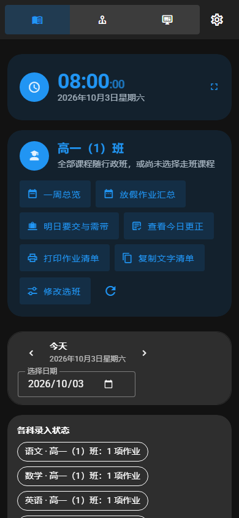

图 S-1：当前学生手机首屏。不是空数据页，下面实际有六科作业。

### 5.1 主要问题

| 问题 | 证据与影响 | 建议 |
| --- | --- | --- |
| 正文入口太深 | **[实测]** 390px 下第一张卡片从 1414px 开始；360px 下从 1537px 开始 | 把班级／日期／轻量状态收为紧凑页头，作业进入首屏 |
| 时钟权重过高 | **[实测]** 手机顶部是一张至少约 108px 高的独立时钟卡 | 学生默认只需日期；完整时钟保留在工具入口或可选设置中 |
| 低频操作全部常驻 | **[实测]** 周览、假期、明日、更正、打印、复制、选班、刷新同时出现 | 优先“今天／明日”，其余进入有文字的“更多”；按真实使用频率确认 |
| 状态摘要展开过长 | **[源码＋实测]** 学生端六科状态逐项展示，还重复班级信息 | 默认显示数量摘要与异常项；需要时展开完整状态 |
| 手机模式导航只剩图标 | **[源码＋实测]** 小于 460px 时隐藏文字，三个角色占据顶部主要空间 | 保留当前角色文字，把切换角色收进明确菜单；不要依赖触摸设备的 hover 提示 |
| 作业卡片重复信息偏多 | **[实测]** 分科标题与卡内科目重复，默认“普通”也成为标签 | 分科标题承担科目识别；卡片只保留必要的目标差异、确认和截止信息 |

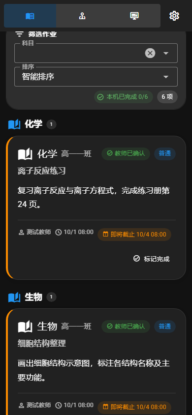

图 S-2：正文能完整阅读，但标题、科目、班名、标签、作者与时间分散在多行。

### 5.2 建议布局

**[建议，尚未实现]**

```text
班级与走班摘要                            更多
今天 10 月 3 日             前一天 / 选择日期
6 项作业 · 1 项待确认 · 明日需带 1 项
────────────────────────────────────
数学                              明早交
必做正文……
选做／提交说明……                  标记完成
────────────────────────────────────
语文……

按需入口：明日要交与需带、周览、假期、打印／复制、选班
```

这里的核心不是减少可用功能，而是让最常发生的“看作业”先完成。可在 390 × 844 的固定验收样本中，以**第一段正文在约 320px 内开始**作为候选目标；遇到重要通知、异常或首次选班时允许例外。该数值是项目建议，不是通用标准。

### 5.3 必须保留的真实语义

- “尚未录入”不能合并成“无作业”；明确无作业与未确认要继续区分。
- 完成标记是**本机记录**，不要通过设计让学生误以为已向教师提交。
- 作业完成后被更正，必须清楚显示“完成后有更新”，不能只保留绿色勾。
- 走班作业的来源不能因精简班名而丢失。
- 有离线缓存时保留最近同步与时效提示。
- 长正文直接可读，不能为了整齐把关键要求永久省略。

学生端的明日、周览、假期、打印／文字分享适合共用一组摘要组件；各视图保留独立日期与范围说明。打印布局本次未做纸面或 PDF 验收。

依据：S01、S03、S04、S10、S11。

<a id="teacher"></a>
## 6. 教师端：把发布和管理组织成任务

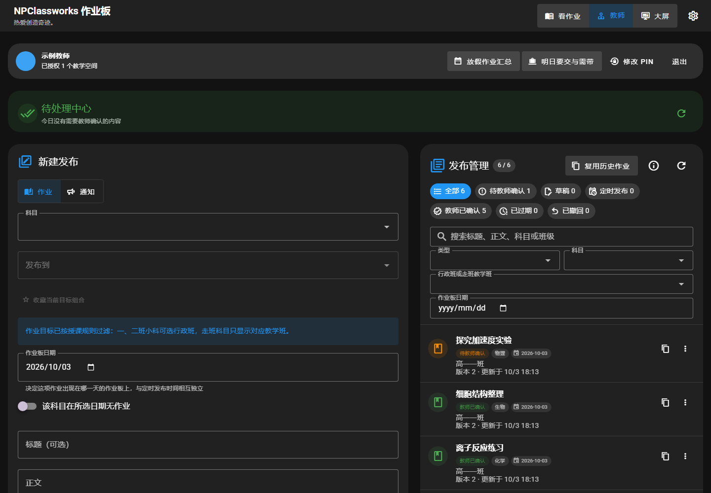

图 T-1：桌面两栏有合理基础，但正文输入靠后，右栏筛选和标签占用较大空间。

### 6.1 桌面端的合理之处

新建发布与已有记录并列，便于参考和修改；教师确认、历史复用、草稿、定时发布及版本历史的入口符合实际教学工作。管理员入口也没有混进学生正文。

这部分不需要为了统一三端而改成大屏式展示板。

### 6.2 主要问题

| 问题 | 当前表现 | 影响与优化方向 |
| --- | --- | --- |
| 表单首段过长 | **[实测]** 1440px 桌面正文输入框 `y=952`；390px 手机为 `y=1088` | 优先放置科目、目标、日期和正文；收藏、说明及高级配置按需展开 |
| 手机发布管理过深 | **[实测]** 手机发布管理从 `y=2596` 开始 | 手机采用“待处理／发布／记录”的任务切换，独立编辑页或全屏编辑层 |
| 空待处理区仍占整张卡片 | **[源码＋实测]** 无任务时仍有大面积绿色背景和图标 | 常态压缩为一行；有待处理或冲突时再展开 |
| 右栏筛选密度偏高 | **[源码＋实测]** 七种状态加搜索、类型、科目、班级、日期 | 默认突出待确认、已发布、草稿；其余进入筛选区，保留筛选结果数量 |
| 主操作离输入远 | **[实测]** 当前默认表单的正式发布按钮在较低位置 | 编辑状态提供固定或吸底操作区，并防止遮挡输入与手机键盘 |
| 账号操作侵占工作区 | **[实测]** PIN、退出、汇总与身份同列，手机占多行 | 身份收为简短头部；账号设置进菜单，教学动作留在任务区 |

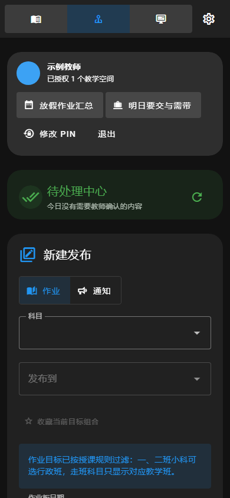

图 T-2：手机首屏还没有正文输入，更没有发布记录。

### 6.3 建议按设备改变任务结构

**电脑：**

- 保留记录与编辑并行的能力；可考虑“记录列表＋编辑区”，或保留现有两栏并缩短表单首段。
- 常用科目与班级可恢复最近选择，但必须显示真实目标，不能把“记住选择”变成静默误投。
- 文本输入、日期、目标、提交状态应在同一视线范围内形成明确层级。
- 带风险的撤回、恢复、覆盖更正，与普通查看、复用分开。

**手机：**

- 默认显示待处理与最近发布，提供显著的“新建作业／通知”。
- 新建时进入专门编辑页面；保留草稿、退出确认、重复提交保护及冲突处理。
- 将正文与常用字段前置，选做、携带、定时、模板等按任务展开。
- 软键盘弹出时仍能看见当前输入；固定按钮应跟随可视视口处理，不能只按静态 844px 截图验收。

**教师平板／较窄电脑：**

现有布局在低于 `lg` 断点后会堆成一栏。应允许列表与编辑切换，不必坚持在窄视口同时呈现全部内容。

### 6.4 不能因美化而损失的能力

教师已确认与正式发布不是同一概念；更正、恢复和复制也不能改成模糊的“保存”。版本冲突必须保留原输入与差异，历史复用要继续要求核对新日期和班级。状态可以更简洁，但语义不能变少。

依据：S01、S12、S13、S14、S15。

<a id="screen"></a>
## 7. 班级大屏：同时照顾远看与近触

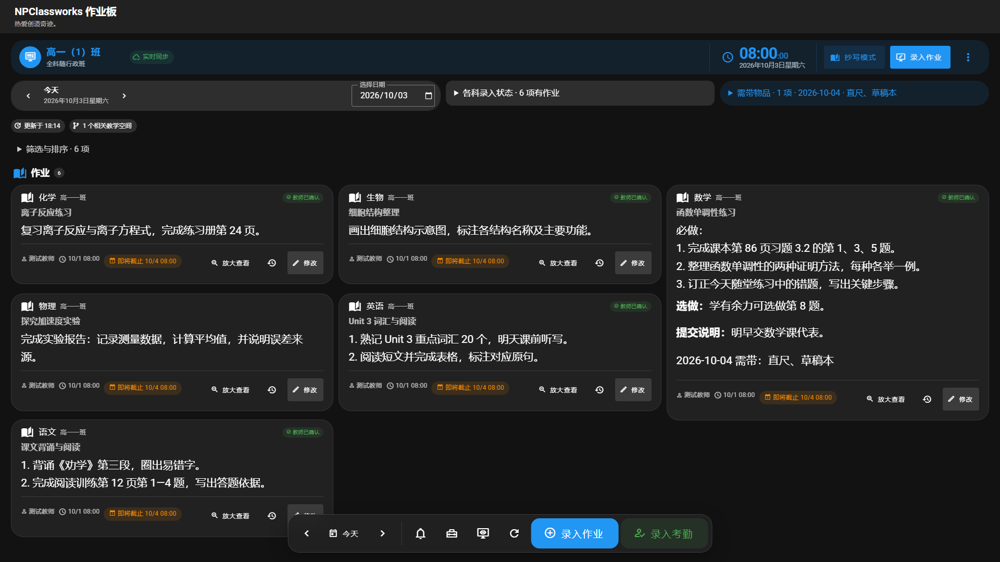

图 B-1：固定操作栏易接近，正文优于普通网页字号；顶部信息层与卡片元信息仍占据不少空间。

### 7.1 大屏最需要保护的特点

现有底部常驻操作栏不是多余装饰。老师或学生站在一体机前，底部比顶端更容易触及；左／中／右定位也有实际用途。录入和考勤有较大文字按钮，部分图标目标达到 56px，设计方向合理。

抄写、放大与正常看板承担不同任务，不宜合并成一种密集列表。大屏也不应照搬手机的完成勾选与个人工具。

### 7.2 主要问题

| 问题 | 证据 | 判断 |
| --- | --- | --- |
| 常驻信息层偏多 | **[实测]** 1080p 作业区从约 355px 开始，约占视口高度 33%；1280 × 720 下约 51% 高度之后才到作业区 | 品牌栏、班级时钟栏、日期／状态、更新信息、筛选和标题可合并层级 |
| 默认正文未随更大 CSS 视口变大 | **[源码＋实测]** 130% 默认比例下，1920 与 3840 CSS 宽度均为 20.8px | 需要设备阅读预设；不能只增加到五列 |
| 科目与元信息相对偏小 | **[源码]** 科目标题有较低 clamp 上限，元信息为 0.75rem | 远看必须明确辨认科目；细节可以转为近距离操作信息 |
| 短作业卡片的附属内容占比高 | **[实测]** 一行作业仍带标题、作者、发布时间、截止、放大、历史、修改 | 只常驻必要截止／更正／确认，其他信息在操作态展开 |
| 瀑布布局阅读顺序不够稳定 | **[源码＋观察]** dense 网格、按内容高度排布，长卡片还可能跨列 | 对经常寻找同一科目的教室用户，应验证固定科目位置是否更好 |
| 浮栏会遮到初始视口下方局部卡片 | **[实测]** 示例页底部操作栏覆盖末张卡片一部分 | 已有底部留白可通过滚动完整访问，不能写成永久遮挡；可优化常显区域与编辑态位置 |
| 节能模式仍有局部模糊 | **[实测]** 底部栏 `backdrop-filter: blur(14px)` 仍生效 | 属于需要弱机测试的合成成本，不等于已证实卡顿 |

### 7.3 建议：分清展示与操作

**[建议]** 常态页可以收敛为三层：

```text
高一（1）班        今天 10 月 3 日        同步正常 / 异常
────────────────────────────────────────────
语文             数学                 英语
正文……           正文……               正文……
物理             化学                 生物
正文……           正文……               正文……
────────────────────────────────────────────
通知 / 抄写 / 工具              录入作业      考勤
```

此示意不要求六科永远等高，也不要求所有作业必须塞在一屏。内容较长时，可使用合理滚动、跨列或抄写页；不能通过缩小正文、隐藏选做／提交要求来追求表面整齐。

- **展示态**：减少修改、历史、作者等操作信息；科目、正文、截止、更正与异常最清楚。
- **操作态**：触摸具体卡片或进入录入后，展示编辑、历史与完整来源。
- **抄写态**：继续突出单项正文与明确的进度、上一项／下一项，保持暂停与退出可见。

建议提供“近距离操作／普通教室／后排阅读”等预设，同时展示字号和列数的实际预览。预设是否适用应由教室后排验收决定，不由面板分辨率单独决定。

### 7.4 录入与抄写

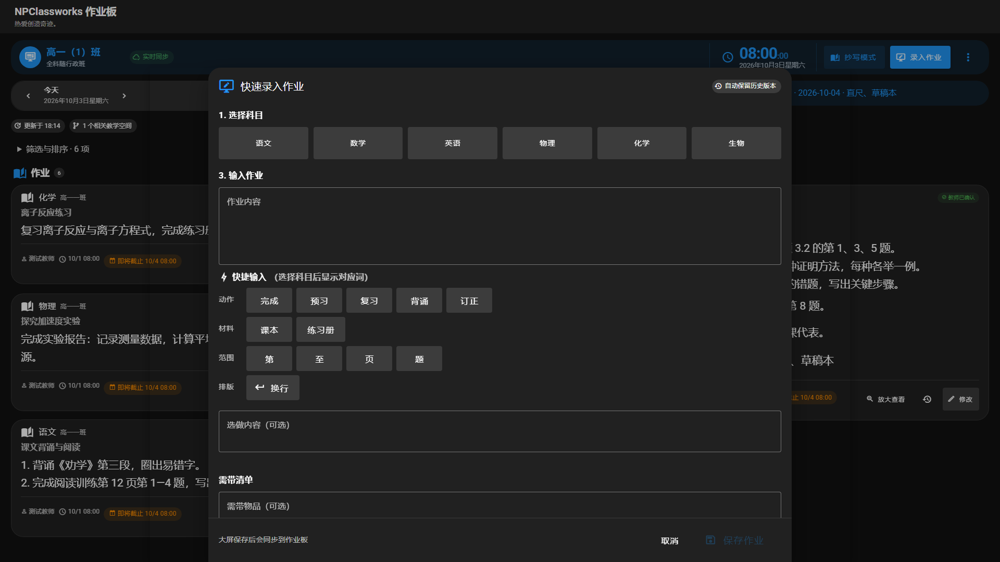

图 B-2：大按钮选科、短语输入、粘性底部操作有实际价值。首次打开未选科时，步骤从“1”跳到“3”，因为“发布到”按条件出现；可用无编号分区或稳定步骤说明减少困惑。

输入区可以进一步突出正文，把选做、需带、提交说明组织为清楚的可选分区；快捷短语按当前科目和常用内容逐步显示。不能为了减少按钮而删除大屏触摸输入的效率工具。

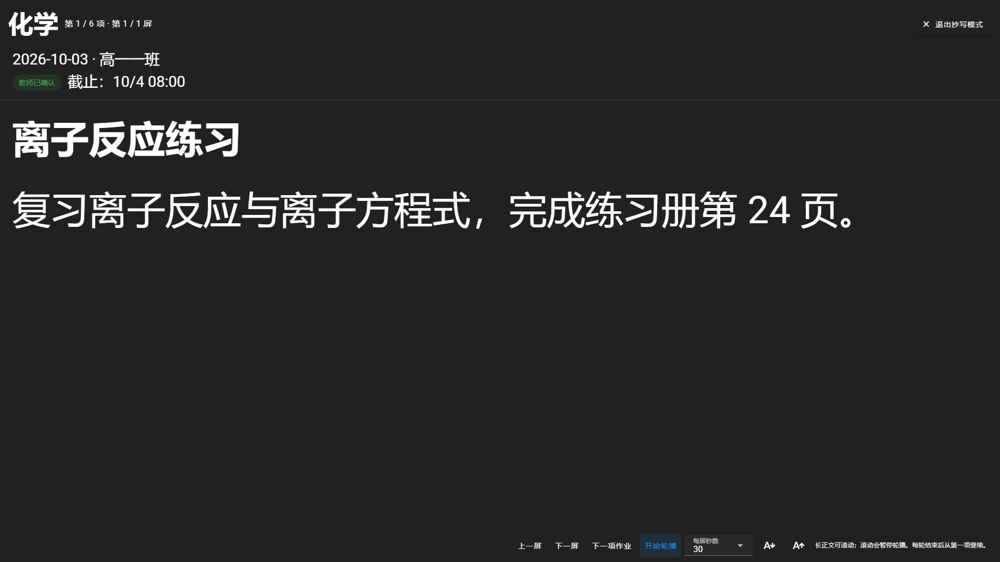

图 B-3：这是现有设计中任务最明确的页面之一。正文优先、字号足够大、进度可见，值得作为其他展示态的参考。仍应检查长文分页、滚动时暂停轮播、退出后回到原位置与焦点，以及真实触屏下的底部控制。

依据：S02、S03、S16、S17、S18。

<a id="support"></a>
## 8. 配套界面：设置、管理、工具与通知

### 8.1 设置：分组已经清楚，需要收住角色边界

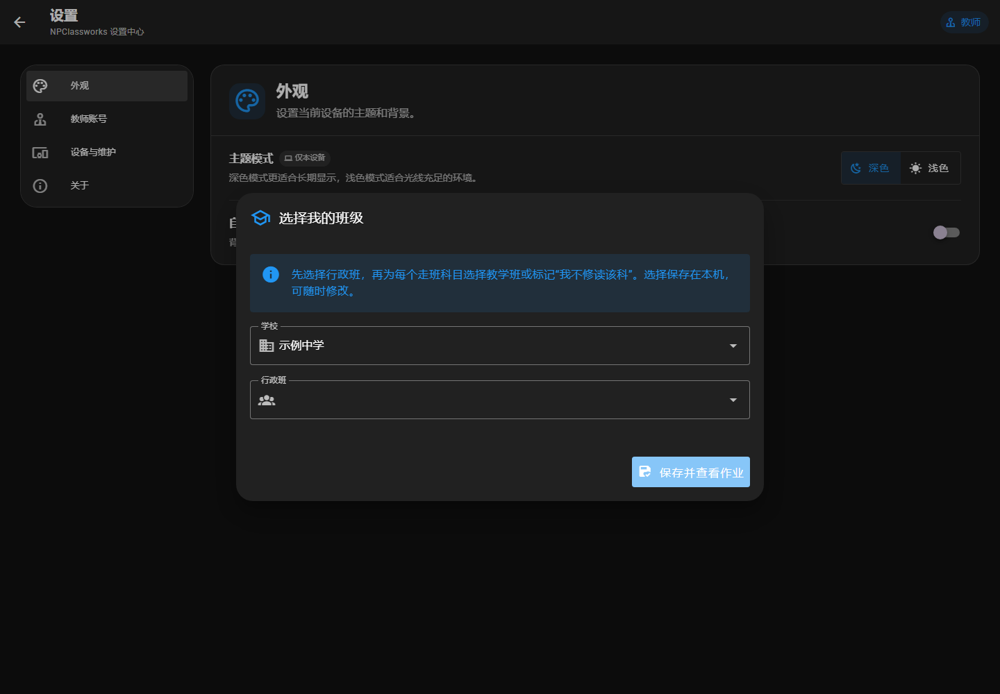

图 A-1：使用已登录教师、没有学生选班记录的浏览器，点击主页“设置”，进入教师设置上下文后仍弹出“选择我的班级”。

**[实测＋源码]** 设置页挂载时同时调用学生、教师、大屏三种初始化；当前样本中学生初始化触发了选班框。它可以关闭，不是页面完全不可用，但会让教师误以为必须再配置学生身份。

**[建议]** 按当前设置上下文加载必要资料；其他身份的初始化不能自动抢占前台。是否增加一个身份的设置入口，与是否立即弹出该身份的引导，应分别控制。

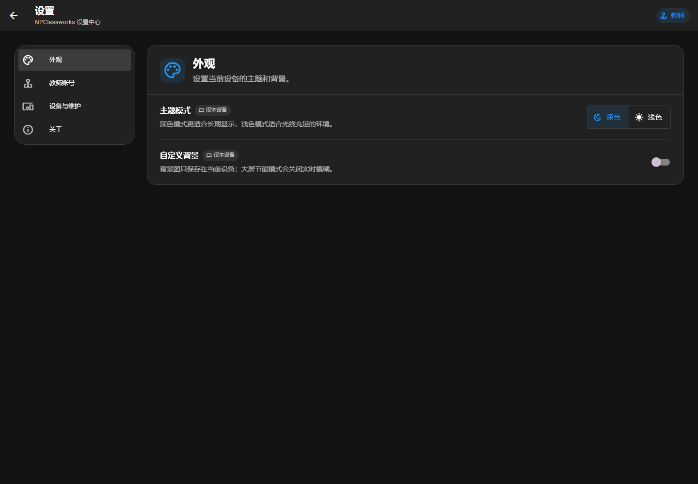

图 A-2：关闭选班框后的设置页。左侧分组、右侧设置行、设备作用范围标签已经比较清楚，适合沿用。

优先改善设置的文字和预览：让用户先看到设置结果，例如字号和列数的预览、背景对正文对比度的影响，再给出详细说明。保留“当前设备／当前大屏／账号”等作用范围，避免美化后产生“这个设置会影响全校”的误解。

依据：S19。

### 8.2 学校管理：范围选择重复，主要任务出现得晚

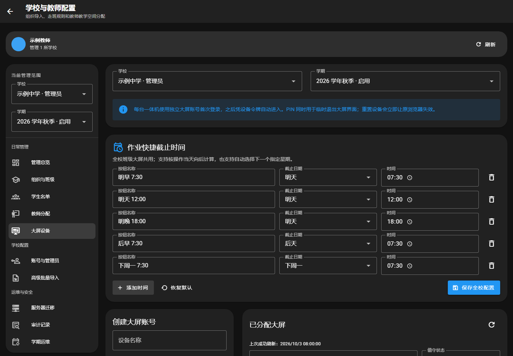

图 A-3：大屏管理页 1440 × 1000。左侧已有学校、学期；右侧再次出现同类选择。全校快捷截止设置占据前部，具体大屏账号任务从约 868px 才开始。

**[建议]**

- 将学校／学期作为统一上下文，固定在导航或页头之一；内容区显示简洁的范围摘要。
- “大屏管理”先显示账号与设备列表、在线状态、搜索和新增入口；“作业快捷截止时间”放进清楚标注的学校作业设置。
- 新建、编辑尽量从列表进入抽屉或对话框，避免每次查看记录都先穿过完整创建表单。
- 宽屏适合对齐的表格或紧凑列表；手机使用保留关键列语义的摘要行，不要求把所有表格挤进窄屏。
- 人员、组织、任课、职责已有独立页签和诊断入口，应保留这种业务分组；进一步统一列表行、筛选条、空状态和页内标题即可。

这里调整的是信息组织。权限、删除影响、迁移确认、PIN 校验和操作审计不能因“界面更清爽”而被去除。

依据：S20、S21、S33、S34。

### 8.3 其他工作流的覆盖与方向

本表主要依据组件模板与调用关系，不表示每个交互都完成了设备实测。

| 界面 | 当前设计价值 | 优化方向与边界 |
| --- | --- | --- |
| 首次使用／角色选择 | 角色入口独立，能说明学生、教师和大屏的区别 | 保持短解释和明确主按钮；手机一次只强调一个下一步；记住选择后减少重复引导。不要把管理员登录和学生选班混在一起 |
| 学校初始化 | 已有快速上线与完整配置、逐步创建组织／教师／大屏的流程 | 用持续可见的步骤摘要说明“已完成／可稍后”；表单优先，JSON 与迁移工具作为明确的高级路径 |
| 学生选班／走班选择 | 表达真实教学空间，不能简单替换成一个班级下拉框 | 用学校→行政班→所需走班的顺序渐进展示；在提交前汇总范围，清楚区分“不参与”和“还没选” |
| 一周、假期、放学核对 | 服务不同时间范围，具有实际使用场景 | 统一日期范围摘要、筛选和结果样式；保留各自查询语义，不能只换标题后共用错误的日期筛选 |
| 打印与复制 | 已有预览和文本／打印模式，适合离线使用 | 屏幕预览与纸面版式分开验收；突出班级、日期、必做、选做、提交和更正，不把暗色背景带入打印 |
| 模板与历史复用 | 有助于减少教师重复输入 | 列表扫描优先，预览与应用分步；清楚展示复用后的日期和目标，避免用户误以为点击模板已发布 |
| 发布预览／发布结果 | 区分“尚未发布”和发布后的目标结果 | 保留明确的阶段词与各目标结果；成功页可更简洁，但部分成功、未投递和失败必须可辨 |
| 历史与更正 | 支持版本追溯，避免修改后失去依据 | 以版本、时间、作者和变化摘要组织时间线；完整快照按需展开；界面不能暗示删除历史等于撤回事实 |
| 通知中心／紧急提示 | 已区分常驻提醒、通知列表、弹出和确认 | 建立普通／重要／必须确认的统一视觉等级；普通通知安静展示，必要确认仍有清楚按钮，不能以自动收起代替确认 |
| 课堂工具／考勤 | 全屏工具入口与较大触控目标适合一体机 | 让工具列表按任务分组，统一进入与返回；考勤优先展示班级、名单、已处理人数和保存状态，减少装饰 |
| 噪音监测与报告 | 已表达设备、来源、运行与结果；说明 dBFS 不是实际声压级 | 顶部先回答“正在测吗、哪台设备、当前信号、是否有效”；原理、校准与诊断下沉。保留单位与限制，不把 dBFS 包装成声压级 |
| NPEP 设备／运行／考试控制 | 能表达设备关联、回执、历史与未知状态 | 用“设备摘要→当前任务→最近结果→诊断详情”组织；诊断 ID 可复制、默认收起；请求已发送、设备已执行、部分完成与未知必须分开 |
| PWA 安装／更新／恢复 | 有安装推迟、更新提醒和刷新保护入口 | 提示与底部工具栏共享避让规则；输入过程中不抢焦点；更新操作保留草稿／待上传保护，不能靠自动刷新消除提示 |

设备界面尤其适合“短摘要＋可展开证据”，不能靠一个绿点取代真实执行状态。学校管理是复杂业务工具，信息密度高本身不是缺陷；应让用户按任务找到所需信息。

`debug.vue`、`socket-debugger.vue` 和错误兜底页属于诊断／异常辅助界面，本次仅纳入页面清单，未做逐状态视觉验收。噪音权限、真实考试执行、迁移与纸面打印也未实际触发。

依据：S15、S22—S26、S29、S31—S35。

<a id="design-system"></a>
## 9. 建议建立的视觉规范

### 9.1 视觉方向：温暖、清楚、克制

**[建议]** 沿用现有暖橙标识，配合温和中性色、明确的中文排版和较少的容器层级。不要通过大面积渐变、发光、玻璃模糊或多种强调色来制造“精致感”。

产品的识别可以来自持续一致的小细节：页头标记、主操作颜色、科目标题、日期条、图标和文字对齐。大面积背景与正文保持安静，让作业内容成为最醒目的部分。

下表是候选色值，尚未实施；这里只给出少量已计算的配色对，不表示整个候选主题已通过可访问性审查。

| 语义 | 浅色候选 | 深色候选 | 用法 |
| --- | --- | --- | --- |
| 页面底色 | `#F6F5F2` | `#171918` | 温和中性背景，降低纯白／纯黑的大面积反差 |
| 正文表面 | `#FFFFFF` | `#202320` | 作业、编辑区等独立内容 |
| 主要正文 | `#232624` | `#EEF0EC` | 正文与关键标题 |
| 品牌标识 | `#D97732` | `#F2B56B` | 图标、装饰、小面积识别；不是通用状态色 |
| 主操作 | `#A94E24` 配白字 | `#F2B56B` 配深色字 | 白字／`#A94E24` 的纯色对比度约 5.52:1；深色方案仍须逐控件验收 |
| 边界与次要文字 | 按表面单独定义 | 按表面单独定义 | 不依赖一律降低 opacity；避免标签消失在背景中 |
| 状态 | 另设成功／警告／危险／信息色对 | 同左，单独调整亮度 | 状态必须同时有文字或图形含义 |

现有品牌橙 `#D97732` 配白字只有约 **3.16:1**，不适合作为普通字号按钮的默认配色。品牌颜色可以保留在 Logo 中，界面动作色则应按用途选择合格的前景／背景组合。[WCAG 文字对比度说明](https://www.w3.org/WAI/WCAG22/Understanding/contrast-minimum.html)

### 9.2 字体与信息层级

| 文字角色 | 学生手机候选 | 教师电脑候选 | 大屏候选 |
| --- | --- | --- | --- |
| 页面／任务标题 | 22—26px | 24—28px | 28—36px |
| 科目／卡片标题 | 18—20px | 17—20px | 26—32px |
| 作业正文／编辑文字 | 16—18px | 15—17px | 28—36px 起做现场验证 |
| 重要截止／异常 | 14—16px | 14—16px | 22—28px，远看也能读到 |
| 辅助说明／元信息 | 13—14px | 13—14px | 近触详情可 14—18px，展示态少放 |
| 正文行高 | 1.55—1.75 | 1.5—1.7 | 1.45—1.65，随行长验证 |

这些是原型起点，不是通用硬标准，也不是“4K 必须用多少 px”的结论。字号最终还要与物理屏幕、缩放、观看距离、汉字复杂度和照明共同验收。

- 中文优先清楚稳定的系统字体回退，如 Microsoft YaHei、PingFang SC 与 sans-serif；拉丁与数字字体要搭配协调。
- 正文不必全部加粗。可用 400／500 的正文与 600／700 的标题形成层级，具体检查目标平台字体是否支持。
- 作业内容保留换行、编号和必做／选做结构；宽卡片控制行长，不让单行横跨整个大屏。
- 不为统一字形默认引入整套大体积中文 Web 字体。实际字体选择与网络成本都应可验证。

### 9.3 间距、形状与容器

建议采用 `4 / 8 / 12 / 16 / 24 / 32` 的间距梯度，固定“同组紧、跨组松”的含义。普通卡片圆角可从 12—16px、输入与按钮 8—12px、对话框 16—20px 起做统一比较；触控目标尺寸与视觉圆角独立处理。

一个页面尽量明确三层：页面背景、独立内容、内容内的轻量分区。对比足够时用间距和细边界，不再给每个小节增加阴影或厚底色。

列表需要统一左边线、标题基线、图标框、日期位置与尾部操作。即使没有新增装饰，稳定对齐也会显著改善秩序感。

### 9.4 组件规范共享，页面结构分端

| 应共享的规范 | 应保留的差异 |
| --- | --- |
| 颜色语义、字体角色、图标含义、状态文案 | 学生阅读、教师输入、大屏展示的内容顺序 |
| 按钮主次、危险操作、禁用／加载反馈 | 手机与一体机的触控尺寸、操作位置 |
| 作业结构、确认、更正、截止和同步语义 | 卡片元信息密度、是否常驻操作 |
| 弹窗标题、关闭、滚动、焦点与底部安全区 | 手机全屏编辑、电脑并排、大屏大按钮 |
| 验证错误、空状态、成功反馈 | 管理端表格与学生端阅读列表 |

实施时先建立语义 token 和少量稳定变体，再逐页面替换零散硬编码。避免将全部页面塞入一个带大量角色条件的“大组件”，也无需为三端复制完整业务逻辑。

依据：S01—S09、S16—S19、S28。

<a id="performance"></a>
## 10. 性能与设备差异

### 10.1 三端关注的性能不同

| 端 | 最需要控制的成本 | 建议观察的方法 |
| --- | --- | --- |
| 学生手机 | 冷启动、移动流量、首段内容等待、滚动与续航 | 真机弱网／冷缓存；记录首屏正文出现、滚动、切科与刷新 |
| 教师电脑／手机 | 长表单输入、筛选、弹窗首次打开、软键盘与草稿稳定 | 输入时延、打开编辑／模板、批量列表、切换任务后恢复 |
| 班级大屏 | 多小时常显、持续 CPU／GPU、动画与模糊、内存增长、离线重连 | 实际旧一体机持续运行；比较高效／丰富模式，记录后台与前台 |
| 学校管理 | 数据量扩大后的列表和筛选 | 按真实学校规模构造人员、班级、设备和日志数据 |

首屏的视觉优化与性能优化可以协同：减少学生首屏非必要组件，让主要内容更早可见。但“首段内容位置靠上”本身并不能证明网络加载更快。

### 10.2 已有基础应保留

**[源码]**

- 复杂弹窗和部分管理功能已经异步加载。
- 作业网格通过 ResizeObserver 与 requestAnimationFrame 调度测量，已有读写组织；不能笼统说成“每秒全页重排”。
- 时钟在页面不可见时有停止更新的处理。
- 大屏具有高效模式；声音和完整背景资源没有全部进入默认预缓存。
- 当前没有必要为了视觉改版立即引入另一套组件库、图表库或动画库。

需要核对的候选成本是：高效模式下底部栏仍有 `backdrop-filter: blur(14px)`；部分只有日期粒度的派生数据仍由秒级时间源驱动；旧样式规则和整套图标资源可以整理。它们是分析与测量入口，**本次未证明这些项目已造成真实掉帧或高占用**。

### 10.3 当前构建资源证据

以下来自本次 E2E production build 的静态文件，并计算 gzip 后体积；不是线上抓包的实际传输量，也不能直接相加得到首屏加载量。

| 资源 | 原始体积 | 计算 gzip 体积 | 解读 |
| --- | ---: | ---: | --- |
| 主样式 `index-z8yovT6c.css` | 665.9 KiB | 94.7 KiB | 可检查框架、图标、全局与旧样式的实际命中 |
| MDI WOFF2 字体 | 393.8 KiB | 386.0 KiB | 可评估仅使用的图标／SVG 方案，但要核对全部动态图标与回退 |
| `index-E6IJbeWb.js` | 293.0 KiB | 91.8 KiB | 大文件之一；需通过依赖图确认内容，不能仅凭文件名认定全是主入口 |
| 学校管理 chunk | 204.9 KiB | 53.5 KiB | 路由加载与缓存策略需要分别观察 |
| `index-BxfhTnaK.js` | 166.7 KiB | 51.9 KiB | 同属构建产物，实际请求路径需抓包确认 |

同时存在 EOT、TTF、WOFF 和 WOFF2，是字体的多种格式；**不能把四份体积都算作每台现代浏览器必然下载的成本**。

Vite 的当前 PWA 配置会预缓存匹配的 JS、CSS、字体等文件。因此“异步组件减少初始解析”和“安装 Service Worker 时可能下载更多分块”可以同时成立。改缓存策略前先测冷访问、已安装 PWA、更新与离线四种路径；本次截图为了场景隔离禁用了 Service Worker，没有验证该过程。

依据：[资源体积记录](../docs/ui-review-20261003/asset-sizes.json)、S03、S11、S27、S28。

### 10.4 优化顺序

1. 用实际目标设备建立基线，记录版本、视口、缩放、缓存、网络、数据量与电源模式。
2. 优先移除首屏不需要的布局工作和重型视觉效果；保持图片、音效、工具按需载入。
3. 分析图标字体和 CSS；只有确认覆盖后再裁剪，避免无声丢图标。
4. 按业务精度选择更新时间源；时钟、考试计时与日期提醒不能统一降频。
5. 学校规模变大时再评估分页或虚拟化；不要为了短作业列表增加复杂滚动机制。

可用 Core Web Vitals 的良好阈值作为 Web 性能参考：第 75 百分位 LCP ≤ 2.5s、INP ≤ 200ms、CLS ≤ 0.1。它们来自真实访问分布的衡量方式；一次本机截图不能给出这些结论，而且仍需补充大屏持续运行指标。[web.dev：Web Vitals](https://web.dev/articles/vitals)

<a id="accessibility"></a>
## 11. 可访问性与易用性

### 11.1 一个已确认的文字对比度问题

**[实测]** 深色大屏顶部“录入作业”为启用状态，字号 14px、字重 500、白色文字、背景 `#2196F3`。纯色前景／背景对比度约 **3.12:1**，低于普通文字要求的 4.5:1。

此处不是禁用控件，也不能因为按钮尺寸较大就套用“大号文字”阈值。WCAG 大号文字门槛约为 24 CSS px 常规字，或 18.66 CSS px 粗体。[WCAG 文字对比度说明](https://www.w3.org/WAI/WCAG22/Understanding/contrast-minimum.html)

建议把按钮文字与背景作为配色对修正，覆盖浅深主题、悬浮、聚焦、按下和加载态。链接、标签和半透明提示另行检查；本次没有对所有状态进行完整 WCAG 审计。

### 11.2 触控尺寸、焦点与重排

- **点击目标**：WCAG 2.2 AA 的最低目标尺寸是 24 × 24 CSS px，并存在间距等例外；44px 不是此项 AA 的统一门槛。实际产品可把手机主操作目标定为 44—48px、大屏为 56—64px 以提高容错。本次多数手机按钮已有 44px、大屏底部常用按钮已有约 56px，应保留。[WCAG 目标尺寸说明](https://www.w3.org/WAI/WCAG22/Understanding/target-size-minimum.html)
- **图标导航**：学生窄屏模式导航隐藏了文字，熟悉图标的人能用，首次使用者识别成本更高。可保留短文字或使用明确的模式菜单；不能把“有 tooltip”当作触摸场景的充分解释。
- **键盘与焦点**：既有焦点处理需要延续到模板、编辑、抄写和管理抽屉；关闭后返回触发位置，主操作不能被固定栏遮住。
- **重排与缩放**：至少增加 320 CSS px 宽度、200% 文字缩放和软键盘打开后的检查。本次最小视口是 360px，尚未证明 320px 通过。数据表等二维内容可以按适用例外单独处理。[WCAG 重排说明](https://www.w3.org/WAI/WCAG22/Understanding/reflow.html)
- **动态效果**：已有部分 reduced-motion 处理，应覆盖全局过渡、悬浮与持续装饰效果；大屏高效模式还应与这些设置配合。没有实际命中的旧动画不作为当前缺陷。

### 11.3 状态表达不能只靠颜色

“已确认／未确认”“没有作业／尚未录入”“已同步／待上传／失败”“请求已发出／设备已执行”必须在文字上可区分。视觉优化应减少常态噪声，提高异常识别，不能让所有状态都只剩绿色、橙色和红色圆点。

表单错误就近说明原因和修正方式，页面级错误说明影响范围与重试入口。成功提示应短而稳定；自动同步不应不断抢占焦点或重复播报。

依据：S01、S02、S09、S17—S26。

<a id="priorities"></a>
## 12. 问题清单与优先级

P1 表示直接影响高频任务、理解或基本可读性，优先处理；P2 表示系统性改善；P3 表示数据与真机验证后再决定。下列优先级是本次建议，不代表已经排期。

| ID | 优先级 | 问题／工作项 | 证据 | 主要收益与注意事项 |
| --- | --- | --- | --- | --- |
| U01 | P1 | 学生手机正文之前的内容过长 | 实测：390px 第一张卡片 y=1414 | 先看到作业；保留异常、日期与范围 |
| U02 | P1 | 教师手机管理区被长表单推到很后面 | 实测：管理区 y=2596 | 独立发布／管理任务入口；切换保护草稿 |
| U03 | P1 | 教师主要输入出现在多个配置与说明之后 | 实测：手机正文输入 y=1088 | 常用配置摘要化、正文前移；不省略目标核对 |
| U04 | P1 | 深色主按钮白字对比度不足 | 实测＋计算：14px、3.12:1 | 明确动作可读性；浅深主题和交互态一起检查 |
| U05 | P1 | 教师设置被学生选班流程打断 | 实测＋源码 | 当前角色任务保持连贯；区分加载资料与触发引导 |
| U06 | P1 基础项 | 品牌、字体、间距和状态缺少统一规范 | 源码＋多页截图 | 支撑后续改版；先少量组件验证，再逐页推广 |
| U07 | P2 | 大屏顶部条带与重复操作占用较多空间 | 实测：1920 下作业区 y=355 | 提高正文占比；保持全班可见的同步／异常 |
| U08 | P1 先验证 | 大屏自动增列但默认正文不随物理观看条件调整 | 实测：FHD／4K 均 20.8px；实际后排尚未测 | 先做实际距离阅读验收，再设预设与列数 |
| U09 | P2 | 作业元信息、标签、说明框与卡片层级重复 | 实测＋源码 | 降低视觉噪声；异常信息不能被一起弱化 |
| U10 | P2 | 管理页重复上下文，设置抢占列表位置 | 实测：大屏管理页 | 对齐页面名称与主要任务；设置作用范围仍明确 |
| U11 | P2 | 工具／噪音／NPEP 的摘要与诊断层级可优化 | 源码，未做真实设备执行 | 加快状态判断；保留单位、未知与部分完成 |
| U12 | P2 先测量 | 图标字体、全局样式和 PWA 预缓存成本 | 构建资源＋配置 | 降低手机成本；检查图标完整性和离线路径 |
| U13 | P2 先测量 | 高效模式仍有底栏模糊等候选持续成本 | 计算样式＋源码，未证明掉帧 | 旧机按实测选择；不删除必要触控反馈 |
| U14 | P2 | 窄屏只剩图标的模式入口不够直观 | 实测＋源码 | 降低首次识别成本；避免增加过高导航 |
| U15 | P2 | 录入步骤编号、说明和可选区域层级不一致 | 大屏录入实测＋教师表单源码 | 提高输入扫描效率；保留大屏快捷短语 |
| U16 | P2 | 弹窗、底部栏、PWA 提示需要统一避让与焦点规则 | 源码；部分大屏叠加状态实测 | 软键盘、触屏和键盘都可操作；不能只看静态图 |
| U17 | P3 | 更丰富动效、背景与个性化风格 | 设计方向，暂无需求频率证据 | 基础问题解决后再考虑，允许关闭 |

本次没有发现需要停止使用产品的 UI 级阻断证据；这不是完整功能、权限或安全审计结论。最先投入的范围应围绕 U01—U06，U08 的真机阅读验证可同步进行。

<a id="plan"></a>
## 13. 分阶段优化计划

### 13.1 按完整任务交付，不同时改散所有页面

| 阶段 | 交付范围 | 主要验收 |
| --- | --- | --- |
| UI.1 基础视觉＋学生首页 | 最小主题 token、按钮文字对比度、学生页头／导航／作业卡片与异常摘要 | 学生首屏正文、浅深主题、日期／走班／更正／完成语义保留；其他端没有主题回归 |
| UI.2 教师发布与管理 | 电脑布局调整、手机任务入口、正文输入位置、管理筛选、设置角色打断问题 | 发布／更正／确认／复用／切换任务；目标明确、草稿稳定 |
| UI.3 大屏展示与操作 | 展示页头、字号预设、列数与元信息、大屏录入、底部栏避让 | 真实后排阅读、不同系统缩放、手指操作、长文抄写、低配置持续运行 |
| UI.4 配套界面一致性 | 设置预览、管理信息顺序、工具与设备摘要、统一弹窗与反馈 | 学校／学期范围、状态真实性、复杂列表、键盘与错误恢复 |
| UI.5 有证据的性能收敛 | 基于采样结果调整资源、更新频率、效果与缓存 | 冷／热启动、PWA 更新／离线、真机交互、长时间稳定性 |

U04 等小而明确的问题可以在基础阶段解决；涉及信息架构的页面先比较具体原型，再实施。每一阶段只维护一个主要交付目标，避免每页改一点却没有任何端完整可用。

### 13.2 建议的首轮任务卡

| 字段 | 内容 |
| --- | --- |
| 名称 | UI.1：学生先看到作业，并建立最小视觉规范 |
| 问题 | 学生手机首屏被辅助模块占据；品牌与控件不统一；深色主按钮文字对比不足 |
| 目标 | 同一班级、日期和作业数据下，进入页面即可看到作业正文，操作与异常仍易找到 |
| 范围 | 学生页头、日期／科目摘要、作业卡片展示；浅深基础色、文字角色、按钮与间距 |
| 主要模块 | ClassworksHome、HomeworkSubjectStatus、OrganizedHomeworkFeed、HomeworkFeedGrid、Vuetify 主题与相关样式 |
| 保留约束 | 不改变发布／权限／同步协议；未知不变成无作业；个人完成状态不变成班级提交状态；主题变动必须检查三端 |
| 不纳入本轮 | 教师完整工作台、大屏工具重做、NPEP 业务控制、新动画库、后端重构 |
| 验收证据 | 相同夹具的改前／改后截图和 DOM 位置；关键行为回归；学生手机真机使用记录 |
| 完成条件 | 达到第 14 节相关项目，问题清单能对应具体结果，而不是仅提交“换色完成” |

此任务卡是建议的实施边界；本次交付仍仅为分析文档与证据。

<a id="acceptance"></a>
## 14. 验收标准

### 14.1 设备与状态矩阵

| 维度 | 后续至少覆盖 |
| --- | --- |
| 学生 | 360／390px 手机、320px 重排检查、平板、1440px 电脑；至少一台实际 Android 或 iOS |
| 教师 | 390px 手机、平板、1440px 电脑；真实软键盘、中文输入法、粘贴多段内容 |
| 大屏 | 1280×720、1366×768、1920×1080 CSS 视口；实际 1080p／4K 面板、常用系统缩放、后排与近触 |
| 主题 | 浅／深主题；背景关闭及开启后的低对比图片 |
| 内容 | 空列表、六科短文、长作业、多段／编号、选做、需带、提交说明、走班、多班、长名称 |
| 业务状态 | 今日／历史／未来、未录入／无作业、未确认／更正、无权限、离线／缓存／待上传／冲突 |
| 交互状态 | 首次进入、已选班、已登录、输入中切换、弹窗内滚动、更新提示与底栏共存 |
| 设备状态 | 在线、离线、状态未知、历史回执、部分完成；真实噪音与考试控制另作专门验收 |

“三端都能打开”“没有横向滚动”是基础条件，不足以代表布局适用。

### 14.2 建议的可观察结果

下表是后续验收目标，不是本次已经达到的结果。具体阈值应在首轮原型与实际设备上校准。

| 对象 | 建议目标 | 避免的取巧方式 |
| --- | --- | --- |
| 学生 390×844 常态首页 | 当前六科样本第一张作业卡片可从约 320px 内开始，首屏可读正文 | 缩小正文、隐藏异常、截掉必做内容 |
| 学生状态理解 | 能分清未录入、无作业、未确认、更正；一处可检查完整科目状态 | 全部显示成“暂无内容”或只用颜色 |
| 教师手机 | 从主界面一个明确任务入口可进入发布或管理；不穿过整张长表单才能查看记录 | 把所有字段塞进更多弹窗，增加发布步骤 |
| 教师编辑 | 常用目标配置有默认值／摘要，正文容易到达；切换与更新不丢输入 | 隐藏实际班级、日期和截止差异 |
| 大屏阅读 | 后排能识别科目、正文、截止和异常；长文有可发现的放大／抄写路径 | 为放满一屏而缩小字，或静默裁切 |
| 大屏触控 | 录入、保存、取消、返回在手指操作下稳定可达；底栏不妨碍最终阅读位置 | 只在鼠标与无头截图中检查 |
| 对比度 | 启用态普通文字至少 4.5:1；大字适用 3:1 条件；含浅深主题与状态组合 | 只验一个纯色样例，忽略透明度与背景 |
| 可访问性 | 键盘完成主要流程，关闭弹窗返回焦点；缩放、重排与减少动态效果可用 | 以 tooltip 代替可识别的主入口 |
| 性能 | 同设备／同数据比较；Web 指标与首次正文时间不退化，旧大屏长期稳定 | 用本机冷启动一次、文件体积或截图推断实际流畅 |

大屏持续运行可安排一个完整教学时段，例如 6—8 小时，记录 CPU、内存、掉帧、联网恢复和交互响应的变化，并说明是否显示背景、是否运行噪音工具。这里没有给出凭空的通用 CPU 百分比阈值；应先获取同一设备现有版本基线。

### 14.3 本次完成与未完成

- **已完成**：当前分支源码结构与主要样式审阅；三端及代表性配套页面的 21 个状态捕获；布局、字体、颜色与构建资源证据整理；问题分级、视觉规范候选、阶段计划。
- **已验证的范围**：所列主页面在稳定布局下没有整页横向溢出；捕获状态没有未捕获页面异常；设置角色打断可以在隔离夹具中复现。
- **未执行**：UI 源码改版、完整自动化套件、生产环境测试、Android／iOS 真机、实际教室后排和触摸驱动、长期性能、真实噪音／考试控制、纸面打印验收。
- **不应据此推断**：所有页面无 Bug、所有设备都流畅、所有功能已验收、生产部署与当前截图一致。

<a id="sources"></a>
## 15. 源码与证据索引

### 15.1 源码索引

链接指向当前本地文件；其含义对应第 1 节记录的 HEAD。工作区后续变化时，应使用该提交复核，而不是把后来文件的行号当作本次基线。

| ID | 文件 | 主要用于 |
| --- | --- | --- |
| S01 | [ClassworksHome.vue](../src/components/v2/ClassworksHome.vue) | 三端入口、学生／教师信息顺序与断点 |
| S02 | [ClassroomScreenView.vue](../src/components/v2/ClassroomScreenView.vue) | 大屏顶部、底部栏、触控与高效模式 |
| S03 | [HomeworkFeedGrid.vue](../src/components/v2/HomeworkFeedGrid.vue) | 作业卡片、正文、元信息与自动布局 |
| S04 | [OrganizedHomeworkFeed.vue](../src/components/v2/OrganizedHomeworkFeed.vue) | 分组、筛选、标题与展示密度 |
| S05 | [App.vue](../src/App.vue) | 全局布局、提示、主题与背景 |
| S06 | [vuetify.js](../src/plugins/vuetify.js) | Vuetify 默认主题配置 |
| S07 | [settings.js](../src/utils/settings.js) | 当前设备外观设置默认值 |
| S08 | [logo.svg](../src/assets/logo.svg)、[PWA Logo](../public/pwa/image/logo.svg) | 现有暖橙品牌与配色 |
| S09 | [index.scss](../src/styles/index.scss)、[global.scss](../src/styles/global.scss)、[transitions.scss](../src/styles/transitions.scss)、[cards.scss](../src/styles/cards.scss)、[glow.scss](../src/styles/glow.scss) | 全局／旧样式、尺寸与动效；是否命中需分别确认 |
| S10 | [HomeworkSubjectStatus.vue](../src/components/v2/HomeworkSubjectStatus.vue) | 科目状态、完整与紧凑变体 |
| S11 | [PreparationBoard.vue](../src/components/v2/PreparationBoard.vue) | 需带信息、日期与展示密度 |
| S12 | [PublicationComposer.vue](../src/components/v2/PublicationComposer.vue) | 教师发布表单及附属入口 |
| S13 | [TeacherPublicationManager.vue](../src/components/v2/TeacherPublicationManager.vue) | 管理筛选、状态计数与记录 |
| S14 | [TeacherActionCenter.vue](../src/components/v2/TeacherActionCenter.vue) | 待处理任务与空状态 |
| S15 | [PublicationHistoryDialog.vue](../src/components/v2/PublicationHistoryDialog.vue) | 历史版本与追溯 |
| S16 | [screenDisplaySettings.js](../src/utils/screenDisplaySettings.js) | 大屏字号、列数、密度与高效模式默认值 |
| S17 | [ScreenHomeworkDialog.vue](../src/components/v2/ScreenHomeworkDialog.vue) | 快速录入、步骤、触控尺寸 |
| S18 | [ScreenCopyMode.vue](../src/components/v2/ScreenCopyMode.vue)、[ScreenHomeworkFocus.vue](../src/components/v2/ScreenHomeworkFocus.vue) | 抄写、放大与控制 |
| S19 | [settings.vue](../src/pages/settings.vue)、[SettingsPanel.vue](../src/components/v2/settings/SettingsPanel.vue)、[SettingRow.vue](../src/components/v2/settings/SettingRow.vue) | 设置分组、作用范围与角色初始化 |
| S20 | [classworks-admin.vue](../src/pages/classworks-admin.vue)、[AdminNavigationPanel.vue](../src/components/admin/AdminNavigationPanel.vue) | 学校管理信息架构 |
| S21 | [AdminScreenAccountPanel.vue](../src/components/admin/AdminScreenAccountPanel.vue)、[AdminHomeworkQuickDeadlines.vue](../src/components/admin/AdminHomeworkQuickDeadlines.vue) | 大屏账号与快捷截止设置 |
| S22 | [ClassroomToolsDialog.vue](../src/components/v2/ClassroomToolsDialog.vue) | 课堂工具与考勤界面 |
| S23 | [NativeNoisePanel.vue](../src/components/v2/NativeNoisePanel.vue)、[MicrophoneDevicePicker.vue](../src/components/v2/MicrophoneDevicePicker.vue) | 噪音运行信息、单位与设备 |
| S24 | [NoiseScheduleStatus.vue](../src/components/v2/NoiseScheduleStatus.vue)、[NoiseReportList.vue](../src/components/v2/NoiseReportList.vue)、[NoiseScheduleManager.vue](../src/components/v2/NoiseScheduleManager.vue) | 噪音排程与报告信息 |
| S25 | [NpepDeviceManager.vue](../src/components/admin/NpepDeviceManager.vue)、[NpepRuntimeControl.vue](../src/components/admin/NpepRuntimeControl.vue)、[NpepExamPlanControl.vue](../src/components/admin/NpepExamPlanControl.vue) | 设备、运行、考试与回执摘要 |
| S26 | [ScreenNoticePopup.vue](../src/components/v2/ScreenNoticePopup.vue)、[ScreenNotificationCenter.vue](../src/components/v2/ScreenNotificationCenter.vue)、[UrgentNoticeBanner.vue](../src/components/v2/UrgentNoticeBanner.vue) | 通知、紧急信息与确认 |
| S27 | [ClassroomTimeCard.vue](../src/components/v2/ClassroomTimeCard.vue) | 时钟布局与后台更新 |
| S28 | [vite.config.mjs](../vite.config.mjs) | 分块、PWA 预缓存与资源配置 |
| S29 | [ClassworksOobe.vue](../src/components/v2/ClassworksOobe.vue)、[ClassSelectionDialog.vue](../src/components/v2/ClassSelectionDialog.vue)、[ScreenAccountLogin.vue](../src/components/v2/ScreenAccountLogin.vue) | 角色、选班与大屏登录 |
| S30 | [screen-layout.spec.js](../tests/e2e/screen-layout.spec.js)、[functional-review.spec.js](../tests/e2e/functional-review.spec.js)、[admin-screens.spec.js](../tests/e2e/admin-screens.spec.js) | 现有回归场景线索；本次未运行完整套件 |
| S31 | [HomeworkWeekButton.vue](../src/components/v2/HomeworkWeekButton.vue)、[HomeworkHolidayButton.vue](../src/components/v2/HomeworkHolidayButton.vue)、[HomeworkTomorrowButton.vue](../src/components/v2/HomeworkTomorrowButton.vue)、[HomeworkCorrectionsButton.vue](../src/components/v2/HomeworkCorrectionsButton.vue)、[HomeworkPrintButton.vue](../src/components/v2/HomeworkPrintButton.vue) | 时间范围、更正、打印与复制 |
| S32 | [TeacherHomeworkTemplates.vue](../src/components/v2/TeacherHomeworkTemplates.vue)、[TeacherHomeworkReuse.vue](../src/components/v2/TeacherHomeworkReuse.vue)、[PublicationScreenPreview.vue](../src/components/v2/PublicationScreenPreview.vue)、[PublicationResultDialog.vue](../src/components/v2/PublicationResultDialog.vue) | 模板、复用、预览与结果 |
| S33 | [AcademicStructureManager.vue](../src/components/admin/AcademicStructureManager.vue)、[TeachingRelationshipOverview.vue](../src/components/admin/TeachingRelationshipOverview.vue)、[StaffResponsibilityManager.vue](../src/components/admin/StaffResponsibilityManager.vue)、[ClassRosterManager.vue](../src/components/admin/ClassRosterManager.vue) | 组织、任课、职责与名单 |
| S34 | [setup.vue](../src/pages/setup.vue)、[SchoolManagementOverview.vue](../src/components/admin/SchoolManagementOverview.vue)、[AdminAccountPanel.vue](../src/components/admin/AdminAccountPanel.vue)、[SchoolMigrationPanel.vue](../src/components/admin/SchoolMigrationPanel.vue)、[AuditLogViewer.vue](../src/components/admin/AuditLogViewer.vue)、[LocalDiagnosticPanel.vue](../src/components/admin/LocalDiagnosticPanel.vue) | 初始化与辅助管理界面结构 |
| S35 | [PwaLifecyclePrompt.vue](../src/components/v2/PwaLifecyclePrompt.vue)、[appReloadProtection.js](../src/utils/appReloadProtection.js) | 安装、更新和刷新保护 |

### 15.2 复核材料

- [21 个状态的布局与样式记录](../docs/ui-review-20261003/measurements.json)：按截图文件名对应；含视口、正文坐标、颜色、字号、按钮尺寸、页面异常与部分实际字体信息。
- [构建资源体积](../docs/ui-review-20261003/asset-sizes.json)：原始 bytes 与计算 gzip bytes，包含未在正文列出的产物。
- [截图与场景脚本](../docs/ui-review-20261003/capture-ui-review.mjs)：使用项目已有 Playwright 与本机 E2E 夹具，样本均为合成数据。
- [隔离服务脚本](../scripts/serve-e2e.js) 与 [内存后端](../tests/e2e/backend.js)：用于构建和渲染本次样本，不能替代真实后端验收。

复现时，从 NPClassworks 仓库根目录启动 `node scripts/serve-e2e.js`，等待本机 4180／4181 就绪，再执行 `node docs/ui-review-20261003/capture-ui-review.mjs`。脚本会重置本机测试夹具并覆盖本文件夹的截图和 measurements；比较新版本时，应先另存这份基线。资源体积记录是本次构建的独立快照，不由截图脚本自动更新。

全页截图用于观察页面顺序，位置统计优先取对应的普通视口记录。固定时间与禁用 Service Worker 只用于稳定视觉样本；验证实时状态、更新、离线与性能时应恢复真实时序和缓存路径。
