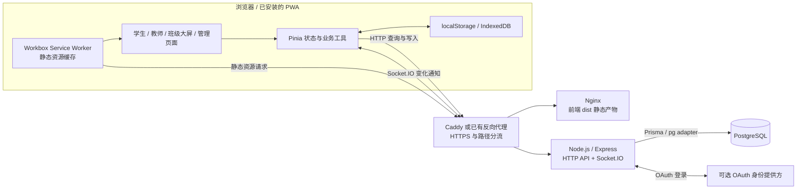
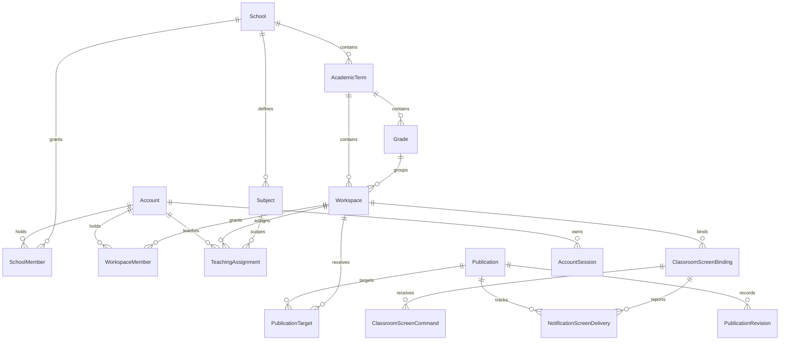
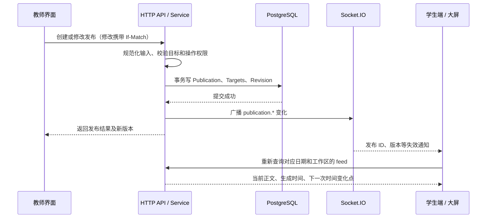

# NPClassworks 前后端工程架构分析

分析日期：2026-09-06。

分析对象为本机两个独立 Git 仓库的当前代码：

| 部分 | 仓库 | 分析时提交 | package.json 版本 |
| --- | --- | --- | --- |
| 前端 | `D:/WebstormProjects/NPClassworks` | `e1a578f` | `1.0.1` |
| 后端 | `D:/WebstormProjects/NPClassworksKV` | `a4adddf` | `1.0.0` |

本文以实际入口、调用关系、数据库定义、构建配置和测试代码为依据，历史文档仅作辅助。分析开始时两个仓库工作区均无未提交改动。本次仅进行静态架构分析，未启动应用、执行测试、连接生产环境或验证线上容量；下文的“已有测试”表示仓库中存在相应检查，不代表本次运行通过。

## 1. 整体判断

当前系统可以概括为：**双仓库、前后端分离、Vue PWA 客户端、Express 模块化单体服务、PostgreSQL 业务数据库，以及面向班级大屏的离线同步机制。**

- **产品中心已经转向学校教学业务。** 核心对象是学校、学期、行政班、走班教学空间、教师职责、作业与通知；`NPClassworksKV` 的仓库名称和部分表结构保留了早期 KV 服务的痕迹。
- **前端三种模式共享同一个应用。** 学生看作业、教师工作台和班级大屏由首页协调；管理员配置与实例初始化使用独立页面。
- **PostgreSQL 是共享业务数据的权威来源。** 浏览器本地数据承担设置、选择、草稿、离线展示和待上传操作等职责；学生完成标记、噪声历史等功能本身只保存在本机。
- **实时同步采用“通知变化，再查询数据”。** Socket.IO 广播发布记录标识和版本，HTTP API 返回正文与最新权限结果。
- **后端按领域拆文件，但部署为一个进程。** API、Socket.IO 和历史清理任务共享 Node.js 进程；目前没有独立消息队列、跨实例 Socket adapter 或单独部署的业务 worker。
- **可靠性机制较完整，边界治理仍有提升空间。** 已实现乐观并发、修订历史、大屏幂等补传、权限撤销、回执、数据库测试和部署版本配对；主要维护压力来自大型页面/服务、手写跨仓协议，以及部分配置与兼容代码的歧义。

## 2. 系统边界与部署视图



标准生产 Compose 编排 PostgreSQL、后端、前端 Nginx 和 Caddy 四个服务；共享服务器方案复用已有代理。图中展示的是配置所表达的拓扑，不代表已检查实际线上部署。

业务协议的主要边界是 `/accounts`、`/api/v2/*` 和 `/socket.io/`。前端不直接访问数据库；后端 EJS 首页只承担服务落地页等辅助用途，主业务界面由 Vue 渲染。

依据：[前端入口](D:/WebstormProjects/NPClassworks/src/main.js)、[后端应用装配](D:/WebstormProjects/NPClassworksKV/app.js)、[生产编排](D:/WebstormProjects/NPClassworksKV/docker-compose.yml)。

## 3. 前端工程架构

### 3.1 技术栈与目录职责

| 层次 | 当前实现 | 职责 |
| --- | --- | --- |
| 应用与组件 | Vue 3.5、Vuetify 3、JavaScript、SCSS | 中文业务界面、主题、表单和大屏布局 |
| 构建 | Vite 5、pnpm 10.33.0 | 开发服务、按需分包、生产资源与 PWA 生成 |
| 路由 | Vue Router 4、unplugin-vue-router、vite-plugin-vue-layouts | 文件路由及页面布局 |
| 共享状态 | Pinia 3 | 学生选择、作业 feed、教师会话、大屏会话与同步状态 |
| HTTP 边界 | Axios + `classworksV2Client.js` | 统一 API 方法、令牌、刷新、超时和错误诊断 |
| 实时通道 | Socket.IO client 4 | 工作区订阅、断线重连、发布变化通知 |
| 本地持久化 | localStorage、sessionStorage、IndexedDB | 设置、身份凭据、缓存、草稿、补传及噪声历史 |
| 课堂音频 | Web Audio / AudioWorklet、`@wydev/noise-core` | 本机噪声监测与通知提示音 |
| 质量工具 | ESLint 9、Node test runner、Playwright | 静态检查、工具/流程测试与浏览器验证 |

主要目录职责如下：

```text
NPClassworks/
├─ src/main.js、App.vue       应用装配与全局 UI
├─ src/pages/                文件路由：主页、管理、初始化、设置等
├─ src/layouts/              页面公共布局
├─ src/components/v2/        当前学生、教师、大屏业务组件
├─ src/components/admin/     学校、学期、教师职责等管理组件
├─ src/components/common/    对话框、加载、恢复等公共组件
├─ src/stores/classworksV2.js 统一 Pinia state / getters / actions 装配
├─ src/stores/classworksV2/   按业务拆分的 action 模块
├─ src/composables/admin/    管理界面状态与操作封装
├─ src/utils/                API、持久化、领域规则与浏览器服务
├─ public/                   PWA 图标、提示音、AudioWorklet、SW 扩展
├─ tests/                    Node 测试与浏览器场景
└─ deploy/、scripts/          容器静态服务、产物验证及构建辅助
```

这些目录已体现分层意图，但 `utils/` 同时包含纯业务函数、存储适配、网络基础设施和长期运行的浏览器服务，并非单一层次。

依据：[前端依赖及命令](D:/WebstormProjects/NPClassworks/package.json)、[构建配置](D:/WebstormProjects/NPClassworks/vite.config.mjs)。

### 3.2 启动、路由与页面组织

启动顺序是：捕获 OAuth 回调 → 启动性能基线记录 → 创建 Vue 应用 → 注册 Vuetify、Router、Pinia 和消息/诊断能力 → 挂载应用 → 初始化可选行为分析。

`App.vue` 承载背景和主题、路由出口、全局消息、限流提示、PWA 生命周期提示、定时噪声监测管理和应用恢复对话框。

| 路径 | 入口与职责 |
| --- | --- |
| `/` | `ClassworksHome.vue`，协调三种模式、首次使用引导、登录与大屏生命周期 |
| `/classworks-admin` | 学校配置、组织结构、教师职责、设备、审计及迁移等管理功能 |
| `/setup` | 实例首次初始化、组织/教师导入、登录验证与完成检查 |
| `/settings` | 按使用上下文呈现设置 |
| `/classworks-2` | 兼容入口，跳转到 `/` |
| `/debug`、`/socket-debugger` | 开发辅助页面，生产构建排除对应路由与代码块 |

路由守卫主要处理初始化状态、废弃入口和开发页面。初始化完成状态缓存在 sessionStorage；接口不可达时不会一直阻断页面，以保留故障恢复和离线使用能力。学校/教师权限最终由后端控制，不能将前端菜单显隐或路由守卫视为权限边界。

首页并行引导学生、教师和大屏状态，再按已有会话/选择决定初始模式。发布编辑器、历史记录、课堂工具等部分弹窗使用异步组件加载；首页本身仍承担较多业务协调职责。

依据：[路由](D:/WebstormProjects/NPClassworks/src/router/index.js)、[首页协调组件](D:/WebstormProjects/NPClassworks/src/components/v2/ClassworksHome.vue)、[应用外壳](D:/WebstormProjects/NPClassworks/src/App.vue)。

### 3.3 状态管理：一个 Store，按 action 职责拆分

当前不是每种用户模式一个 Store，而是保留单一 `classworks-v2` Store，通过对象展开组合 action：

| 模块 | 状态/操作范围 |
| --- | --- |
| `boardActions.js` | 学校与选班、feed、日期、订阅、事件合并刷新与兜底轮询 |
| `teacherActions.js` | 教师身份、工作区、目标偏好、发布、修订、认证及行动中心 |
| `screenSessionActions.js` | 大屏登录与缓存会话、名单考勤、作业保存入口 |
| `screenSyncActions.js` | 在线状态、心跳命令、补传与人工处理 |
| `studentSelection.js` / `screenRequestError.js` | 跨 action 使用的选择持久化和请求错误分类 |

action 通过 `this` 访问同一个 Pinia 实例，模块间经 Store action 协作。该拆分减少了单文件体积，但不会自动形成独立业务状态容器。

组件仍保存对话框、表单、当前编辑对象等局部状态；管理页面部分直接调用 API。学校结构编辑已提取到 `useAcademicStructureManager`，其响应式状态归属于组件实例。

已实现的并发防护包括请求序号、教师会话版本、令牌会话版本以及卸载后的结果失效处理。需要注意，部分计时器、订阅清理数组和请求序号仍位于模块作用域，设计上偏向浏览器中的单应用实例；增加多 Store 实例或嵌入式应用时需重新梳理生命周期。

依据：[Store 装配](D:/WebstormProjects/NPClassworks/src/stores/classworksV2.js)、[看板 actions](D:/WebstormProjects/NPClassworks/src/stores/classworksV2/boardActions.js)、[教师 actions](D:/WebstormProjects/NPClassworks/src/stores/classworksV2/teacherActions.js)、[管理 composable](D:/WebstormProjects/NPClassworks/src/composables/admin/useAcademicStructureManager.js)。

### 3.4 API、身份凭据与错误处理

所有当前业务 Axios 请求集中在 `classworksV2Client.js`。该文件既是 API 方法目录，也承担身份凭据管理和请求拦截，现有规模约 807 行。

- 普通请求默认超时 15 秒；账号刷新独立限制为 10 秒，导入/迁移等操作有更长的单独超时。
- 教师/管理员使用 `Authorization: Bearer ...`；大屏使用 `X-Classworks-Screen-Token`；初始化使用 `X-Classworks-Setup-Token`。
- 账号 access/refresh token 与大屏 token 存 localStorage；初始化 token 存 sessionStorage。
- 并发 401 共享一次刷新请求；通过会话版本避免旧账号请求回写新账号状态。刷新遇到临时网络故障时保留会话，明确的刷新鉴权失败才清除凭据。
- 发布更新、撤回、认证、恢复携带 `If-Match` 版本头；管理结构编辑另有 `expectedUpdatedAt` 等并发协议。
- 错误统一提取后端业务码和校验信息，并写入经过敏感字段清理的本地诊断。

HTTP 与 Socket.IO 共用 `getServerUrl()`：开发模式优先 `VITE_SERVER_URL`；其余情况使用构建时的 `VITE_DEFAULT_KV_SERVER`，未设置则取当前站点 origin。虽然 Socket 客户端保留了“设置覆盖域名”的旧注释，当前函数没有读取该设置。

依据：[API 边界](D:/WebstormProjects/NPClassworks/src/utils/classworksV2Client.js)、[Socket 客户端与地址解析](D:/WebstormProjects/NPClassworks/src/utils/socketClient.js)。

### 3.5 浏览器存储与 PWA 的不同职责

| 数据 | 当前主要保存位置 | 生命周期与范围 |
| --- | --- | --- |
| UI 设置 | localStorage | 本机主题、背景和课堂工具等；包含历史设置迁移 |
| 学生选班 | localStorage | 学校、学期、行政班、走班与明确不修读的科目；启动时向后端重新校验 |
| 学生完成标记 | localStorage | 以发布 ID 和 revision 记录本机完成状态，不是服务端学生提交/成绩系统 |
| 教师发布目标偏好 | localStorage + 后端 AccountPreference | 按账号保存收藏、最近目标，带待同步状态 |
| 大屏会话与 feed | localStorage | 会话快照单份、保留 30 天；feed 按绑定和日期保存 3 天，上限 30 项/约 1 MiB；键不含后端地址 |
| 大屏编辑草稿与待上传操作 | localStorage | 按绑定/编辑对象隔离；草稿保留 7 天；新增作业队列上限 50 项，超过 7 天转人工处理 |
| 通知展示与确认标记 | localStorage + 后端投递记录 | 本机按绑定及发布版本去重；完整待发送回执队列仅在页面内存中 |
| 噪声历史 | IndexedDB；该 API 不存在时使用 localStorage | 同 origin 共享的本机采样摘要，不按大屏绑定划分；IndexedDB 事务失败不会自动改存 localStorage |
| 页面、脚本、字体、图标、提示音 | Cache Storage / Workbox | 应用外壳和静态资源离线可用 |

**生产 PWA 的实际来源是 `vite.config.mjs` 中的 `generateSW`。** `src/sw.js` 不是当前配置的注入源；正式接入的是自动生成的 SW，加上 `importScripts` 引入的 `public/sw-cache-manager.js`。

当前缓存策略明确让 `/api/`、`/accounts/`、`/socket.io/` 等后端路径走 `NetworkOnly`，同时覆盖跨域 API。静态资源按类型使用预缓存、CacheFirst 或其他策略；音频按需缓存，不在首次安装时预下载整套声音。SW 扩展负责查询/清理资源缓存和删除部分旧缓存。

因此，PWA 安装成功不等于所有业务都可离线运行。学生 feed 请求失败会显示加载失败；大屏则可以在允许的临时网络故障下回退到匹配的业务缓存。资源缓存恢复也不应被理解为业务草稿或补传数据的备份。

依据：[PWA 配置](D:/WebstormProjects/NPClassworks/vite.config.mjs)、[已接入的 SW 扩展](D:/WebstormProjects/NPClassworks/public/sw-cache-manager.js)、[大屏缓存](D:/WebstormProjects/NPClassworks/src/utils/screenOfflineCache.js)、[学生完成标记](D:/WebstormProjects/NPClassworks/src/utils/studentHomeworkCompletion.js)。

## 4. 后端工程架构

### 4.1 运行入口与分层

后端采用 Node.js 22、Express 5、ES modules、Prisma 7 和 PostgreSQL。手写业务代码以 JavaScript 为主；`generated/prisma/*.ts` 是 Prisma 生成产物，不能据此认为业务层已使用 TypeScript。

```text
NPClassworksKV/
├─ bin/www                   生产配置检查、HTTP/Socket 启动、后台清理、优雅关闭
├─ app.js                    Express 中间件、探针、静态页、路由与错误处理
├─ routes/accounts.js        本地/OAuth 身份、会话、偏好及部分历史设备接口
├─ routes/v2/                当前业务 HTTP 路由
├─ services/                 用例编排、鉴权、事务与 Prisma 查询
├─ domain/                   规则、校验、规范化、差异与范围计算
├─ middleware/               JWT、限流、全局错误处理
├─ utils/                    Prisma 单例、令牌、Socket、配置和观测能力
├─ prisma/schema.prisma      当前数据库结构
├─ prisma/migrations/        数据库演进记录
├─ generated/prisma/         ORM 生成代码
├─ tests/                    规则、HTTP 与 PostgreSQL 集成测试
└─ deploy/、scripts/          环境生成、备份恢复、升级回滚、部署代理
```

请求的典型路径为 `route → service → domain / Prisma`。路由解析参数、执行入口鉴权并组织响应；service 承担业务流程与事务；domain 尽量保存不依赖 HTTP 的规则。

这是**实用的分层单体**，不是严格的六边形架构或独立微服务集合：service 直接依赖 Prisma，部分路由也直接查询数据库，没有统一 repository 抽象或强制的依赖方向检查。当前规模下这种做法降低了间接层成本，但大服务的修改影响面需要控制。

`bin/www` 将 HTTP 和 Socket.IO 绑定到同一 server，启动修订历史清理；退出时依次停止任务、关闭连接并断开数据库。`app.js` 提供 `/check` 存活信息、查询 PostgreSQL 的 `/ready`，以及可配置令牌保护的 `/metrics`。

依据：[进程入口](D:/WebstormProjects/NPClassworksKV/bin/www)、[应用装配](D:/WebstormProjects/NPClassworksKV/app.js)、[Prisma 实例](D:/WebstormProjects/NPClassworksKV/utils/prisma.js)。

### 4.2 HTTP 模块边界

| 前缀 | 主要职责 | 身份要求 |
| --- | --- | --- |
| `/accounts` | 本地/OAuth 登录、刷新、会话撤销、个人偏好 | 按接口区分公开登录和账户鉴权 |
| `/api/v2/setup` | 实例状态、初始化、组织/教师导入、迁移导入 | 状态等入口公开；初始化操作使用 setup 会话及状态检查 |
| `/api/v2/catalog` | 可选学校、活动学期、年级、科目、班级、走班选择校验 | 面向学生的公开目录 |
| `/api/v2/me` | 当前账户的学校与工作区 | JWT |
| `/api/v2/admin` | 学校结构、任教与管理职责、设备、审计、迁移、学期切换 | JWT + 具体学校/资源授权 |
| `/api/v2/publications` | feed、发布、修订、撤回、认证、恢复、行动中心、通知投递查询 | feed 公开；其他业务操作使用 JWT 和资源权限 |
| `/api/v2/classroom-screens` | 大屏登录、会话、作业、心跳、回执、名单考勤 | 按接口使用设备凭据或大屏 token |

公开目录和学生 feed 是当前产品设计的一部分。学校、工作区及学期的范围过滤仍由后端执行；公开读取不能外推为任意写入或管理员权限。

依据：[目录路由](D:/WebstormProjects/NPClassworksKV/routes/v2/academic-catalog.js)、[发布路由](D:/WebstormProjects/NPClassworksKV/routes/v2/publications.js)、[大屏路由](D:/WebstormProjects/NPClassworksKV/routes/v2/classroom-screens.js)。

### 4.3 数据模型：教学空间和统一发布记录是中心

下图为核心关系的简化视图，省略可空外键、审计字段及部分辅助表：



关键设计如下：

1. **Workspace 统一承载行政班与走班教学空间。** 模型还定义年级与全校频道。科目投放规则和来源行政班关系决定学生如何组合自己应看的作业，不是简单的“班级 ID 对应一段文本”。
2. **Publication 统一表示作业和通知。** 类型为 `ASSIGNMENT` / `NOTICE`，状态包含 `DRAFT` / `PUBLISHED` / `WITHDRAWN`，另有认证状态、优先级、版本、作业板日期、发布时间、截止及失效时间。
3. **PublicationTarget 支持一条内容投放多个工作区。** PublicationRevision 保存历史版本、操作及快照，供比较、恢复和追溯。
4. **身份与教学职责分开建模。** SchoolMember、WorkspaceMember 表达成员角色；TeachingAssignment、GradeLeadership、AdministrativeClassLeadership 表达任教、年级和班级管理职责。
5. **大屏有独立身份及运行记录。** ClassroomScreenBinding 保存绑定与凭据状态；命令、通知投递、名单考勤和审计分别有对应记录。
6. **业务数据按学校/学期划分。** 多学校能力主要依赖关系与查询授权，没有每校独立数据库的默认隔离部署。

当前 ORM 主源是 `prisma/schema.prisma`，由 `prisma.config.js` 指定；`docker/schema.prisma` 是遗留的简化 schema，不应拿它推断当前生产数据结构。

schema 设置了 `relationMode = "prisma"`，关系维护主要交由 Prisma，而非默认依靠 ORM 生成数据库外键。数据库仍有唯一约束和索引，但不能将每条 ORM 关系声明都视为数据库外键保证；raw SQL、外部导入和运维写入需单独考虑关系完整性。

依据：[当前 schema](D:/WebstormProjects/NPClassworksKV/prisma/schema.prisma)、[Prisma 配置](D:/WebstormProjects/NPClassworksKV/prisma.config.js)、[发布领域规则](D:/WebstormProjects/NPClassworksKV/domain/publication.js)。

### 4.4 鉴权与业务授权

当前有三套用途不同的凭据：账号 JWT 会话、大屏设备 token、首次初始化 setup token。

- **账号认证**支持学校本地账号/PIN 与可选 OAuth。access JWT 校验检查账户是否存在及 tokenVersion；刷新 token 另结合 AccountSession 的状态与摘要。全部设备退出通过增加 tokenVersion 并撤销刷新会话实现，另有受条件限制的旧 token 兼容逻辑。
- **资源授权**由学校角色、工作区角色、任教学科和管理职责共同决定。学校管理角色以 `OWNER` / `ADMIN` 为核心；工作区写角色包括 `OWNER` / `TEACHER` / `ASSISTANT`。具体操作还会检查认证方式、资源所属范围和活动状态。
- **作业认证权限**与一般编辑权限单独计算，考虑任教学科和管理职责；大屏写入后会产生待教师确认的版本。
- **大屏凭据**与教师凭据分离，数据库保存 token 哈希及绑定状态。设备重置或重新登录会轮换 token；PIN 更新递增 credentialVersion，关键写事务复核绑定与版本。仅更新 PIN 不会使已持有 token 的后续认证自动失败。
- **管理员前端**只是这些权限规则的界面映射，后端 service 才是最终执行位置。

单设备退出的语义需要特别区分：目前撤销的是对应刷新会话，access token 的验证并不读取该会话的 `revokedAt`，而 JWT 中间件还会在临近到期时响应新的 access token。因此，当前实现不能描述为“单会话退出会立即使该会话所有 access token 失效”；这是会话策略需要进一步统一的地方。

依据：[JWT 中间件](D:/WebstormProjects/NPClassworksKV/middleware/jwt-auth.js)、[账户令牌管理](D:/WebstormProjects/NPClassworksKV/utils/tokenManager.js)、[发布授权](D:/WebstormProjects/NPClassworksKV/services/publicationAuthorizationService.js)、[职责授权](D:/WebstormProjects/NPClassworksKV/services/staffAuthorizationService.js)、[大屏写入授权](D:/WebstormProjects/NPClassworksKV/services/screenWriteAuthorization.js)。

### 4.5 当前版本与历史兼容代码

后端没有在 `app.js` 挂载早期 KV 业务路由，但数据库仍有 `KVStore`、`Device`、`AppInstall`、`AutoAuth` 等历史模型。`routes/accounts.js` 也保留部分设备绑定、解绑、列表和 UUID 查询接口。

标准 Caddy 配置对若干废弃路径返回 410；直接访问后端端口与经过标准代理的可达接口集合并不完全相同。前端也保留旧路由跳转、旧设置迁移以及未接入当前构建的 SW 文件。

后续维护应明确标记“当前运行入口”“兼容保留”“候选清理”三种状态，避免从目录名、旧注释或生成文件误判架构。是否清理历史表需要结合数据迁移和实际使用情况另行决定。

依据：[后端路由装配](D:/WebstormProjects/NPClassworksKV/app.js)、[账户兼容接口](D:/WebstormProjects/NPClassworksKV/routes/accounts.js)、[代理废弃路径规则](D:/WebstormProjects/NPClassworksKV/deploy/Caddyfile)、[前端旧路由规则](D:/WebstormProjects/NPClassworks/src/utils/routeAccess.js)。

## 5. 关键业务链路与一致性

### 5.1 教师发布、其他终端更新



发布修改使用预期 revision 和数据库条件更新进行乐观并发控制，历史快照与业务修改位于同一事务；冲突时由界面引导比较、保留草稿或重新编辑。教师创建通常已认证，大屏创建或修改产生未认证版本。

历史记录也不是绝对不可变的事件日志：认证元数据可更新，清理任务会清空超过保留期、非当前、未认证，且所有已知目标均存在并已停用的作业历史正文，保留追溯外壳。管理结构的 `expectedUpdatedAt` 并发检查则为兼容旧客户端保留可选性，不应与发布必需的版本前置条件混为一谈。

对投放多个班级的作业，大屏修改本班内容时有拆分处理：保留其他班级的原内容，为本班建立独立记录和历史，避免一次班内修改覆盖其他班级。

发布时间和失效时间主要在查询时过滤，响应包含 `nextTransitionAt`，客户端到时再拉取。当前不是由独立定时发布 worker 在某时刻执行一次发布推送。

Socket 通知在事务提交后发送，没有事务消息表/持久化事件重放。客户端用约 250ms 合并刷新、断线重连后重新查询、恢复可见性时刷新，以及前台约 5 分钟的兜底刷新补偿漏事件；教师发布列表与行动中心的刷新范围也有所区分。在页面继续运行、网络恢复且后续刷新成功时，这些机制可使客户端重新收敛到服务端状态；不能保证消息严格不丢或跨端瞬时一致。

依据：[发布 service](D:/WebstormProjects/NPClassworksKV/services/publicationService.js)、[后端 Socket](D:/WebstormProjects/NPClassworksKV/utils/socket.js)、[前端刷新调度](D:/WebstormProjects/NPClassworks/src/stores/classworksV2/boardActions.js)。

### 5.2 大屏离线保存与恢复上传

大屏对新增作业提供“编辑草稿 → 本地待上传操作 → HTTP 提交 → 清理已完成记录”的链路。**离线可将新建作业入队，修改现有作业要求在线**；修改失败或断网时，输入以草稿保留。临时网络故障与权限/版本冲突分别处理；无法自动处理的新增操作保留为待人工确认状态。

新增作业使用稳定的客户端请求 ID。后端以“大屏绑定 ID + 请求 ID”设置唯一约束，配合事务锁、绑定校验和请求内容 hash：同请求重试返回既有结果，同 ID 不同内容返回冲突。旧客户端不提供请求 ID 时仍可调用，但不能获得同样的新增幂等保证。

因此，“请求已在服务端成功、响应却丢失”时可以安全重试同一新增操作。在线修订请求另外携带原始版本，避免把本地草稿直接覆盖到已变化的内容上。

在线恢复后客户端补传队列并刷新 feed。后续 session/feed 校验可以清理失效会话，其中 feed 的 401/409 会撤销当前大屏状态；补传业务拒绝则转人工处理，心跳错误主要记录诊断，并非所有请求错误都会立即退出。不能把本机旧缓存视为继续拥有服务端写权限的证明；离线时无法即时获知远端撤销，需要后续网络校验。

补传顺序执行，暂时错误按指数退避和随机抖动重试，上限约 5 分钟。队列读写失败会明确报错；feed 缓存则采用尽力保存策略。当前未使用 Service Worker Background Sync，页面关闭后的持续上传不在现有能力范围内。

依据：[保存入口](D:/WebstormProjects/NPClassworks/src/stores/classworksV2/screenSessionActions.js)、[同步 actions](D:/WebstormProjects/NPClassworks/src/stores/classworksV2/screenSyncActions.js)、[补传队列](D:/WebstormProjects/NPClassworks/src/utils/screenPublicationQueue.js)、[后端幂等实现](D:/WebstormProjects/NPClassworksKV/services/publicationService.js)。

### 5.3 心跳、通知回执与远程命令

Socket 连接状态、大屏 HTTP 心跳和业务上传状态分别记录，并共同形成同步反馈。约每 60 秒的 HTTP 心跳承担运行状态上报和服务端命令领取；远程重载还要经过本地编辑、保存及同步忙碌检查。

通知采用独立的投递记录和回执链路：通知进入当前大屏 feed 后，客户端上报 `displayed` 回执，另有人工确认操作。该字段表示客户端已接收并纳入展示状态；实现未校验 DOM 渲染完成、页面可见或通知进入视口，因此不是屏幕实际可见性的严格证明。发送失败进入页面内存中的待补发队列。本机确认标记会持久保存，但完整回执队列不会；重载后只能为当前 feed 中仍存在的通知重建回执，已离开 feed 的待发回执不保证恢复。

教师端可以查询大屏投递情况，但“进入 Socket 房间”“已发送变化事件”“大屏已展示”“用户已确认”是不同事实，回执也不是逐个学生的阅读记录。浏览器通知依赖页面仍在运行，当前没有服务端 Web Push 唤醒链路。

命令和投递记录保存在 PostgreSQL，因此这部分业务状态不依赖某次 Socket 连接持续存在。

依据：[同步生命周期](D:/WebstormProjects/NPClassworks/src/stores/classworksV2/screenSyncActions.js)、[通知回执队列](D:/WebstormProjects/NPClassworks/src/utils/notificationDeliveryQueue.js)、[通知投递服务](D:/WebstormProjects/NPClassworksKV/services/notificationDeliveryService.js)、[大屏服务](D:/WebstormProjects/NPClassworksKV/services/classroomScreenService.js)。

### 5.4 本机课堂工具

噪声监测由浏览器麦克风、Web Audio / AudioWorklet 和 `@wydev/noise-core` 组成，包含设备选择、权限处理、定时监测与历史汇总。AudioWorklet 汇总 RMS、峰值等特征，主线程评分并形成统计片段；不支持时回退到 AnalyserNode。历史主要使用 IndexedDB，当前限制为最多 5000 条、保留 14 天；保存的是监测切片/统计，当前没有音频或噪声历史上传 API 链路。

这里的声级和活动评分依赖本机麦克风、基线及采样覆盖，属于估算结果；界面保留 confidence/coverage 等指标。噪声服务为全局单例，定时调度由 App 中的组件管理，浏览器关闭后停止。

名单与考勤通过大屏 API 保存到后端；学生完成标记保存在本机；打印和作业清单图片由浏览器对已加载的作业快照生成。项目中的 `homeworkImages.js` 主要用于 Canvas 导出图片，不能据文件名推断存在作业附件上传或对象存储服务。

依据：[噪声服务](D:/WebstormProjects/NPClassworks/src/utils/noiseService.js)、[噪声历史存储](D:/WebstormProjects/NPClassworks/src/utils/noiseHistoryStore.js)、[图片导出](D:/WebstormProjects/NPClassworks/src/utils/homeworkImages.js)、[课堂工具服务](D:/WebstormProjects/NPClassworksKV/services/classroomToolsService.js)。

## 6. 构建、配置与交付架构

### 6.1 构建与运行约定

| 项目 | 当前方式 | 工程含义 |
| --- | --- | --- |
| 前端开发 | `pnpm run dev`，Vite 端口 3031 | 支持环境变量指定后端；未指定时可使用 Vite 同源代理 |
| 前端构建 | `pnpm run build`，prebuild 生成提示音列表 | 生成静态 `dist` 与 Workbox 产物 |
| 前端容器 | Node 22 构建，Nginx 1.27 提供静态文件 | API 地址写入构建结果，运行后改容器变量不会自动改变已有 JS |
| 后端运行 | `pnpm start` → `node ./bin/www`，默认端口 3000 | 单进程承载 HTTP、Socket.IO 和清理任务 |
| 后端容器 | Node 22，构建生成 Prisma client | 启动时执行 `prisma migrate deploy` 后运行服务 |
| 数据库 | 生产/集成测试使用 PostgreSQL 17，本地 debug 使用 PostgreSQL 16 | 生产命名卷持久化；迁移及备份属于发布流程的一部分 |
| 本地后端联调 | `debug:init`、`debug:db:up`、`debug:prepare`、`debug:server` | 提供专门的数据库准备和环境加载路径 |

前端 Nginx 对带 hash 的 `/assets/` 使用长期 immutable 缓存，对 HTML、SW 和注册脚本使用不缓存/重新验证规则，并为 Vue history 路由回退到 `index.html`。后端 API 与 Socket 路径由外层代理分流。

后端 `dev` 脚本仍写成 `NODE_ENV=development nodemon node .bin/www`，与实际 `./bin/www` 路径不一致，且没有声明 nodemon 依赖，Windows shell 也不能直接使用这种环境变量赋值。就当前代码而言，应优先依据明确的 `debug:*` 联调脚本，而不是把 `dev` 当成已验证入口。

依据：[前端 Dockerfile](D:/WebstormProjects/NPClassworks/Dockerfile)、[Nginx 配置](D:/WebstormProjects/NPClassworks/deploy/nginx.conf)、[后端 Dockerfile](D:/WebstormProjects/NPClassworksKV/Dockerfile)、[后端命令](D:/WebstormProjects/NPClassworksKV/package.json)。

### 6.2 关键配置边界

前端关注 `VITE_SERVER_URL`、`VITE_DEFAULT_KV_SERVER`、`VITE_ENABLE_ANALYTICS`；后端关注 `DATABASE_URL`、外部/前端地址、允许来源、代理信任、JWT/刷新令牌密钥、初始化密钥、监控令牌及可选 OAuth 配置。

当前有一个值得优先处理的默认值差异：前端 `.env.example` 描述“后端地址留空则同源”，客户端代码也支持该行为；但前端 Dockerfile 和后端两套生产 Compose 的前端 build arg 默认会回落到 `https://api.newfires.top`。因此，**Compose 中留空不等于一定访问本机后端**。按现有配置自托管时应显式提供实际后端 HTTPS 根地址；统一这些默认值可减少联调和部署误连。

行为分析只有 `VITE_ENABLE_ANALYTICS=true` 的构建才会包含对应第三方 SDK 分支，默认关闭；本机设备 ID 由浏览器随机生成并持久化。Sentry 文件和依赖存在，但 `main.js` 中初始化调用目前被注释，不能把它计为已启用的前端集中错误上报。

依据：[环境示例](D:/WebstormProjects/NPClassworks/.env.example)、[地址解析](D:/WebstormProjects/NPClassworks/src/utils/socketClient.js)、[共享生产编排](D:/WebstormProjects/NPClassworksKV/docker-compose.shared.yml)、[设备标识](D:/WebstormProjects/NPClassworks/src/utils/visitorId.js)、[前端启动](D:/WebstormProjects/NPClassworks/src/main.js)。

### 6.3 版本配对、备份与回滚

两个仓库分别维护版本号，当前前端 `1.0.1`、后端 `1.0.0` 并不直接表示不兼容。自动部署使用两仓 `deploy/compatibility.json` 中的 `compatibilityEpoch`，当前均为 `1`；还支持通过 `requiresPeerCommit` 表达对对端提交的依赖。

升级脚本获取部署锁后解析两端 Git 引用，固定完整 SHA，校验兼容性，再执行备份、构建、启动和健康检查；成功后记录部署版本。仓库还提供数据库备份/恢复、升级/回滚及部署代理脚本。

标准维护脚本面向具备 Bash、Git、Docker Compose、Node 和 `flock` 的 Linux 服务器，默认依赖两个仓库同级放置。生产 CI 经签名请求触发服务器部署代理，由服务器拉取源码并构建；它与单独的镜像发布工作流不是同一交付路径。

需要区分两项保证：

- 固定 SHA 保证一次发布过程不会随着分支继续移动而改变计划，但固定的是获得锁后读取的两仓引用，不保证就是触发 GitHub Action 的提交。
- epoch 和依赖提交是维护者声明的兼容性约束，不是自动推断出的接口兼容性证明；现有升级脚本也不负责重新执行两仓完整测试。

数据库恢复和应用镜像/代码回滚应配套评估，不能把“容器能回到旧版本”直接等同于任意 schema 变更都能无损回滚。自动回滚分支针对启动后的就绪检查失败，不能概括为所有构建/升级失败都会自动回退；数据库恢复需单独选择。备份脚本默认写服务器本地目录，具有校验和保留策略，本身不提供异地上传。

依据：[前端兼容声明](D:/WebstormProjects/NPClassworks/deploy/compatibility.json)、[后端兼容声明](D:/WebstormProjects/NPClassworksKV/deploy/compatibility.json)、[发布计划](D:/WebstormProjects/NPClassworksKV/deploy/release-plan.js)、[升级脚本](D:/WebstormProjects/NPClassworksKV/deploy/upgrade.sh)、[备份脚本](D:/WebstormProjects/NPClassworksKV/deploy/backup.sh)、[恢复脚本](D:/WebstormProjects/NPClassworksKV/deploy/restore.sh)。

## 7. 测试与可观测性

### 7.1 已有质量检查

统计口径为当前仓库中的测试文件数量，不是测试用例数或覆盖率：

| 层次 | 已有检查 | 可验证范围 |
| --- | --- | --- |
| 前端 Node 测试 | 58 个 `*.test.js` | 纯函数、API 客户端、Store/组件 setup 流程、会话、缓存、队列、生命周期等 |
| 前端浏览器测试 | 4 个 Playwright spec | 发布、打印、作业概览、噪声历史；涉及生产产物、浏览器、SW、Socket.IO |
| 后端 Node 测试 | 46 个 `*.test.js`，其中 11 个数据库集成文件 | 业务规则、权限、HTTP、部署配置及 PostgreSQL 事务/约束 |
| 构建与静态检查 | 前端 lint、build、PWA validate；后端配置和发布检查 | 语法风格、产物、部署输入和版本配对 |

前端流程测试使用 Vite 加载真实模块，配合内存存储和可控 HTTP fixture；浏览器测试使用真实前端生产构建和 Socket.IO 服务，但 `tests/e2e/backend.js` 是自制内存 API，并非 `NPClassworksKV` 的 Express + Prisma。

后端真实数据库测试独立验证授权、会话撤销、发布动作、幂等、历史清理、迁移和备份恢复等。普通测试命令不应被当成已执行全部数据库场景的证明，需看 `test:database` / `test:release` 和 CI 的具体执行。

因此，目前已有较好的分层验证，但缺少统一运行“真实前端 + 真实后端 + PostgreSQL”的跨仓发布门禁。现有文件数量也不能推导出测试覆盖率或大屏长期运行稳定性。

依据：[前端测试 CI](D:/WebstormProjects/NPClassworks/.github/workflows/tests.yml)、[前端流程 harness](D:/WebstormProjects/NPClassworks/tests/helpers/flowHarness.js)、[浏览器 API fixture](D:/WebstormProjects/NPClassworks/tests/e2e/backend.js)、[后端质量 CI](D:/WebstormProjects/NPClassworksKV/.github/workflows/quality.yml)、[数据库测试入口](D:/WebstormProjects/NPClassworksKV/scripts/run-database-tests.js)。

### 7.2 运行观测

前端具有本地诊断事件与快照、敏感字段清理、导出诊断包、性能基线和资源加载恢复界面。后端具有 Morgan 请求日志、Prometheus 指标、可选 OpenTelemetry，以及数据库审计日志。

观测内容与当前业务仍有距离：现有 Prometheus 自定义指标主要围绕旧 Device/KVStore 的设备数与键数，不能据此认为已监控作业发布吞吐、大屏在线率或离线积压。审计 middleware 在 HTTP 响应完成后异步写入，失败仅记录错误，不与业务写入原子提交。

这些机制分别服务于用户设备故障、服务运行状态和业务操作追溯；代码中存在集成不代表线上已经配置采集系统、告警阈值或集中检索。当前前端 Sentry 启动未启用，跨端 trace/request ID 的完整关联也不能由现有入口直接确认。

依据：[本地诊断](D:/WebstormProjects/NPClassworks/src/utils/localDiagnostics.js)、[性能基线](D:/WebstormProjects/NPClassworks/src/utils/performanceBaseline.js)、[后端指标](D:/WebstormProjects/NPClassworksKV/utils/metrics.js)、[后端追踪](D:/WebstormProjects/NPClassworksKV/utils/instrumentation.js)、[审计服务](D:/WebstormProjects/NPClassworksKV/services/auditLogService.js)。

## 8. 架构优点、限制与改进优先级

### 8.1 已形成的工程优势

1. **业务模型适配行政班与走班。** 教学空间、任教关系和投放目标可以支撑跨班发布、按学科确认及学校管理。
2. **服务端掌握数据一致性。** 条件更新、事务历史、绑定校验和新增幂等共同处理并发编辑及不可靠网络。
3. **大屏可靠性超出普通在线网页。** 离线 feed、编辑草稿、补传、心跳、远程重载保护和通知回执各自有实现边界。
4. **生产资源与业务缓存分开处理。** API 不进入通用 SW 缓存，降低陈旧鉴权响应与跨会话数据混用的风险。
5. **交付具备可恢复流程。** 数据库迁移、备份恢复、版本配对、健康检查及数据库测试均已落到仓库代码。

### 8.2 需要明确处理的工程问题

下表的优先级是后续维护建议，不代表本次已修改，也不等于已证实线上发生故障。

| 优先级 | 当前证据与限制 | 影响 | 建议 |
| --- | --- | --- | --- |
| 高 | Docker/Compose 的 API 默认地址与“留空同源”说明不一致 | 自托管产物可能连接到非预期后端 | 统一默认策略，在构建/部署检查中校验最终后端地址 |
| 高 | 单设备退出撤销刷新会话，但 access 校验未检查 session 撤销状态，仍有临期续签路径 | 单会话退出与 access token 失效范围不一致 | 明确单会话撤销语义，并让 access 校验、刷新及续签遵守同一会话状态 |
| 高 | 前端实时订阅合并学生/大屏与教师工作区，一次发送；后端单次 join 超过 20 个会整批拒绝 | 工作区较多的教师可能缺失预期实时更新，现有轮询只能部分兜底 | 明确协议上限、分批订阅并显示/处理 join 错误；单独保留 feed 的业务数量限制 |
| 高 | 浏览器 E2E 后端为内存 fixture；生产升级不重新执行完整测试 | 两仓各自通过仍可能存在接口组合问题 | 增加固定两仓 SHA 的真实 PostgreSQL 全链路冒烟门禁 |
| 中 | `classworks-admin.vue` 约 3172 行，`ClassworksHome.vue` 约 1489 行；API 客户端和发布 service 也集中承担多职责 | 页面状态、权限和异步流程交织，评审与回归成本上升 | 按学校结构、身份、设备、发布等用例继续拆分，优先迁移行为及对应流程测试 |
| 中 | Socket 使用进程内 adapter，事务提交后直接广播；定时清理也在应用进程中 | 横向扩实例后存在跨实例事件传播、任务重复与提交后事件丢失问题 | 保持当前单实例约束明确；扩容时一起设计共享 adapter、持久化事件与任务协调 |
| 中 | 两仓手写 API/错误码/版本头，未建立统一生成式契约 | 协议变更依赖人工同步，兼容 epoch 粒度较粗 | 先统一核心请求/响应 schema、业务错误码与契约测试，再考虑生成客户端 |
| 中 | 本地存储键、单例服务、模块作用域计时器分散；部分身份键未按后端地址命名 | 多实例嵌入、同 origin 切换后端及生命周期扩展需要额外处理 | 明确“当前站点/后端/账号/设备/日期”作用域，统一 dispose 与存储接口 |
| 中 | 大屏发布队列使用 localStorage 整数组读写，本页同步锁不协调多个标签；通知待发回执仅在内存 | 多标签可能产生本地竞争，重载也不能保证所有回执恢复；属于代码推导的限制，未复现 | 按实际多标签需求引入事务存储/跨标签互斥，并明确回执持久化要求 |
| 中 | 指标偏向旧 KV 模型，审计在响应完成后异步写入 | 新业务健康状态不易直接观测，业务成功不保证审计同时落库 | 补齐发布、大屏、回执与补传指标；按追溯要求确定审计一致性 |
| 低 | 旧 schema、旧路由/设置、未接入 SW、失效开发脚本与过时注释共存 | 新维护者容易依据非运行代码做判断 | 标明兼容保留用途，修正文档与入口，按独立变更逐步清理 |

其中，20 个工作区的边界可以由代码直接复核：后端 Socket 在请求去重后超过 20 时立即返回错误；前端 `joinWorkspaces` 直接发送整个数组，当前未分批。它与后端 feed 对单次查询工作区数量的限制是两处独立约束。

依据：[订阅集合计算](D:/WebstormProjects/NPClassworks/src/stores/classworksV2.js)、[订阅发送](D:/WebstormProjects/NPClassworks/src/utils/socketClient.js)、[订阅上限](D:/WebstormProjects/NPClassworksKV/utils/socket.js)、[feed 与发布实现](D:/WebstormProjects/NPClassworksKV/services/publicationService.js)。

### 8.3 推荐演进顺序

1. 先统一部署默认地址、会话撤销语义与开发入口，补上超限订阅处理和真实跨仓冒烟检查，使现有单体更容易正确部署和验证。
2. 再围绕发布、大屏同步和学校管理整理模块边界，将大型页面中的流程迁入按组件实例管理的 composable，将后端大型 service 按用例拆分。
3. 建立核心 API 契约、错误码和权限矩阵的共同测试，作为两个仓库独立演进时的约束。
4. 只有在监测到明确的容量或高可用需求后，再投入多实例 Socket、持久化事件、独立任务调度和更复杂的基础设施。

当前业务和部署形态仍适合继续维护模块化单体。优先提升边界清晰度、协议验证和故障恢复，比立即拆分为多个服务更符合现有代码基础。
