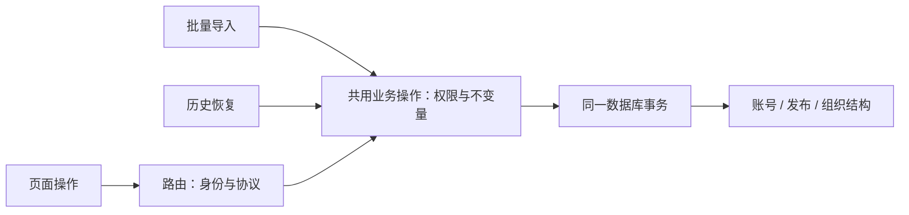

# NPClassworks 新一轮工程审查：功能、安全与架构

审查日期：2026-09-08。本文保留上一轮报告，基于当前源码重新判断，不把历史问题自动视为仍然存在。

| 项目 | 本轮基线 |
| --- | --- |
| 前端 | `NPClassworks`，`960c8d7bfed0229c372147a6795292682a5498e6` |
| 后端 | `NPClassworksKV`，`0b4d8e1a6f844ac8e18c302b607018abff1926fc` |
| 历史对照 | [前后端工程架构分析](engineering-architecture.md) |
| 方法 | 当前源码静态审查、前后端调用追踪、独立审阅交叉核对、已有测试断言与实现对照 |
| 验证边界 | 本轮没有运行应用、测试或攻击请求，没有连接生产数据库、外部 OAuth 服务或查询依赖漏洞库；没有修改业务代码 |

本文的“确认”指触发条件及结果可由当前实现推导，不代表已在浏览器或生产环境复现。既有文档记录的测试结果仅作为背景，不能视为本轮测试通过。安全部分的外部条件、反证和完整代码片段见文末生成的安全报告。

## 1. 结论与优先级

项目已经具备实际的会话撤销校验、发布版本控制、离线补传幂等、通知回执持久化和真实全链路测试。当前主要问题转向了**相同业务规则在不同入口执行不一致**，以及**大屏长期运行、跨标签和草稿恢复的状态边界**。

本轮整理出 6 项安全发现、7 项功能缺陷，另列 4 组架构改进事项。安全发现包含有明确外部前提的条件性问题；没有证据支持直接声称存在未认证远程代码执行、任意跨校管理员操作或原账号令牌窃取。

本文采用 P0～P3：P0 为紧急严重事故，P1 为应立即处理的高风险，P2 为应排期修复的明确问题，P3 为影响或利用条件较受限的问题。功能优先级不等同于漏洞评分。本轮安全评级为 5 项中危、1 项低危。

| 编号 | 优先级 | 问题 | 判定及关键条件 |
| --- | --- | --- | --- |
| S1 | P2 | ADMIN 迁移导出包含 OWNER PIN 哈希 | 凭据暴露已确认；接管需恢复 OWNER PIN，4 位 PIN 是受支持配置 |
| S2 | P2 | 教师重导入/管理员 upsert 改密不撤销会话 | 已确认；旧令牌持有者可继续使用账号当前权限 |
| S3 | P2 | 普通修改/恢复绕过学科认证范围 | 已确认；需要对应空间写权限，属于认证策略不一致 |
| S4 | P2 | 自选设备 ID 绕过 8 次 PIN 失败限制 | 已确认；每 IP 300 次/15 分钟的外层限流仍存在 |
| S5 | P2 | 未验证 OAuth 邮箱可进入邀请认领 | 条件性；取决于启用的服务商是否允许可控未验证邮箱 |
| S6 | P3 | OAuth 登录结果可强制替换浏览器会话 | 已确认；需用户打开链接，不等于接管受害者账号 |
| F1 | P2 | 恢复旧草稿后使用新版 revision 覆盖远端修改 | 已确认；旧草稿重新打开场景，历史通常仍可恢复 |
| F2 | P2 | 停用走班仍可选择，导致整个作业板请求失败 | 已确认；目录、选择校验与 feed 定义不一致 |
| F3 | P2 | 组织导入绕过工作区科目/类型历史保护 | 已确认；学校管理者的正常导入也可触发 |
| F4 | P2 | 临时退出大屏的 15 分钟期限随首页卸载消失 | 已确认；共享设备残留管理会话的安全后果需结合使用方式 |
| F5 | P2 | 跨标签共享草稿键及队列读改写造成数据丢失 | 草稿清理冲突确定；队列并发交错未做浏览器调度实测 |
| F6 | P2 | 长期运行后“今天”停留在组件挂载日期 | 已确认；午夜或休眠跨日后触发 |
| F7 | P2 | PWA“立即刷新”绕过编辑/保存保护 | 已确认；需用户点击，正常落盘的大屏草稿可恢复 |

建议先处理 S1、S2、S3 与 F1～F3：它们分别涉及权限边界、凭据撤销、认证完整性和业务数据一致性。S5 在确认当前服务商策略前也应收紧邮箱授权条件。

## 2. 上一轮问题的复核

| 旧问题或不足 | 当前状态 | 当前证据与剩余边界 |
| --- | --- | --- |
| 单会话退出后 access token 仍有效 | 已有修复 | [tokenManager.js:325](../../NPClassworksKV/utils/tokenManager.js#L325) 检查 session 所属账号、撤销、到期和 tokenVersion；新式令牌不能退回旧兼容路径。S2 是另外两个改密入口遗漏撤销，不是该修复失效 |
| 超过 20 个工作区整批 Socket 订阅失败 | 已有修复 | [socketClient.js:122](../src/utils/socketClient.js#L122) 去重后按 20 个分批；拒绝事件有诊断记录 |
| 通知回执只在内存，刷新丢失 | 主要路径已修复 | [notificationDeliveryQueue.js](../src/utils/notificationDeliveryQueue.js) 持久化、恢复、分批上传，已接入大屏；跨标签事务仍有改进空间 |
| 噪声异步启动取消及旧资源干扰新会话 | 本轮未再确认原问题 | [noiseService.js](../src/utils/noiseService.js) 已有代次校验、迟到流关闭及同步摘除资源；计划管理处理取消和卸载 |
| 草稿/队列读取失败按空值继续覆盖 | 已有显式错误路径 | [screenHomeworkDraft.js:33](../src/utils/screenHomeworkDraft.js#L33)、[screenPublicationQueue.js:53](../src/utils/screenPublicationQueue.js#L53) 的关键写入路径会拒绝继续；仍需注意 F5、F7 |
| 缺少真实前后端与数据库全链路验证 | 已新增 | [.github/workflows/contracts.yml](../.github/workflows/contracts.yml) 运行真实后端、PostgreSQL 与生产 PWA；[现有测试说明](fullstack-smoke-tests.md) 记录了发布、离线幂等、版本冲突三类场景 |
| 前后端部署版本没有配对控制 | 部分解决 | [upgrade.sh:48](../../NPClassworksKV/deploy/upgrade.sh#L48) 在锁内解析两端 SHA，并检查兼容声明；仍不保证该组合就是触发 CI 测试通过的组合，见 A3 |
| 后端开发启动命令不完整 | 已有修复 | 后端 [package.json](../../NPClassworksKV/package.json) 的 dev 命令使用 debug 环境及 `scripts/dev-server.js` |

这些结论来自当前文件及现有测试接线，不对当前线上版本是否已部署这些修改作判断。

## 3. 安全问题

### S1 — ADMIN 迁移导出包含 OWNER PIN 校验哈希

**控制缺口。** [学校管理校验](../../NPClassworksKV/services/academicAuthorizationService.js#L13) 接受 OWNER 和 ADMIN；[迁出确认](../../NPClassworksKV/services/schoolMigrationService.js#L127) 只验证调用者自己的 PIN，OAuth 管理员则输入学校代码。随后 [collectSchoolData](../../NPClassworksKV/services/schoolMigrationService.js#L197) 将全校相关账号的 `localPasswordHash` 原样纳入迁移包。

攻击者作为本校 ADMIN，使用自己选择的迁移密码导出并解密，即可得到 OWNER 的用户名和 PIN 校验哈希。[PIN 校验](../../NPClassworksKV/domain/localAccount.js#L17) 允许 4～8 位数字；若 OWNER 使用 4 位，候选空间只有 10,000 个，可离线尝试，不受 HTTP 限流约束。成功恢复后可走正常本地登录；本轮未执行恢复，也不估计具体耗时。

**为什么属于权限问题。** [schoolOwnerPolicy.js:14](../../NPClassworksKV/services/schoolOwnerPolicy.js#L14) 和本地账号管理明确禁止 ADMIN 管理 OWNER 凭据。迁移包加密保护传输和文件持有过程，但无法隔离本来就知道解密密码的导出者。

**修复与验证。** 含凭据校验材料的导出应要求 OWNER；如保留 ADMIN 导出，则去除相应凭据，并设计目标实例重新设置凭据的流程。验证 ADMIN 导出既不能获得 OWNER 哈希，也不能通过其他账号集合间接带出；同时保留合法 OWNER 迁移能力。

### S2 — 批量改密与普通改密的会话撤销行为不同

[教师导入](../../NPClassworksKV/services/localAccountService.js#L168) 与 [管理员创建/upsert](../../NPClassworksKV/services/localAccountService.js#L310) 在用户名已存在时更新 PIN 哈希，却不递增 `tokenVersion` 或撤销 `AccountSession`。两个操作分别由当前 [管理路由](../../NPClassworksKV/routes/v2/academic-admin.js#L177) 和同文件的 `local-admins` POST 路由调用。

最小场景：账号已在设备 A 登录；管理员通过重导入或同名管理员 upsert 更换 PIN；A 继续使用旧 access token 或旧 refresh token。后端验证依赖的版本、会话及刷新哈希均未改变，旧登录依然成立。刷新令牌默认有效期为 180 天，而非只有 access token 的 15 分钟。

对照：[普通账号更新](../../NPClassworksKV/services/localAccountService.js#L362)、个人改 PIN、OWNER 恢复已有撤销逻辑。初始化专用的 `importStaffConfiguration` 也不是这里遗漏的 `importLocalTeachers`。

**修复与验证。** 抽取同一事务内的“替换凭据＋递增版本＋撤销会话”操作，覆盖全部已有账号的改密入口。使用真实数据库先签发令牌再走两种入口，断言旧 access/refresh 均失败、新 PIN 可登录。撤掉业务角色后下游权限仍会重新判断，不能把本问题描述成任意保留已撤销的角色。

### S3 — 修改和恢复能完成显式认证接口禁止的跨学科认证

显式认证调用 [assertCanCertifyPublication](../../NPClassworksKV/services/publicationAuthorizationService.js#L119)，按任教学科或管理职责限制范围；普通修改只要求空间可写，然后 [无条件标为已认证](../../NPClassworksKV/services/publicationService.js#L1245)。[历史恢复](../../NPClassworksKV/services/publicationService.js#L669) 存在同样差异。

可复现前提：普通教师只任教某行政班的物理，无全科管理职责；任课服务授予该班 TEACHER 空间角色；大屏创建该班语文未认证作业 P。使用教师 JWT 及当前修订 R：

```http
POST /api/v2/publications/P/certify
If-Match: "R"
```

此路径按学科应拒绝。改为下列请求，缺省字段保留原内容，空间授权通过后生成已认证的 R+1：

```http
PATCH /api/v2/publications/P
Content-Type: application/json
If-Match: "R"

{}
```

现有 [数据库测试:199](../../NPClassworksKV/tests/workspaceAssignmentDatabase.integration.test.js#L199) 及同文件 258～283 行恰好构造了这种任课/大屏关系，并明确要求显式跨学科认证失败。[待处理查询](../../NPClassworksKV/services/publicationActionQuery.js#L24) 仅包含未认证记录，因此此路径还会使内容退出负责教师待处理列表。

**限制与反证。** 调用者本来就有该班编辑权限；认证者仍记录真实账号，版本锁与历史仍存在。[既有设计](../../NPClassworksKV/docs/classworks-2-phase-6.md#L8) 规定教师修改自动认证。这里的问题是该宽泛设计与后来明确的学科认证范围没有统一，不能夸大为任意班级越权或冒用他人认证。

**修复与验证。** 对最终快照的全部目标和学科计算认证资格，统一创建、修改、恢复、显式认证的行为；没有资格时拒绝或保持未认证。仅禁止空 PATCH 无法修复实际编辑和恢复入口。给现有跨学科夹具补上入口对照测试。

### S4 — 设备标识能重置细粒度 PIN 失败计数

[限流键](../../NPClassworksKV/middleware/rateLimiter.js#L89) 优先使用未认证请求自行提供的 `X-Classworks-Device-Id`，而非稳定来源。改变该头即可换一组 8 次/15 分钟的失败额度；本地登录不再设置账号级失败锁。

**实际影响边界。** 外层 IP 限流仍为 300 次/15 分钟，不能称为完全绕过限流。风险是短数字 PIN 允许持续猜测，管理员也支持相同长度策略。故意避免校园共享 IP 或恶意输错导致全校锁定，是合理的可用性目标；随机可改的客户端标识不能独立承担认证防护。

**修复与验证。** 即使携带设备头，也保留来源 IP＋学校＋账号的稳定限制；设备计数作为附加层。管理员采用更强凭据，并评估不会造成长时间全局锁定的渐进延迟。测试须跨多个设备头累计失败，而不只验证同一头值。

### S5 — 未验证邮箱进入 OAuth 邀请认领链路（条件性）

[STCN 与 Dlass 用户信息转换](../../NPClassworksKV/routes/accounts.js#L397) 在 `email_verified=false` 或字段缺失时仍保留 `email`，写入账号后，[回调认领](../../NPClassworksKV/routes/accounts.js#L463) 将其交给 [claimWorkspaceInvitations](../../NPClassworksKV/services/workspaceAssignmentImportService.js#L153)，按邮箱授予预分配空间角色。

**必须满足的条件。** 实例启用其中一个服务商；攻击者可让该服务商返回自己指定且未经验证的受邀邮箱；存在匹配邀请；学校允许该 OAuth 账号使用教师空间。源码能证明未验证地址会进入授权链，但本轮没有核实这些外部服务商当前是否允许这种邮箱设置。这里也不是直接接管被邀请者已有 OAuth 账号。

**修复与验证。** 把邮箱展示字段和可用于授权的已验证邮箱分开，只接受严格的验证状态或等价服务商验证证据。不能仅把新值设空，却通过 `normalizedUser.email || account.email` 保留历史未验证地址继续认领。用 false、缺字段、true 和历史污染地址四组用户信息验证。

### S6 — 登录结果没有和发起浏览器绑定

[后端 state](../../NPClassworksKV/routes/accounts.js#L234) 只关联 provider、时间等数据，[回调](../../NPClassworksKV/routes/accounts.js#L293) 不核对发起浏览器。前端在 [main.js:23](../src/main.js#L23) 启动时调用 [captureOAuthCallback](../src/utils/classworksV2Client.js#L178)，任意 URL 的 `success=true` 与非空 `access_token` 都会被接受，覆盖已有登录。

攻击者引导用户打开其有效登录结果链接，可让浏览器改为攻击者账号。实际上，前端直接接受攻击者自己的有效 token 链接，因此只修后端 state 不够。另一个标签仍可能显示旧身份，而请求拦截器动态读取已变化的 localStorage token；在攻击者对目标也有写权限且用户继续提交的条件下，可能产生草稿错投。

**评级限制。** 新页面会显示当前账号姓名；未证明受害者原 token、已有历史或任意更高权限泄露。报告为低危登录 CSRF/会话完整性问题。

**修复与验证。** 引入与发起浏览器关联的一次性登录事务，回调只交付短期一次性兑换结果；前端校验自己正在等待的流程。拒绝无发起记录的 URL token，并同步跨标签账号切换，避免旧身份界面继续提交。

## 4. 功能漏洞与数据一致性

### F1 — 旧草稿恢复把旧内容绑定到了新修订

[草稿结构](../src/utils/screenHomeworkDraft.js#L15) 保存表单和时间，不保存 `baseRevision`；[编辑器](../src/components/v2/ScreenHomeworkDialog.vue#L498) 先以当前发布对象设置基线，[恢复时](../src/components/v2/ScreenHomeworkDialog.vue#L574) 又用旧草稿覆盖表单；[提交](../src/components/v2/ScreenHomeworkDialog.vue#L638) 将旧内容与新基线一起传入 API，由 [客户端](../src/utils/classworksV2Client.js#L489) 生成最新版本的 `If-Match`。

1. 大屏基于 v1 编辑，关闭窗口留下草稿。
2. 另一设备把该作业保存为 v2；大屏获取新版 feed。
3. 重新打开作业，恢复 v1 草稿后保存。

预期应提示 v1/v2 冲突；实际会携带 v2 的版本号保存旧内容为 v3，覆盖新内容、截止时间等字段。后端乐观锁工作正常，但前端传错了草稿的真实基线。窗口持续打开的普通版本冲突场景不能覆盖此问题；历史备份通常仍能恢复。

**建议：** 草稿保存来源修订和必要基线快照；恢复时先比较当前修订，不同则进入现有冲突处理。回归测试必须包含“关闭编辑器→远端更新→重新打开”，而不只测两端一直打开。

### F2 — 停用走班仍进入学生有效选择

[目录查询](../../NPClassworksKV/services/academicCatalogService.js#L77) 加载来源走班时不筛选 `isActive`；[纯函数映射](../../NPClassworksKV/domain/academicCatalog.js#L30) 丢弃此字段，仅按 `isStudentSelectable` 过滤；选择校验只判断 ID 是否在目录中。

管理员停用一个仍有来源关系、仍可供学生选择的走班后，学生能重新选中它且通过校验。但 [发布空间加载](../../NPClassworksKV/services/publicationAuthorizationService.js#L24) 排除停用空间，[feed](../../NPClassworksKV/services/publicationService.js#L471) 因目标数量不符返回 `WORKSPACE_NOT_FOUND/404`，包含正常行政班和其他科目的整次请求也随之失败。前端 [错误处理](../src/stores/classworksV2/boardActions.js#L202) 会清空 feed 并显示错误，未自动修复这份选择。

**建议：** 查询、目录转换、旧选择校验共用有效性规则；停用后清除失效选项并引导重选。测试正常行政班＋停用走班的混合选择，不应把用户带入反复失败的配置。feed 的拒绝本身是有效防护，本项不是越权读取停用内容。

### F3 — 组织导入绕过教学班历史保护

[单项走班编辑](../../NPClassworksKV/services/academicStructureManagementService.js#L500) 明确禁止已有作业历史的教学班更换科目。[组织导入](../../NPClassworksKV/services/organizationAdminService.js#L189) 却按 `termId_code` upsert，直接修改 `subjectId`、`gradeId` 和 `type`；同文件 [行政班分支](../../NPClassworksKV/services/organizationAdminService.js#L153) 也可把同代码工作区改为 ADMIN_CLASS 并清空学科。

最小场景：已有语文走班 G 和作业；导入同校、同学期、同代码 G，但声明为数学且提供合法数学来源班级。文档内部校验通过后，G 被原地改义，旧 Publication 和 TeachingAssignment 等仍引用同一 ID。历史展示语义不一致，后续编辑还可能被学科/目标校验拒绝。[dry-run](../../NPClassworksKV/services/organizationAdminService.js#L61) 没有检查实际工作区历史和类型冲突。

**建议：** 导入与单项编辑共享类型、学科、已有引用的约束；真正改变含义时新建工作区，避免复用原 ID。预检读取数据库并展示真实影响。事务只能保证一起提交，不能替代业务不变量。此处调用者已有本校管理权，不归为管理员提权。

### F4 — 大屏临时退出期限只存在于首页

界面承诺到时自动返回大屏；[临时退出](../src/components/v2/ClassworksHome.vue#L937) 用首页局部变量和 interval 记录 15 分钟期限，但 [首页卸载](../src/components/v2/ClassworksHome.vue#L892) 会清除该 interval。切换设置或学校管理后，超过期限也不会自动返回；[路由守卫](../src/router/index.js#L26) 没有检查该期限。

另外，[返回大屏](../src/components/v2/ClassworksHome.vue#L924) 只切换显示 mode，不清除已持久化的教师凭据。若管理员临时在共享设备登录并依赖自动返回后离开，后续操作者可能继续使用该管理会话。需要先存在合法管理登录；这不是远程未认证提权，也不能把大屏 PIN 与账号 JWT 混为同一权限。

**建议：** 期限归 App/会话层管理，所有路由及恢复可见时检查；明确临时教师登录的结束策略，需要锁定共享设备时清理或撤销该临时账号会话。测试跳转管理页、后台休眠和直接访问管理路由。

### F5 — 共享草稿键与队列缺少跨标签协调

[新作业草稿键](../src/utils/screenHomeworkDraft.js#L11) 只有绑定 ID 和 `new`。同一绑定开两个标签，A 写草稿甲、B 写草稿乙；A 保存成功后 [清理公共键](../src/components/v2/ScreenHomeworkDialog.vue#L649)，B 尚未保存的乙也被删除，刷新 B 即丢失。此场景无需精确并发调度。

[发布队列](../src/utils/screenPublicationQueue.js#L77) 则对同一个 localStorage 数组执行整体读改写；两个标签新增或一个删除、一个新增，可能后写覆盖先写。[screenSyncing](../src/stores/classworksV2/screenSyncActions.js#L271) 只协调当前 Store。后端请求 ID 幂等能防重复新增，无法恢复上传前已被覆盖的本地记录。队列交错属于源码可见风险，本轮未做具体浏览器调度实测。

**建议：** 队列采用 IndexedDB 事务或适用的跨标签锁，覆盖完整读改写；草稿增加编辑会话标识，并在成功清理前核对归属/版本。测试两个真实同源标签，不只注入一个内存 storage 模拟器。

### F6 — 日期导航把“今天”固定为挂载日

[BoardDateNavigator.vue:77](../src/components/v2/BoardDateNavigator.vue#L77) 只调用一次 `todayBoardDate()`；相对日期标签和“回到今天”按钮一直使用这个常量。

页面在 9 月 8 日打开，运行到 9 月 9 日后仍把 9 月 8 日称为“今天”；选择其他日期再点“回到今天”，仍返回 9 月 8 日。刷新或重新挂载可恢复。大屏另一处实时调用日期的 `goToToday()` 正常，不能笼统说所有日期按钮都失效。是否自动跟随当天是产品选择，但日期标签本身错误不依赖这个选择。

**建议：** 使用共享响应式当前日，在午夜和页面恢复可见时更新，明确区分手动历史日期与跟随今天。验证跨午夜及电脑休眠跨日两个场景。

### F7 — PWA 立即刷新忽略未保存内容

[PwaLifecyclePrompt.vue:91](../src/components/v2/PwaLifecyclePrompt.vue#L91) 无条件执行 `window.location.reload()`，未查询已有 [编辑重载保护](../src/components/v2/ScreenHomeworkDialog.vue#L438)。[教师编辑器](../src/components/v2/PublicationComposer.vue#L500) 的未提交表单主要存在内存；大屏也存在已明确提示“草稿保存失败，请勿刷新”的情况。

用户输入未提交内容后点击更新提示的“立即刷新”，教师表单或未成功落盘的大屏输入会丢失。正常写入本地存储的大屏草稿可以恢复；这里只确认用户点击造成的丢失，没有证据证明自动更新会强制刷新。

**建议：** 将用户刷新、远程重载和页面离开统一接入编辑状态检查；先可靠保存，或者明确告知未保存内容并由用户决定。测试存储不可写及提交进行中的刷新路径。

## 5. 架构问题与改进方向

### A1 — 规则按入口分散，已有修复容易只覆盖一条路径

后端是 Express 单体，路由负责身份和协议转换，service 组织业务与 Prisma 事务，domain 承载部分纯规则。这个分层可继续使用，当前问题不需要拆微服务。

S2、S3、F3 表现出相同的维护困难：业务不变量存在于某个入口，而导入、恢复、upsert 等入口使用另一份逻辑。尤其数据库使用 `relationMode = "prisma"`，跨学校/学期及历史语义不能仅靠关系声明保证。

建议优先集中三类操作：凭据替换、发布认证状态转换、组织结构变更。操作接受显式 actor 与事务 client，对最终数据检查权限和历史约束。新增入口应复用这些操作，再用入口矩阵回归验证；单纯把大文件拆成小文件不能保证规则一致。



### A2 — 大屏生命周期跨组件、存储与浏览器，但控制仍停留在局部

草稿、待提交队列、通知回执、临时退出、编辑保护和日期刷新目前分布在 util、Pinia action、页面组件中。F1、F4～F7 表明“单个组件内正确”尚不能保证跨路由、跨标签、跨版本和跨日正确。

建议建立统一的大屏会话上下文：后端地址、绑定 ID、账号/设备代次、编辑会话、草稿基线、临时退出期限。持久数据使用版本化结构和事务；定时与可见性恢复由应用层协调。已有噪声代次隔离、回执持久化、离线幂等可作为继续收敛的基础。

### A3 — 部署固定了版本，但还没有绑定测试通过的精确组合

当前 [CI](../.github/workflows/production-deploy.yml) 等待测试与全链路任务，已是实际进步。[部署代理](../../NPClassworksKV/deploy/agent/server.js) 验证 HMAC，并运行固定脚本；请求里的 commit 是元数据。[ci-deploy.sh](../../NPClassworksKV/deploy/ci-deploy.sh) 仍选择两仓 `origin/main`，随后 upgrade 在锁内固定当时的 SHA。

因此时间线仍可能是：CI 测试前端 A＋后端 B → 另一提交推进任一 main → 部署解析出 A'＋B 或 A＋B'。兼容 epoch/依赖提交检查可拒绝声明的不兼容组合，却不能证明新组合经过同一轮测试。现有 [版本配对说明](deployment-version-pairing.md) 已诚实记录此边界。

建议发布输入是一份 CI 已验证的两仓 SHA 清单或不可变镜像摘要；部署只接受并验证该组合。保留现有部署锁、兼容声明、版本记录及健康检查。此项属于交付可重复性风险，不是部署代理任意执行漏洞。

### A4 — 配置默认值和文档仍有分歧

当省略 `VITE_DEFAULT_KV_SERVER` 时，后端 Compose 的 `BASE_URL` 回退为当前 `CLASSWORKS_DOMAIN`，前端 build arg 却回退为 `https://api.newfires.top`，参见 [docker-compose.yml:31](../../NPClassworksKV/docker-compose.yml#L31) 和 [65 行](../../NPClassworksKV/docker-compose.yml#L65)。shared Compose 同样如此。当前初始化模板显式设置分域地址，初学者文档显式设置同源地址，正常遵循这些配置可以避免问题；不能据此声称线上已经请求错误服务器。

建议用一个生产配置模型生成/验证 API 根地址、OAuth callback、CORS 与前端构建参数；省略必需参数时失败，而不是选另一个公共实例。另应统一 [刷新令牌文档](../../NPClassworksKV/REFRESH_TOKEN_API.md) 中“7 天”和有效默认值“180 天”的描述。当前未使用的 `docker/schema.prisma` 仍保留旧模型，应明确废弃用途以避免维护误读。

## 6. 暂不作为已确认漏洞的边界

| 问题 | 当前证据 | 本轮处置 |
| --- | --- | --- |
| 成员被移除后，作者仍可撤回自己的旧发布 | 作者快捷授权存在；更新和恢复另查当前写权限，而撤回没有；文档和测试明确保留作者读取分支 | 需要明确“永久作者撤回权”还是“成员移除撤销旧内容变更权”；不直接认定安全越权 |
| 大屏对未来发布内容的详情/复制权限 | 屏端复制来源仅按 PUBLISHED 和 boardDate 选择，再设 publishAt 为当前时间；与公开 feed 的时间门槛不同 | 需明确屏端编辑能力是否被允许提前接触计划内容；未作为新漏洞，保留后续核验项 |
| 撤销、重新绑定与部分写事务之间的竞态 | 已检查发布和考勤的事务内 screen binding 校验；其他路径仍有事务外读写 | 未建立完整可控竞态，不用通用 TOCTOU 标签代替证明；优先补并发回归 |
| 组织导入 ACTIVE 学期与正式切换流程不同 | 导入独立归档/upsert；正式切换还有 readiness 和大屏重绑 | 路径差异确定，具体上线流程影响待专项验证，避免重复计算 F3 |
| 匿名目录和 Socket 订阅 | 当前产品主动允许学生匿名读取已发布班级作业，Socket 主要传失效通知 | 匿名本身不构成漏洞；不能把所有公开 ID 都称为敏感信息泄露 |
| 初始化专用教师配置导入缺普通管理员 OWNER 检查 | 当前实际调用要求 setup 权限且使用初始化 OWNER | 不作为普通 ADMIN 提权入口 |

## 7. 下一轮修复应补的验证

现有全链路测试已覆盖发布、离线重载/幂等和持续打开时的乐观冲突。建议在这些基础上增补以下场景，而不是只增加函数级断言数量：

| 验证主题 | 必须验证的结果 |
| --- | --- |
| 凭据与会话 | 每个改密入口的旧 access/refresh 同时失效；普通资料编辑按既定策略处理 |
| 迁移凭据边界 | ADMIN 无法导出 OWNER 校验材料，合法迁移仍可恢复业务并重新设置凭据 |
| 认证入口矩阵 | 相同 actor、目标、学科，在创建/修改/恢复/认证入口不能得到相互矛盾的认证能力 |
| OAuth | 未验证邮箱不能授予邀请；无发起记录或不同浏览器不能接收登录结果 |
| 草稿恢复与多标签 | 关闭后的旧草稿识别新版本；一个标签成功保存不得清除另一个标签未提交内容 |
| 组织结构 | 停用目标不能被重新选中；单项编辑与导入共同遵守历史科目/类型保护 |
| 长期运行与升级 | 跨日、休眠恢复、路由切换、PWA 更新时期限/日期正确且未保存内容受保护 |
| 发布可重复性 | 最终部署记录与 CI 通过的两仓 SHA 或镜像摘要严格相同 |

以上是建议补充的回归场景，本轮没有执行，也没有宣称已有测试全都覆盖这些情况。

## 8. 安全审查附件与覆盖范围

安全审查以 `NPClassworksKV` 为登记目标，前端用于验证调用和登录/编辑结果，并在本报告单独分析功能。后端登记库存为 279 个文件，完成逐文件安全审阅的去重集合为 101 个，包含 services、routes、middleware、utils、domain 的全部当前源码，以及入口、schema 和选定脚本/测试。其余 178 个文件包括生成代码、迁移、测试、文档和部分运维配置；部分已用于架构核查，但没有计为完整安全审阅。前端文件也不计入此数。

这是以高风险入口及业务闭环为重点的源代码审查，不是依赖 CVE 全量审计、渗透测试或生产环境安全认证。未完整逐文件审计的路径及条件性证明缺口保留在 coverage 附件；无发现不代表不存在其他问题。

- [工具生成的安全报告](reviews/2026-09-08/report.md)
- [安全发现规范附件](reviews/2026-09-08/findings.json)
- [覆盖范围、排除项和未决问题](reviews/2026-09-08/coverage.json)
- [扫描基线与威胁模型](reviews/2026-09-08/scan-manifest.json)
- [完整论证及 UTF-8 源码证据补充](reviews/2026-09-08/source-evidence.json)

前四份附件由安全审查工具生成、封存并原样复制，本文负责跨前后端的中文归纳及功能/架构分析。生成附件中部分中文源码注释存在编码损失，部分摘要字段会被工具缩短；为保持封存文件不变，另提供按当前源码逐段核验的 UTF-8 完整证据补充，以补充文件及项目源码为准。此差异不改变控制流结论。

完成时工具返回 4 个线程累计用量：总计 **25,051,483 tokens**，其中输入 24,950,739、输出 100,744；输入中 24,062,720 为缓存输入。统计来源为 `codex_rollout`，这里原样报告工具口径，没有把它解释为本轮净新增消耗或费用。
