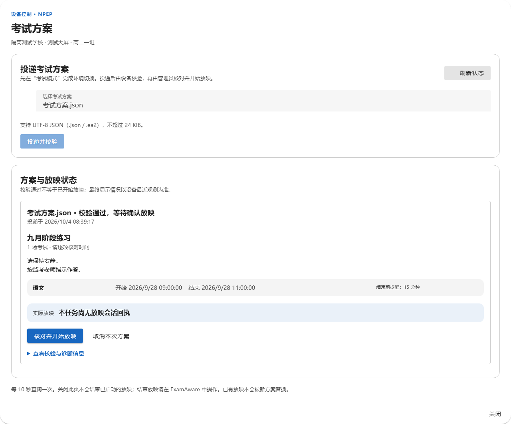
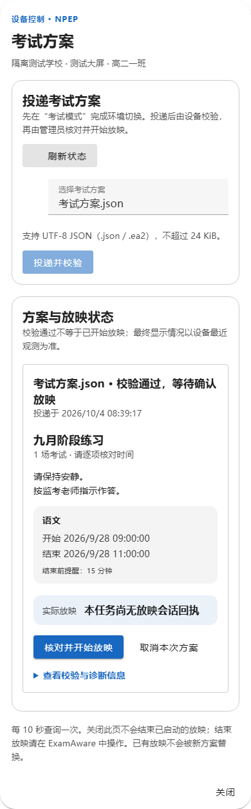
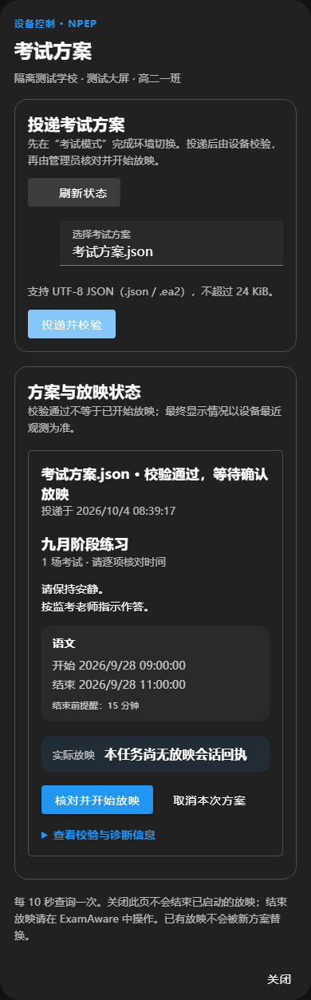
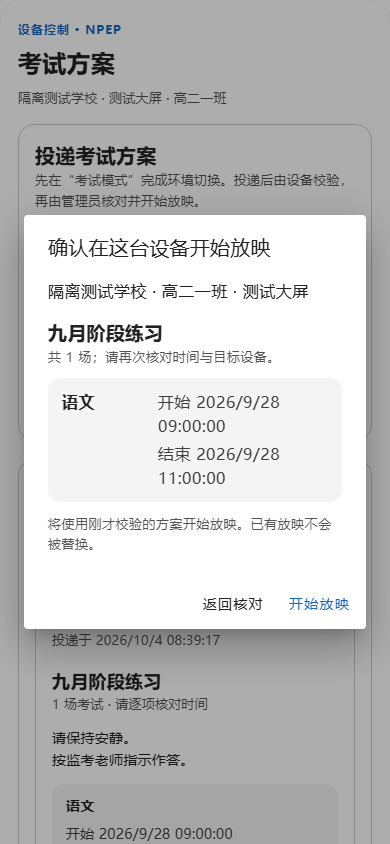
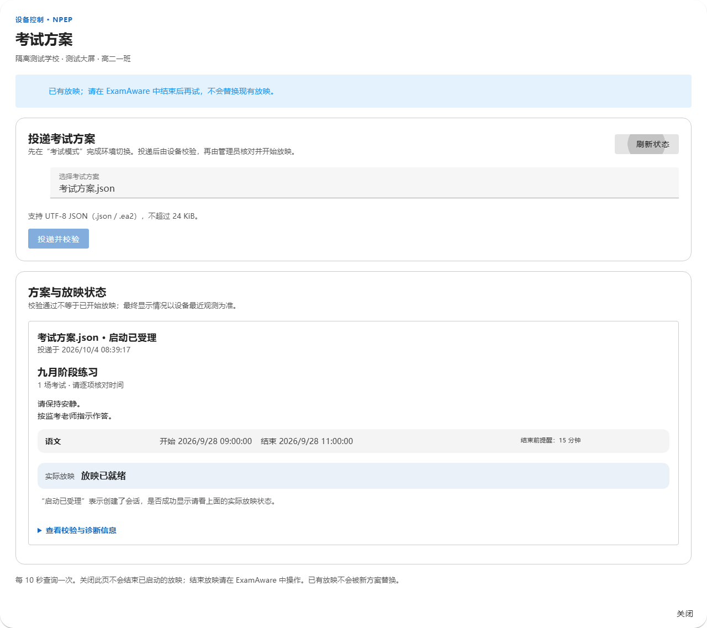

# NPEP 考试方案弹窗：先投递，再核对放映

日期：2026-10-04。范围：NPClassworks 学校管理端的考试方案弹窗，接续[设备互联与远程考试模式](ui-npep-management-20261004.md)。

旧界面将上传、状态阻断、校验摘要、实际放映和诊断编号顺次堆在一张卡内。手机上四列表格难读；最后确认虽然要求核对考试时间，却没有列出各场时间。

本轮分成「投递考试方案」和「方案与放映状态」两区。每场考试用可重排的信息块显示科目、起止与提醒；实际放映状态保持可见，任务编号和 SHA-256 收入诊断详情。最终确认列出学校、班级、设备与每场考试时间。保留原有上传校验、设备阻断、手动确认、同一请求重试、取消、每十秒刷新和现场结束放映的语义；只调整展示与信息层级。

本地合成数据验证：668 项单元测试、ESLint、生产构建、学校管理端 NPEP 浏览器流程及考试方案隔离浏览器流程通过。隔离浏览器覆盖校验后不自动放映、确认取消不提交、模糊回执不重复启动、设备放映回执、390px 窄屏和深色主题。真实设备与考场现场仍需另行验收。本轮未改后端、数据库、NPEduTools 或 NPEssentials；未推送或部署。

