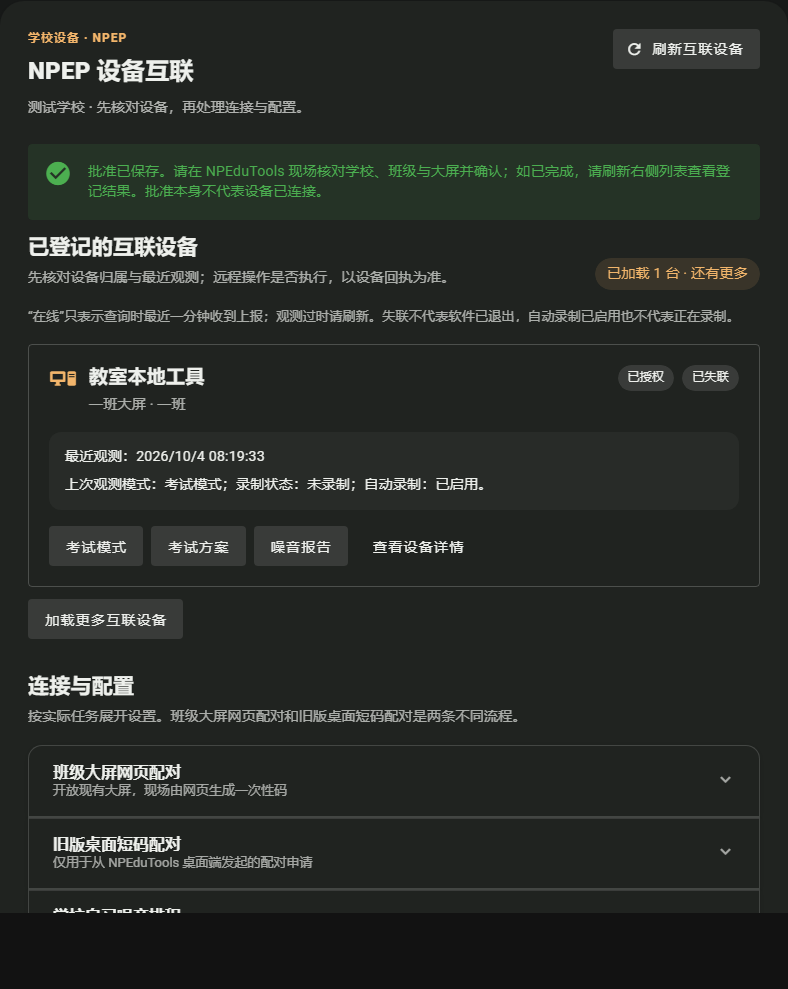
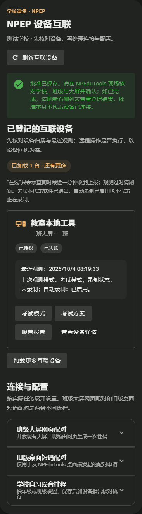
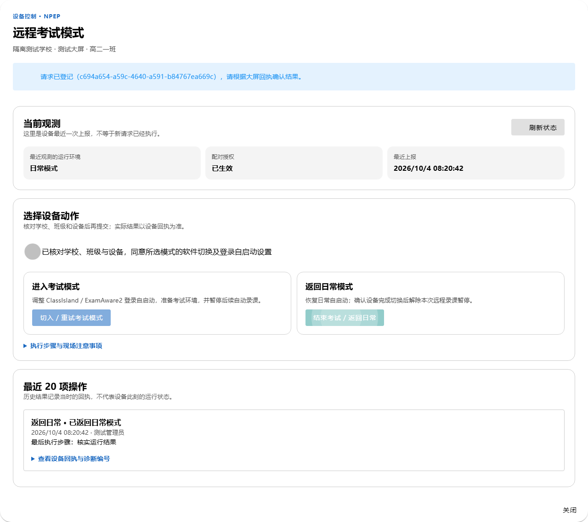
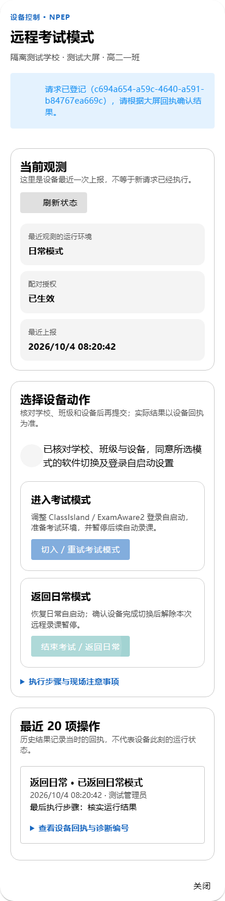
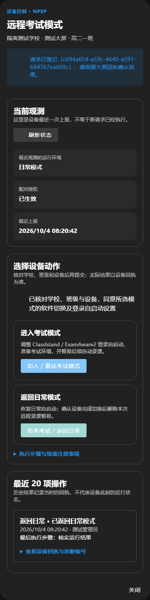

# NPEP 学校管理页：设备先行与分层控制

日期：2026-10-04。范围：NPClassworks 学校管理中的 NPEP 设备互联及远程考试模式弹窗。承接[班级大屏配对页](ui-npep-pairing-20261004.md)的视觉与任务层级。

## 目标与范围

管理员打开互联面板时，首先需要确认学校、已登记设备、归属、授权和最近观测，再决定要不要进入配对、排程或远程控制。旧页面先连续展示网页预授权、噪音排程和旧版配对表单，设备列表需要向下滚动才能看到；远程考试模式弹窗也把长执行说明放在当前状态之前。

本轮把已登记设备移到面板前部。设备卡默认展示名称、归属、授权、连接观测、最近状态和常用操作；凭据到期、软件／桥接版本及撤销授权放在「设备详情」。列表计数明确写为「已加载」，避免把分页结果误认为全校总数。「班级大屏网页配对」「旧版桌面短码配对」「学校自习噪音排程」成为三个可展开的配置入口，区分新旧流程。配置组件保持挂载，收起面板不会丢失未保存输入。

远程考试模式弹窗按「当前观测 → 选择设备动作 → 最近操作」排列。进入考试与返回日常分开说明；完整执行步骤和历史设备回执按需展开。当前观测和历史结果都注明时效边界。原有确认勾选、禁用条件、幂等重试、撤销、权限及后端接口均未更改。

## 验收

- 打开面板先看到已登记设备；空列表仍可直接进入班级大屏网页配对。管理员能识别已失联、未上报、凭据过期、刷新失败的旧快照，且不能把这些状态当作已执行结果。
- 旧版短码配对、网页预授权和噪音排程可展开操作；分页、换码核对、批准重试和撤销流程保持原行为。收起配置不会清掉输入草稿。
- 远程考试模式在提交前显示当前设备、观测时间和两种动作的影响；历史回执可展开核对，诊断编号不占据默认首屏。
- 桌面与 390px 窄屏无横向溢出；远程控制弹窗的浅色和深色主题均可辨读。真实设备、权限和课堂现场仍需单独验收。

## 本地验证

- `tests/e2e/admin-screens.spec.js` 的 NPEP 定向浏览器流程：配对批准重试、分页、失联与旧快照、撤销、关闭面板后迟到响应；增加设备列表顺序、默认收起内容、设备详情和窄视口重排检查。
- `scripts/test-npep-exam-plans-browser.mjs` 的隔离浏览器流程：考试方案与返回日常的请求、模糊回执重试、回执展示；增加 760px 与 390px 截图、深色主题稳定态和横向溢出检查。
- 全量单元测试、ESLint、生产构建及受影响的 NPEP 浏览器流程通过。测试使用回环服务和合成数据；真实学校管理员与 NPEduTools 设备尚未验收。本轮未修改后端、数据库、NPEduTools 或 NPEssentials，也未推送／部署。

截图均为合成学校与本地响应：

