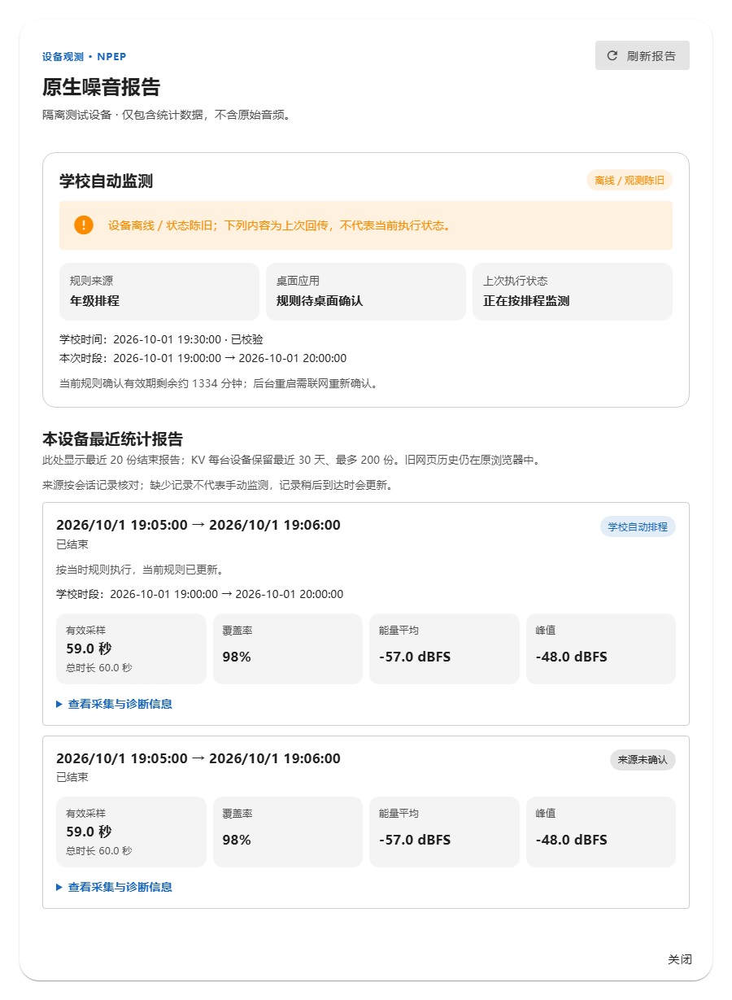
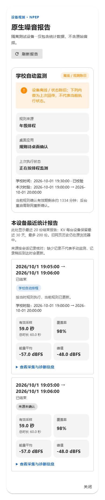
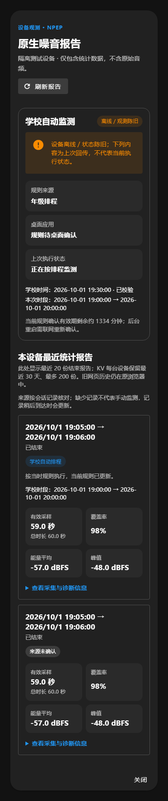
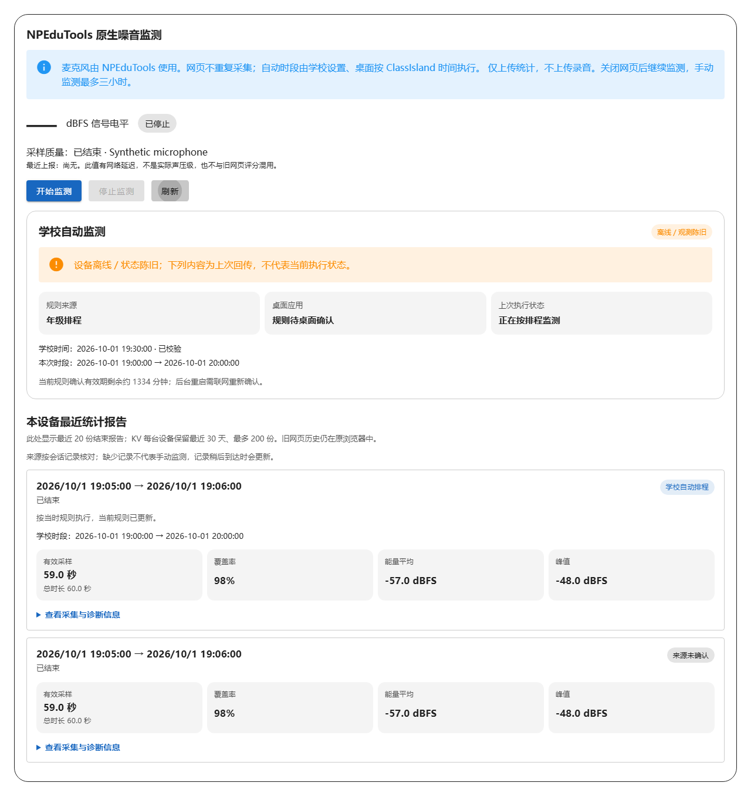

# NPEP 噪音报告：区分当前排程与历史统计

日期：2026-10-04。范围：NPClassworks 的学校管理端“原生噪音报告”，以及与班级大屏共用的排程状态、统计报告组件。承接[设备互联页](ui-npep-management-20261004.md)的任务层级。

原页面用一整块深底文字显示排程状态，报告卡把时段、采样、覆盖率、能量值和诊断编号排成相同权重的连续文本。手机上很难先判断设备是否仍在线、规则是否已应用，以及报告是否来自学校排程。

现在，排程状态按规则来源、桌面应用、最近执行状态分栏；离线或陈旧时保留醒目提示，明确下面是上次回传。每份报告先显示时间、来源和结果，再展示有效采样、覆盖率、能量平均与峰值；削波、麦克风、算法、会话编号放入可展开详情。来源缺失仍标为“来源未确认”，不推断成手动监测。页面只使用统计数据，不读取原始音频。

管理端的报告与排程状态各自刷新。报告刷新失败时保留旧数据并标注“上次成功加载”；首次失败时提示尚未完成加载，不误报“尚无报告”。共享组件也改善班级大屏的本机噪音面板，没有修改采集、排程保存或恢复请求的后端语义。

本地合成数据浏览器流程覆盖桌面、390px 手机、深色主题、历史规则版本、来源未确认、离线旧回传、报告与排程分别刷新失败、零浏览器麦克风请求。668 项单元测试、学校管理端 NPEP 浏览器流程、ESLint 与生产构建也通过。真实设备、教室麦克风与学校现场仍需另行验收；未推送或部署。

