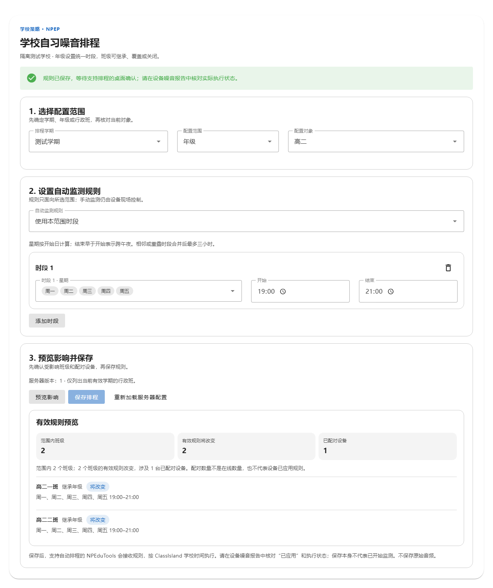
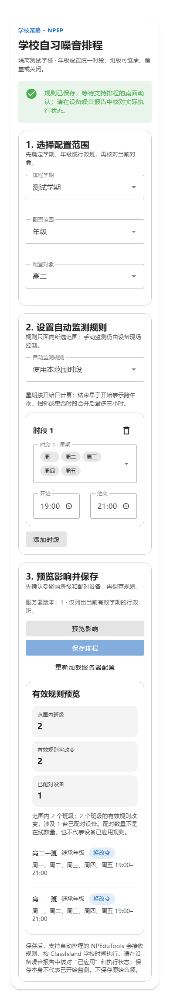
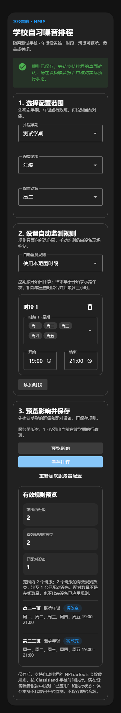
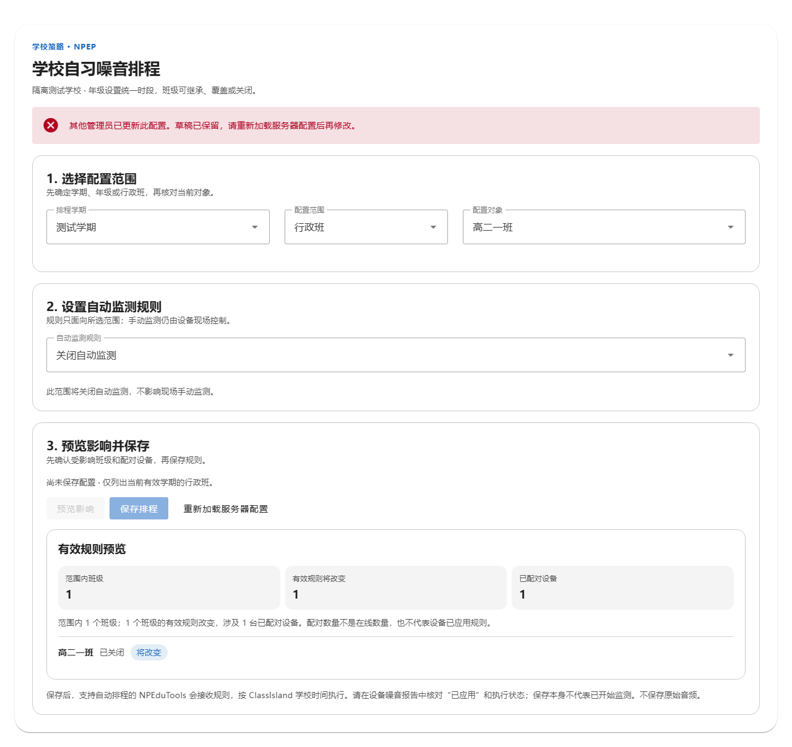

# NPEP 学校自习噪音排程：编辑顺序与移动端布局

日期：2026-10-04。范围：NPClassworks 学校管理端的排程编辑器 `NpepNoiseSchedules.vue`。本轮沿用已有排程协议、校验、预览和保存逻辑，只调整信息层级及布局。

原页面先展示长段执行说明，再连续排列学期、对象、规则、时段和操作。手机上星期与时间输入、删除入口相互挤压；预览为整块深底文字，班级结果与设备数量难以快速核对。

现在按管理员实际操作拆成三步：先选配置范围，再设置自动监测规则，最后预览影响并保存。继承、关闭和自定义时段各有简短状态说明；每个时段独立成卡，删除入口放在标题行，手机端开始和结束时间并排。预览用三项指标和逐班结果呈现，明确“已配对”不等于在线或已应用；保存后的实际执行仍需到设备噪音报告核对。原有版本冲突提示和草稿保留语义没有改变。

隔离浏览器流程使用真实 Vue 组件和合成 HTTP 响应，覆盖年级规则预览与保存、班级关闭自动监测、版本冲突、重新加载，以及 390px 窄屏和深色主题。窄屏无横向溢出，按钮和时段删除入口可见。整仓 ESLint、单元测试、管理端 NPEP Playwright 流程（2 项）和生产构建均通过。真实学校配置和设备执行仍须现场验收；未推送或部署。

