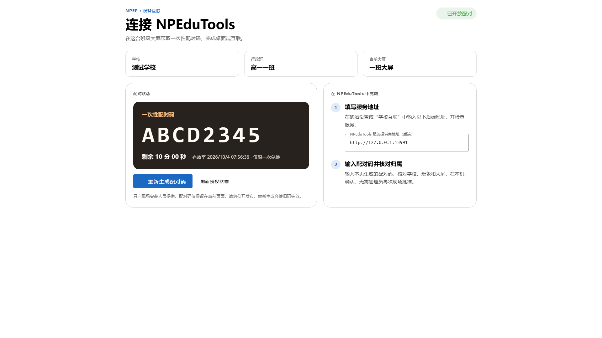
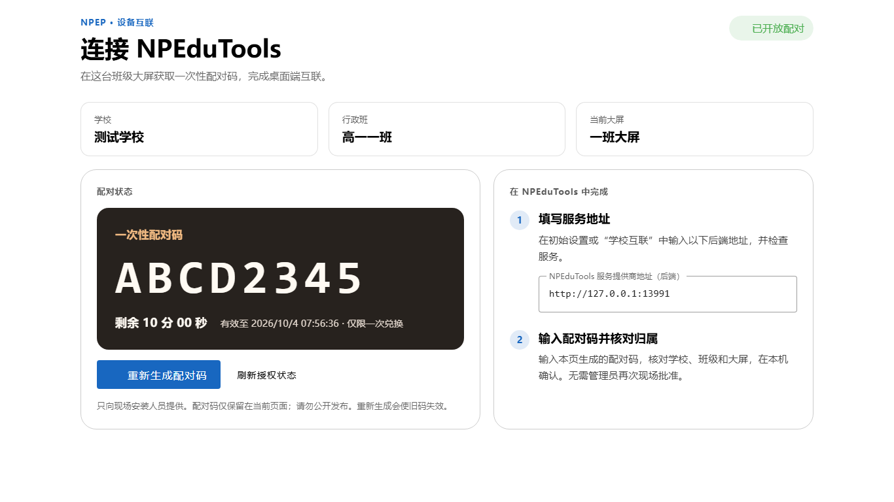
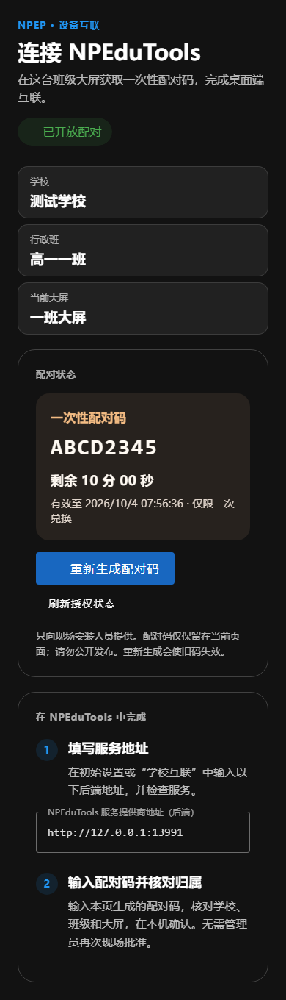

# NPEP 班级大屏配对页：信息层级提级

日期：2026-10-04。范围：NPClassworks「课堂工具 → 连接 NPEduTools」中的大屏配对页。

## 目标与判断

这是一项低频、现场操作的设备设置任务。原页能完成配对，但授权状态、当前大屏归属、后端地址、一次性码、有效期和操作说明在单张通用卡片内连续排列。对安装人员而言，最先要确定「是不是这台大屏、现在能不能配、码还能用多久」；原有视觉层级不足以支持快速核对。

本轮将页面分成当前大屏归属、配对状态／一次性码、桌面端两步操作。配对码在获得授权后成为页面焦点；未开放、已占用、读取失败和已过期都有明确文字状态。仍保留后端提供的服务地址、一次性码只在当前页面保存、重新生成使旧码失效等既有行为。

入口继续放在课堂工具中。配对是一次性安装任务，不需要占据日常作业和课堂操作的常驻主入口。本轮未改管理员预授权页、后端协议、NPEduTools、NPEssentials 或部署配置。

## 本轮验收

- 1920×1080 与 1366×768 大屏有效视口：无需滚动即可读到归属、配对码、有效期、服务地址和下一步；8 位码远看清楚。
- 窄视口：归属和操作说明顺序堆叠，页面无横向溢出；浅色和深色主题的标题、输入框、按钮保持可读。
- 未授权或已有绑定时无法生成码，且显示管理员应处理的事项；授权变化可手动刷新。
- 生成与重新生成仍走原有请求和身份隔离；短码不进入本地持久存储，刷新网页后消失。

## 验证与边界

本地 `pnpm test:e2e:pairing` 通过 7 组浏览器流程，包含预授权、短码生成／换码、占用、关闭授权、服务地址和短码不落存储；增加 1920、1366、390 视口和深色主题截图、窄视口横向溢出检查。定向 ESLint 与生产构建通过。浏览器使用回环地址和模拟响应，尚未在学校真实大屏、NPEduTools 安装设备或生产环境验收。

以下截图使用测试学校、合成配对码和本地服务地址：

