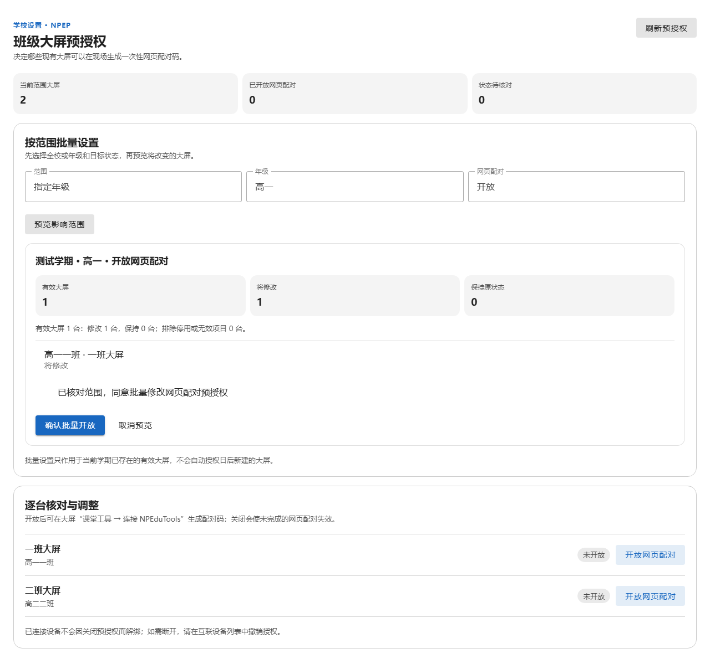
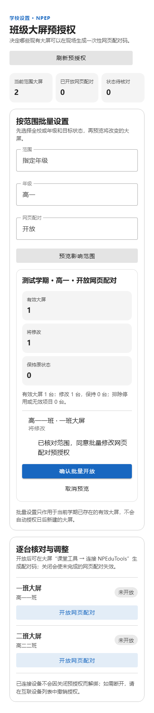
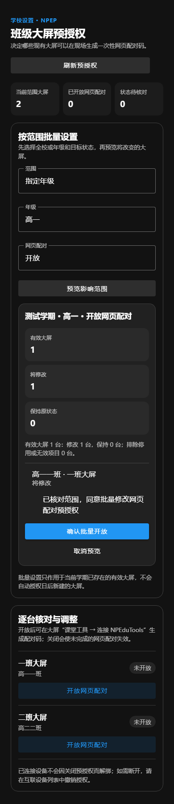
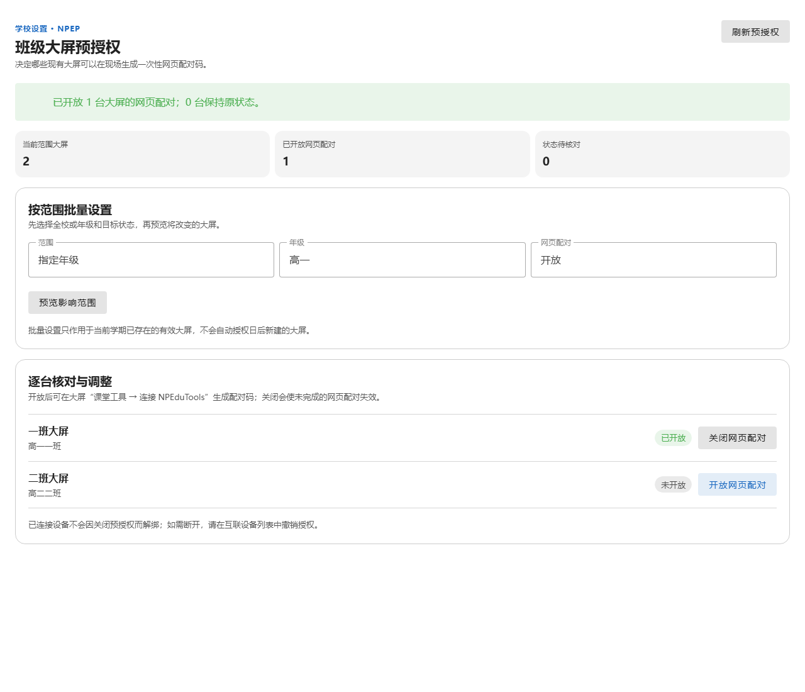

# NPEP 班级大屏预授权：先预览范围，再逐台核对

日期：2026-10-04。范围：NPClassworks 学校管理端的 `NpepPairingAccess.vue`。本轮调整信息层级和响应式布局，沿用现有预授权、批量预览、确认与版本冲突处理；不修改后端协议、NPEduTools 或 NPEssentials。

原界面将长段规则说明、批量表单、影响预览和逐台开关放进同一张卡。管理员需要往下寻找当前开放状态，手机上逐台按钮也挤在列表尾部。现在顶部先显示当前有效大屏、已开放数量和待核对数量；批量设置与逐台调整分别成区。批量预览把有效、将修改、保持原状态分开，同时保留排除数量、截断提示和明确的确认勾选。手机上的逐台开关占满一行，避免误触相邻项目。

关闭预授权只让未完成的网页配对失效，已连接设备需在互联设备列表撤销授权；批量设置也只影响当前学期已有的有效大屏。页面在相应操作旁解释这两条边界。服务器未给出某台大屏的授权记录时，显示“状态待核对”并禁用该台开关，不把未知写成未开放。

隔离浏览器流程使用真实 Vue/Vuetify 组件与回环 HTTP 夹具，覆盖按年级、全校的预览与确认、选择变化后清除同意、版本冲突、逐台开关、学期切换，以及 390px 窄屏与深色主题。8 组浏览器检查通过，且请求通过 NPClassworksKV 当前 wire schema 校验；窄屏无横向溢出。整仓 668 项单元测试、ESLint、生产构建，以及管理端 2 项 NPEP Playwright 流程也通过。真实学校管理员、NPEduTools 桌面和教室大屏仍需现场验收。本轮改动随本地 UI 批次提交，尚未推送或部署。

