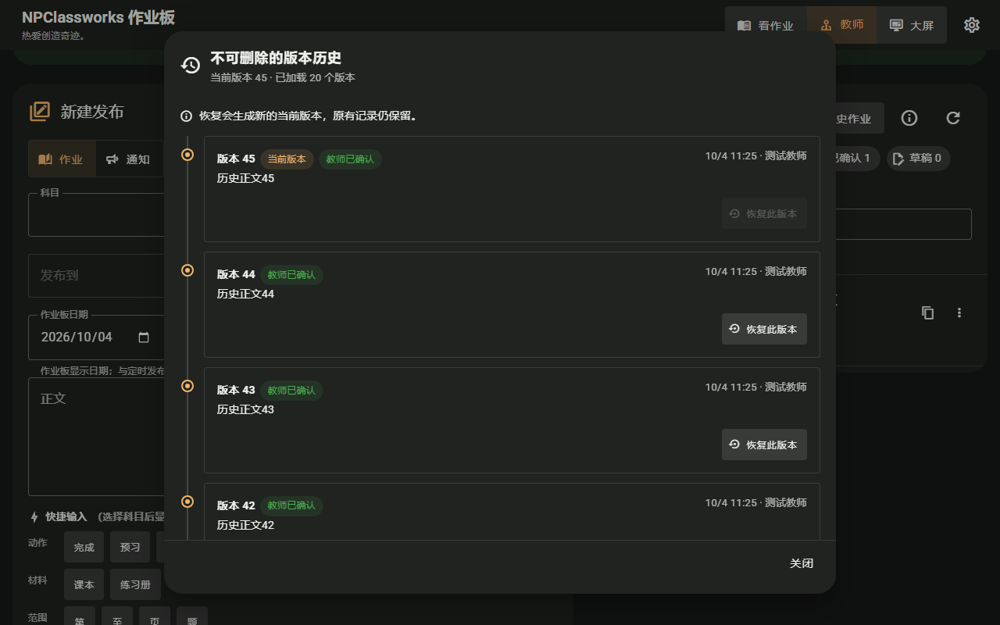
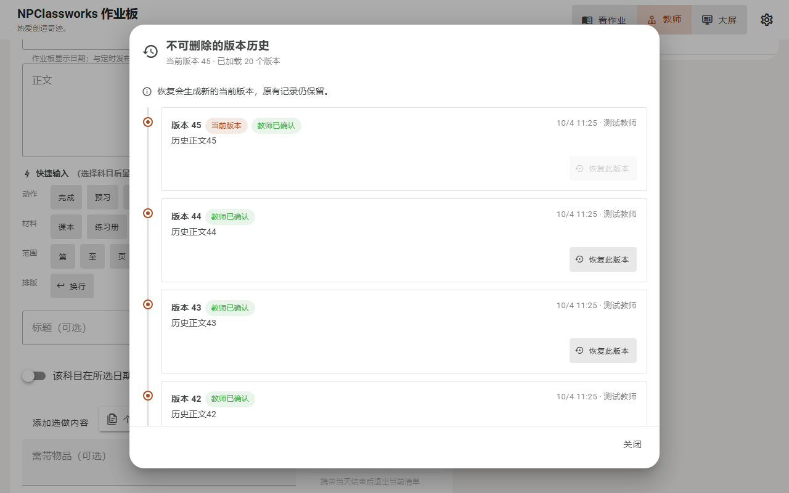
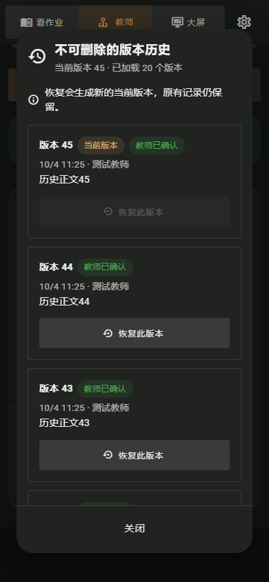

# 发布版本历史：全宽阅读与固定关闭操作

日期：2026-10-04。范围：NPClassworks 教师端与班级大屏共用的“版本历史与恢复”弹窗。目标是让使用者先认出当前版本，再按时间阅读完整记录，在窄屏和长历史中仍能安全关闭。涉及 `PublicationHistoryDialog.vue` 和对应浏览器回归；不改版本数据、分页、恢复、教师确认、冲突处理或后端协议。

原时间线在桌面弹窗里只占约半幅，正文与恢复按钮挤在左侧；手机还为轨道保留较宽缩进，弹窗底部操作需要随长列表一起寻找。现在版本条目使用桌面全宽列表，手机移除轨道缩进；页头显示当前版本与已载入数量，每条当前记录有明确的“当前版本”标记。恢复后的版本仍作为新版本出现，原记录保留。正文、选做、提交、需带、更正原因、作者、时间和状态继续完整显示。正文单独滚动，关闭按钮常驻弹窗底部；错误提示也留在可见的底部区域。

验收：本地合成 45 个版本，初次加载 20 个；1280px 桌面中首条卡片宽度超过弹窗的 80%，390px 与 320px 视口无横向溢出。滚到已加载列表末尾仍可关闭；深浅主题均已截图核对。分页到第 45 版、恢复、教师确认、请求失败与重试等相关 32 项 Playwright 回归通过；668 项单元测试、ESLint 和生产构建通过。真实教室触摸、教师手机软键盘及长正文仍待现场验收。本轮改动准备单独提交在本地分支；尚未推送或部署。

