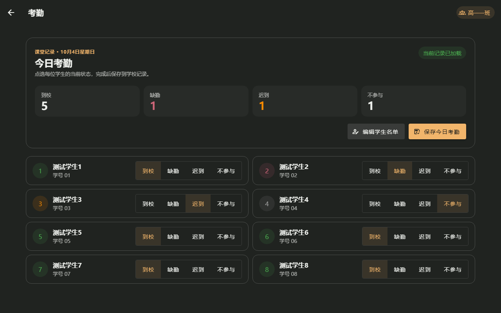
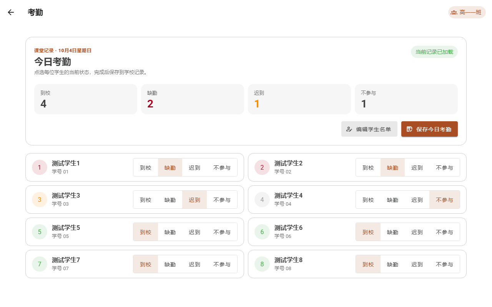

# 班级大屏考勤：先核对人数，再逐人操作

日期：2026-10-04。范围：NPClassworks 班级大屏“课堂工具 → 考勤”。本轮只调整页面布局与状态呈现，保留考勤读取、名单编辑、异常重试、日期切换和保存语义；不改后端、NPEduTools 或 NPEssentials。

原界面的到校、缺勤、迟到、不参与人数是并排的小标签；较多学生时，名单只有一列，需要较长滚动。新版页头显示考勤日期与当前记录状态，四类人数用独立指标展示，保存与编辑名单集中在指标下方。宽大屏把学生名单排成两列；窄视口改回单列，每名学生的四个状态按钮移到姓名下方，保持可触控宽度。未保存修改有明确文字提示，保存后回到“当前记录已加载”。

隔离浏览器使用 8 名合成学生，覆盖不同考勤状态、草稿更新、保存、1280px 双列、390px 单列与浅深主题；320px 下无横向溢出，四个状态按钮各至少 44 CSS px。新增布局流程与原有功能回归共 16 项 Playwright 测试、668 项单元测试、ESLint 和生产构建通过。真实教室大屏、后排观看距离、触摸驱动和整班人数仍须现场验收。本轮改动随本地 UI 批次提交，尚未推送或部署。

