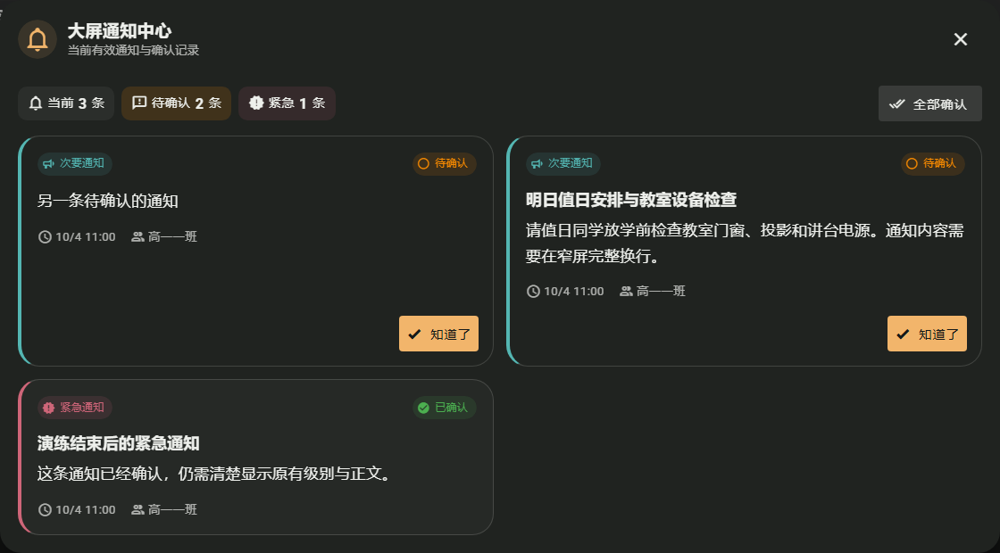

# 大屏通知中心：优先级、回执与正文分层

日期：2026-10-04。范围：NPClassworks 大屏通知中心弹窗。目标是在多条通知并存时，让教师先看清当前有效数量、待确认数量和每条通知的优先级，再阅读正文并确认。保留通知排序、弹窗提示、逐条与批量回执、失败重试和本地确认记录；不修改通知 API 或 NPEduTools。

原页面以整卡色块和图标表达优先级，有自定义标题的通知不显示“紧急 / 重要 / 普通 / 次要”文字；已确认卡片整体降透明度，正文也随之变淡。新布局把数量与批量确认集中在卡片上方；每张卡明确标出优先级和确认状态，标题只在发布者填写时出现，正文保持稳定对比度。细色边提示级别，已确认卡以较轻背景区分。桌面为两列，确认按钮靠卡片底部；窄屏改为单列，批量和逐条确认按钮占满可用宽度。

验收方式：合成三条通知，其中一条紧急通知已确认、两条次要通知待确认；核对自定义标题、正文、级别、状态、数量和批量确认。Playwright 在 1280px 桌面、390px 与 320px 窄屏及明暗主题运行；窄屏无横向溢出，批量确认后回执数量为零，刷新后仍保留已确认状态。相关 14 项浏览器回归、668 项单元测试、ESLint 和生产构建通过。真实教室大屏触摸与运行时性能尚未现场验收。本轮改动随本地 UI 批次提交，尚未推送或部署。

