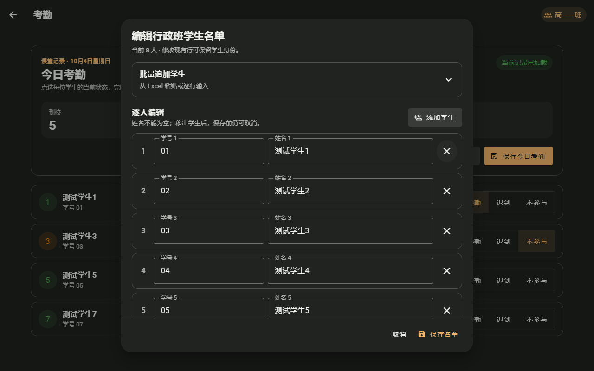
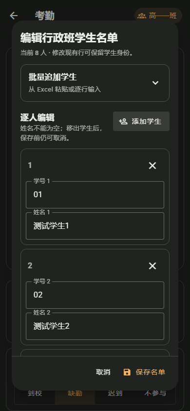
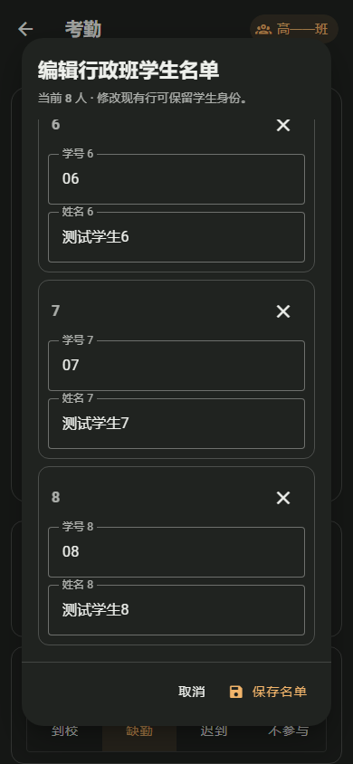

# 班级大屏名单编辑：批量导入与逐人修改分开

日期：2026-10-04。范围：NPClassworks 大屏考勤中的“编辑行政班学生名单”弹窗。只调整页面结构与滚动方式，保留现有学生身份、导入、校验、冲突提示和保存确认逻辑。

原弹窗打开后先占用大段空间解释批量导入格式，下面逐人字段与移除按钮挤在同一行。8 名学生的窄屏样例中，保存操作已经落在可视区域外。新版页头直接显示当前人数与身份保留提示；批量追加从顶部展开，按需粘贴 Excel 两列或逐行输入；逐人编辑保留原有学号、姓名和移除动作。手机上的每名学生独立成行，学号与姓名纵向排列，避免字段过窄。正文单独滚动，取消与保存始终留在弹窗底部；滚到最后一名学生时仍可直接保存。顶部“添加学生”会滚动并聚焦新行，避免新行落在名单末尾而不被发现。

隔离浏览器覆盖 8 名合成学生、桌面与 390px/320px 窄视口、导入区展开、无效导入保留输入、同名学生处理、名单保存与冲突保留。相关 16 项 Playwright 回归、668 项单元测试、ESLint 和生产构建通过；数据库全栈流程未在本轮运行。真实教室触摸、中文输入法和整班名单长度还需现场验收。本轮改动随本地 UI 批次提交，尚未推送或部署。

