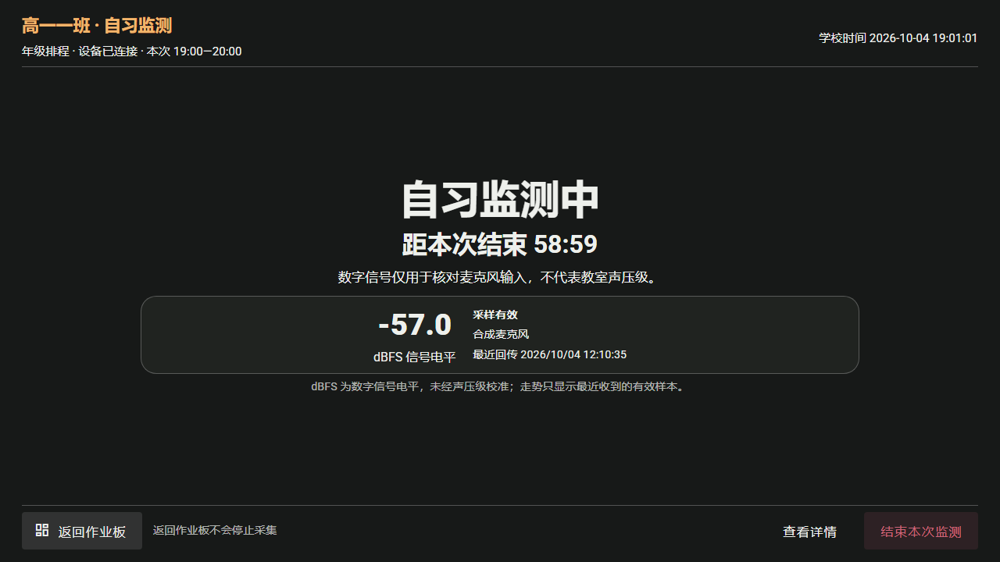
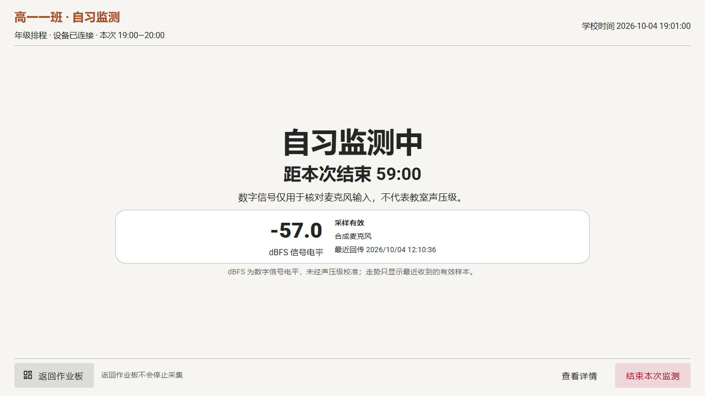
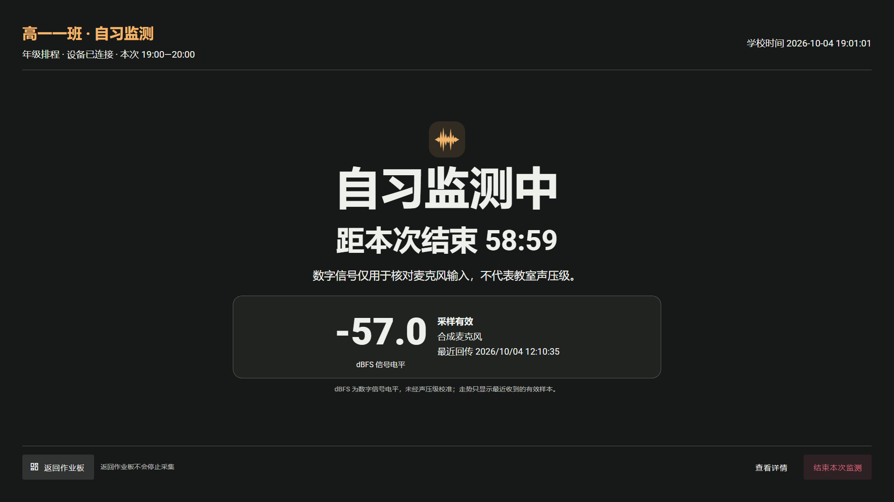

# 班级大屏定时监测独立展示：页面与导航任务卡

日期：2026-10-04。状态：NPClassworks 本地实现与浏览器回归已完成，待教室设备验收；未推送或部署。与 [NPEduTools 桌面边界方案](../../NPEduTools/docs/iterations/SCHEDULED-NOISE-DISPLAY-PLAN-20261004.md)配套；本文件记录 NPClassworks 的大屏展示与交互。

| 项目 | 本轮决定与边界 |
| --- | --- |
| 目标 | 有可靠的**实际定时采集会话**时，大屏自动进入便于远看的独立展示；返回作业板不停止采集。 |
| 主要模块 | `App.vue` 的常驻 `NoiseScheduleManager`、`ClassworksHome.vue`、`ClassroomScreenView.vue`、`nativeNoiseController.js`、展示组件与独立 0.8 返回期限接口。 |
| 保留 | 作业板及弹窗宿主、通知回执、未保存草稿、现有 0.6 手动停止与 0.7 排程恢复语义；定时停止走 0.8 PIN 保护。 |
| 不包含 | 网页再开原生设备的麦克风、重新执行学校排程、原音频上传、dBFS 声压级评分、浏览器窗口抢前台、生产部署。 |
| 验收 | 本地双接口状态与浏览器交互矩阵；另由真实 ClassIsland、麦克风、教室显示器完成现场验收。 |

## 现有实现与页面承载

- `NoiseScheduleManager` 已挂在 `App.vue` 根层，每 3 秒更新 0.6 原生状态，并在原生提供商下读取 0.7 排程状态。原生接管时旧网页采集被禁用；不能为新展示再建一套轮询或在断线时改用网页麦克风。
- `ClassroomScreenView` 目前承载通知弹窗及回执、放大／抄写、作业与底部操作栏；`ClassworksHome` 承载录入和课堂工具弹窗。真正切到新路由会卸载这些宿主。第一版采用**占满浏览器视口的独立展示模式**，让原宿主继续挂载；它看起来是独立页面，但不离开当前路由，也不请求系统全屏。不得暗示浏览器最小化后网页可以自行唤回前台。
- 班级和绑定身份来自当前 `screenSession`。现有 `GET /screen/noise-schedule` 提供 `supported/online/applied/policy/status/receivedAt`，`GET /screen/noise` 提供 `provider/online/status/receivedAt`；两份回传不是原子快照。

## 进入与退出规则

**当前保护规则：** 返回作业板无需 PIN，默认临时返回 10 分钟；学校管理员可按年级设置，班级可覆盖或继承，范围为 1–60 分钟。到期且同一排程时段仍实际采集时自动恢复展示。刷新、重连、重复返回和同一时段的新采集会话都不延长期限。定时停止须输入本大屏 PIN，并由 KV 与桌面再次核对；HTTP 受理不等于实际停止。详见 [保护任务卡](../../NPEduTools/docs/iterations/SCHEDULED-NOISE-PROTECTION-PLAN-20261004.md)。

**原生自动进入**只在绑定大屏前台、未临时退出、OOBE 已完成且没有教师或管理员编辑操作抢占时判断。0.6 必须是 `provider=native`、`online=true`、`status.state=Active`；0.7 必须 `supported=true`、`online=true`、`status.owner=Schedule`、`status.reason=WINDOW_ACTIVE`、`status.clockReady=true`、`status.dateNeedsReview=false`，且有本次 `window/sessionId`。两份状态的 `sessionId` 必须相等。`applied` 单独表示当前服务端规则是否已被桌面应用；`applied=false` 需要明确提示“规则待确认”，但不把已经回传的实际采集误判为停止。任何字段缺失、两次读取暂时不一致或状态陈旧，先等下一轮，不发启动或纠正命令。

旧网页提供商可复用这张展示页，但入口只依据已有本机 `scheduledActive` 与实际采集 `active` 同时成立；手动监测不自动进入。原生与网页提供商互斥，不能因 0.7 暂不可读而降级开麦克风。

进入时若录入、考勤、工具、确认弹窗或抄写正在使用，显示小型“定时监测已开始 · 查看”入口，待当前操作结束且会话仍有效时再进入。紧急通知弹窗必须压在展示模式之上，确认后回到展示；考试模式及 `EXAM_PAUSED` 优先，展示不能盖住考试界面。页面关闭、绑定变化或临时退出时清除当前显示状态，但不向桌面发送 STOP。

“返回作业板”只退出展示。KV 按大屏绑定和本次 `window.start/end` 保存返回起点、截止时间和当时分钟数；有效期限内再次点击、刷新、重连或同一时段换 `sessionId` 不续期。页面用 `performance.now()` 推进当前倒计时，重载后先向 KV 核对；离线时本地缓存仅允许原期限内临时返回。期限到达而录入、通知、工具或确认弹窗仍占用时，显示非模态“返回期限已到”提示，待当前操作结束再恢复展示，不抢焦点。大屏原有“查看展示”仍可手动进入；原期限已过且展示确实恢复后，再次返回才创建新期限。考试暂停、时段结束或换绑清除当前返回状态。

自然结束要等**新鲜的桌面执行状态**，不能靠网页倒计时归零宣布停止。停止回传后短暂显示“本次监测结束，报告可能仍在上传”，再回到原作业板位置。考试暂停立即让考试展示优先；离线或两份状态不一致时，已打开的展示保留上下文并改为“状态未知”，不擅自退出或声称采集结束。

## 版面示意

```text
┌─────────────────────────────────────────────────────────────────────┐
│ 高二（1）班   自习监测        年级排程 · 桌面已连接 · 本次 19:00—19:45 │
│ 学校时间 19:12:08                                  规则待确认（如有） │
│                                                                     │
│                         自习监测中                                  │
│                       距本次结束 32:52                              │
│                                                                     │
│       近一分钟信号走势（有效样本）  ·  采样有效／等待／异常             │
│       -57.0 dBFS 信号电平 · 麦克风名称 · 最近回传                      │
│                                                                     │
│ 返回作业板                    查看详情        结束本次监测             │
└─────────────────────────────────────────────────────────────────────┘
```

主体使用大字号与稳定的纯色表面，兼容浅深主题和大屏高效模式；不增加实时模糊或高频动画。保留自定义背景设置，但展示内容有足够不透明底色，避免照片干扰后排阅读。趋势只由已收到、`quality=Good` 的短时 dBFS 样本形成，不跨会话拼接，也不增加服务端采样接口。dBFS 是数字信号电平，**不是已校准声压级**；不据此显示“安静合格／超标”的红黄绿评价。采集已启动但无有效样本时，主标题改为“采样待核对”，隐藏数字与趋势，并说明“等待有效采样／全零／削波／无新数据”等真实原因。

倒计时以 0.7 桌面 `schoolNow` 和同一学校日历格式的 `window.end` 为基准；这些字段无时区后缀，不做 UTC 八小时换算。两次新鲜观测之间只用 `performance.now()` 短暂平滑显示；`clockReady=false`、日期待核对、断线或回传陈旧时冻结／隐藏剩余时间，不用浏览器墙钟替代学校时间。倒计时归零只改变提示，不触发停止或结束判断。

底部明确分开：**返回作业板**不会停采，并显示本次有效返回分钟数；**结束本次监测**要求本大屏 PIN，通过 0.8 `/screen/noise-management/commands` 申请受保护 STOP，随后等待桌面实际回执，不能把 HTTP 受理写成执行成功。旧 0.6 STOP 对受保护的定时会话返回 `MANAGEMENT_REQUIRED`；手动监测仍沿用 0.6。详细排程、报告与“恢复本次自动监测”仍从现有噪声面板进入。

## 验收矩阵与契约结论

至少覆盖：进入时会话已运行、启动中尚无有效采样、双接口乱序／不同 `sessionId`、`applied=false` 但采集仍运行、返回后刷新和重连、重复返回不续期、期限到达遇到编辑操作延后恢复、错误／正确 PIN、旧 STOP 拒绝、跨午夜、STOP 请求待回执与持久化跳过、自然结束后报告迟到、断线、学校时钟无效、考试暂停、紧急通知、临时退出与绑定切换；原生模式网页麦克风请求数须为零。视觉检查 1280×720、1366×768、1920×1080 CSS 视口、明暗主题及自定义背景；真实设备另测后排阅读与触摸。

**0.6/0.7 Schema 不变。** 当前排程状态已有归属、原因、会话、时段和学校时钟；原生状态已有实际采集、质量、电平与时间。新增的 0.8 能力单独承载展示返回期限与管理授权；`EXAM_PAUSED` 阻止／退出监测展示。

## 本地实现与接口

`src/utils/scheduledNoiseDisplay.js` 导出 `nativeScheduledDisplayCandidate(noiseStatus, scheduleStatus)`：两个参数分别为 `GET /api/v2/npep/screen/noise` 的 `data` 和 `GET /api/v2/npep/screen/noise-schedule` 的 `data`。返回 `null` 或 `{provider, sessionId, window, windowKey}`。`nativeDisplayPhase(noiseStatus, scheduleStatus, context)` 返回 `active`、`unknown`、`ended` 或 `exam`。桌面合成契约的 `noiseStatus`、`scheduleStatus` 是内部状态对象，供测试包装成上述两个接口的 `data`；不修改原有 0.6/0.7 Schema。`schoolCalendarMilliseconds` 与 `schoolRemainingSeconds` 保留毫秒精度，只在学校日历字段内部做算术，不把无时区字段转为浏览器当地时间。自然结束允许 0.7 `window=null`，但必须同时看到新鲜 0.6 已停止、同一历史会话、0.7 `OUTSIDE_WINDOW` 和学校时间已经越过本次结束；故障状态不显示“正常结束”。

`ScreenScheduledNoiseDisplay.vue` 挂在原 `ClassroomScreenView` 内、覆盖浏览器视口；作业板、通知、回执与草稿宿主继续挂载。它只订阅已有 `NoiseScheduleManager` 的状态，不新建原生轮询或麦克风。前端连续 7 秒收不到任一接口的新快照时，已打开画面转“状态待确认”，隐藏旧电平与倒计时；同一时段换会话时更新上下文并清空趋势。趋势最多保留约一分钟有效样本，长时间无新样本会清空。`返回作业板` 使用独立 0.8 接口确认期限，网页本地按服务器地址／绑定保存短时缓存；手动“查看展示”仍可打开。原生定时停止先输入 PIN，再发 0.8 受保护 STOP 并等待桌面回执。网页旧提供商只在定时且实际采集 `active` 时进入，不会因为原生暂时离线改开网页麦克风。

原生来源标记优先取 0.7 实际执行状态的 `source`；若桌面明确回报 `applied=false` 且缺少实际来源，不把待应用的最新规则来源写成当前会话来源。0.6 `receivedAt` 是真实时间戳，按北京时间显示；0.7 `schoolNow` 是学校日历时间，不做时区换算。

浏览器验收入口：`pnpm exec playwright test tests/e2e/scheduled-noise-display.spec.js`。用例覆盖课堂工具弹窗占用时延后进入、1280×720 底部操作可见、1280×720／1366×768／1920×1080 深色与 1366×768 浅色画面、返回／刷新不续期、手动重开、到期遇编辑弹窗的待恢复提示、7 秒回传悬挂、显式离线、同一时段新会话、错误／正确 PIN、STOP 请求与实际结束、网页麦克风请求为零。状态单测入口：`node --test tests/scheduledNoiseDisplay.test.js tests/nativeNoise.test.js`；可选桌面合成快照由 `NPEP_NOISE_CONTRACTS_DIR` 指定。另有 `pnpm test`、针对性 ESLint、`pnpm build`，以及 KV 隔离 PostgreSQL 的 0.8 HTTP/SQL 测试。浏览器模拟和桌面合成采集器均不等于真实麦克风、教室显示器或考试场景验收。

尚需在实际教室联动检查紧急通知压层、长时间编辑草稿、临时退出及换绑、ClassIsland 考试暂停、麦克风状态与后排可读性。本地模拟验证了状态判定和已列出的浏览器路径，不能代替这些现场结果。






